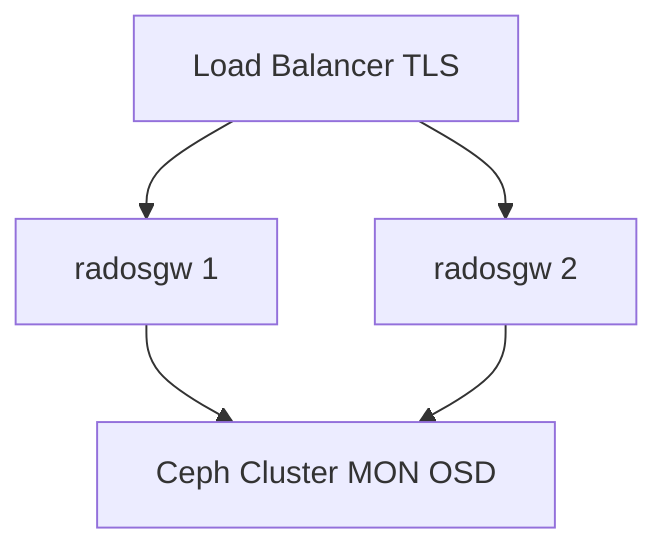

# معماری استقرار

## توپولوژی پیشنهادی تولید

## پیکربندی کلیدی (مفهومی)

| پارامتر | نقش |
|---------|-----|
| `rgw_frontends` | نوع frontend (مثلاً `beast`) |
| `rgw_enable_apis` | فعال‌سازی s3, swift, admin, … |
| `rgw_store` | انتخاب SAL driver |
| realm / zonegroup / zone | multisite و placement |

## چند منطقه (Multisite)

- **Realm** — فضای نام پیکربندی
- **Period** — نسخه epoch پیکربندی
- **Zone** — سایت جغرافیایی با poolهای محلی
- همگام‌سازی: metadata log + data sync بین زون‌ها

## جداسازی dev و prod

| محیط | تفاوت معمول |
|------|-------------|
| dev | تک نمونه، SSL خودامضا، APIهای بیشتر برای تست |
| prod | چند نمونه، TLS واقعی، rate limit، فقط API لازم |

## وابستگی سرویس

`radosgw` بدون خوشه Ceph سالم (برای driver RADOS) قابل استفاده تولیدی نیست. MON باید reachable باشد.

## راهنمای گام‌به‌گام

جزئیات عملیاتی در [راهنمای مدیر RGW](../../../cheatsheet/guides/roles/rgw-admin.md) — **بدون** دستورالعمل CI/CD.

## مستندات مرتبط

- [توپولوژی زمان اجرا](runtime-topology.md)
- [محدودیت‌های HA](critical-gaps-and-ha-limitations.md)
