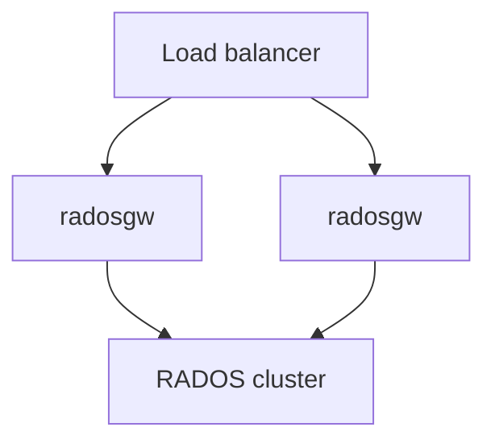

# 部署架构

## ## 典型生产布局



- **Stateless gateways** — scale out HTTP workers
- **Shared RADOS** — single source of truth
- **Separate networks** — public (clients) vs cluster (OSD traffic) when possible

## cephadm

```bash
ceph orch apply rgw <svc-id> --placement="3 host1 host2 host3" --port=8080
```

See [Cheatsheet: RGW admin](../../../cheatsheet/guides/roles/rgw-admin.md) for operations.

## TLS and frontends

- `rgw_frontends` — Beast SSL, port binding
- Certificates via local files or external termination at LB

## Multisite

Each zone runs its own RGW fleet; sync via HTTP between zones. See [Multisite module](../modules/multisite.md).

## 相关

- [Runtime topology](runtime-topology.md)
- [Critical gaps and HA limitations](critical-gaps-and-ha-limitations.md)
