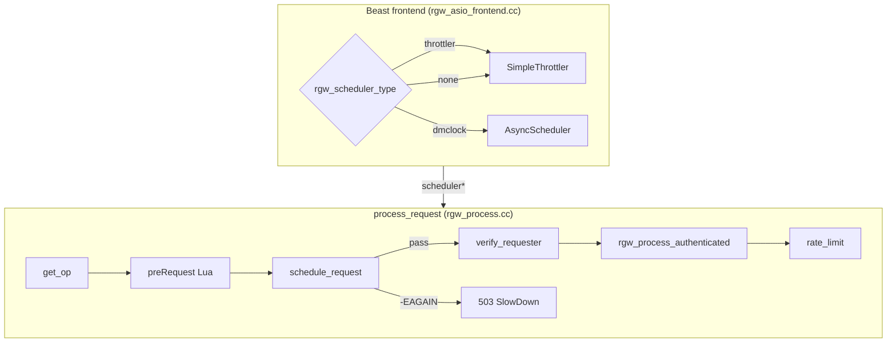
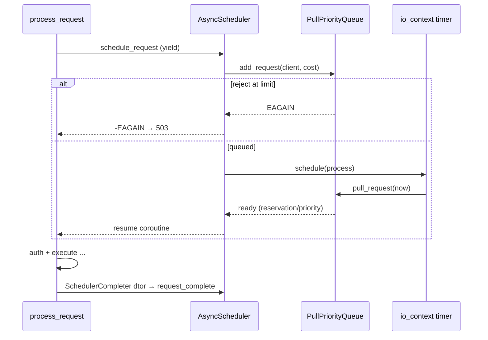
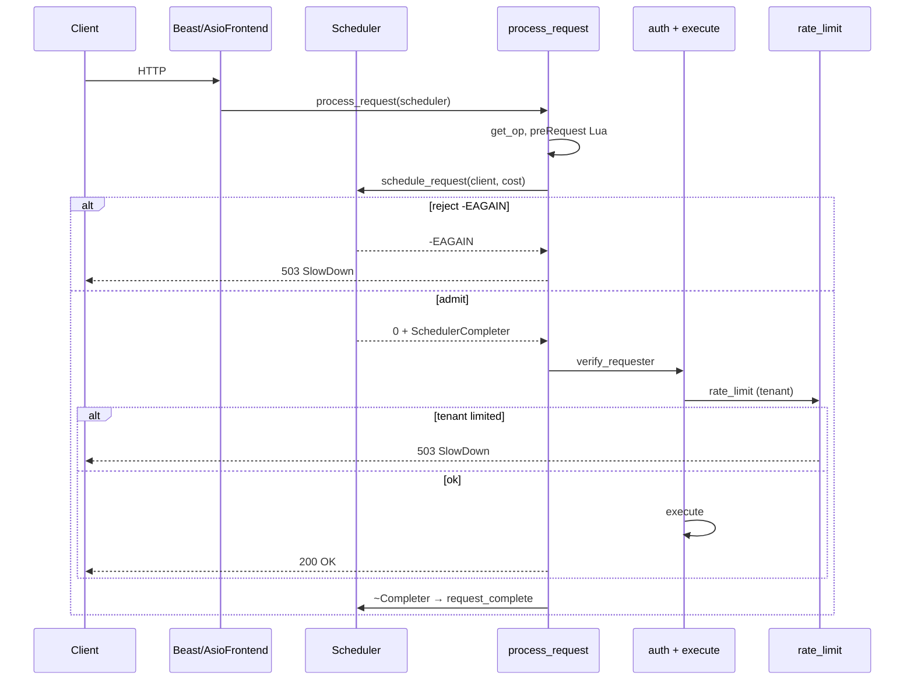

# معماری dmclock / Scheduler در RGW

این سند **زمان‌بندی و QoS در لبه RGW** را توضیح می‌دهد: از `SimpleThrottler` (پیش‌فرض production) تا **dmclock** (experimental) — با تفسیر کد، سناریوها، و مقایسه با [rate limit per-user/bucket](rate-limit-architecture.md).

| فایل | نقش |
|------|-----|
| `rgw_dmclock.h` | `client_id`، `scheduler_t`، انتخاب نوع scheduler |
| `rgw_dmclock_scheduler.h` | interface `Scheduler`، `SchedulerCompleter` (RAII) |
| `rgw_dmclock_async_scheduler.{h,cc}` | `AsyncScheduler` (Beast) + `SimpleThrottler` |
| `rgw_dmclock_sync_scheduler.{h,cc}` | `SyncScheduler` (تست / blocking) |
| `rgw_dmclock_scheduler_ctx.{h,cc}` | `ClientConfig`، perf counters |
| `rgw_process.cc` | `schedule_request()` — نقطه اعمال |
| `rgw_asio_frontend.cc` | ساخت scheduler در Beast frontend |
| `dmclock/src/dmclock_server.h` | الگوریتم mClock (reservation/weight/limit) |

!!! note "تفاوت با rate limit"
    | مکانیزم | محل | معیار | scope |
    |---------|-----|-------|-------|
    | **dmclock / throttler** | قبل از auth | فشار سرور / QoS کلاس عملیات | per-RGW |
    | **rate limit** | بعد از `pre_exec` | سهمیه tenant (user/bucket) | per-RGW |

    هر دو می‌توانند **503 SlowDown** (`-ERR_RATE_LIMITED`) برگردانند — در log/monitor باید جدا track شوند.

---

## نمای کلی



**نکته:** `schedule_request` **بعد از** ساخت `RGWOp` و **قبل از** `verify_requester` اجرا می‌شود — یعنی throttle بر اساس **نوع عملیات** است، نه identity کاربر.

---

## سه حالت scheduler

```cpp linenums="35" title="rgw_dmclock.h — scheduler_t"
[`rgw_dmclock.h`](https://github.com/ceph/ceph/blob/main/src/rgw/rgw_dmclock.h#L35-L50)
```

| `rgw_scheduler_type` | کلاس | رفتار |
|----------------------|------|-------|
| `throttler` (**پیش‌فرض**) | `SimpleThrottler` | سقف concurrent request (`rgw_max_concurrent_requests`) |
| `dmclock` (**experimental**) | `AsyncScheduler` | صف اولویت mClock per کلاس عملیات |
| `none` / invalid | → fallback به `throttler` | همان throttler |

```cpp linenums="525" title="rgw_asio_frontend.cc — ساخت scheduler"
[`rgw_asio_frontend.cc`](https://github.com/ceph/ceph/blob/main/src/rgw/rgw_asio_frontend.cc#L525-L541)
```

فعال‌سازی dmclock نیاز به `experimental_feature_enabled` دارد (مستندات upstream).

---

## کلاس‌های client (OpClass)

```cpp linenums="23" title="rgw_dmclock.h — client_id"
[`rgw_dmclock.h`](https://github.com/ceph/ceph/blob/main/src/rgw/rgw_dmclock.h#L23-L29)
```

هر `RGWOp` با override کردن `dmclock_client()` کلاس خود را اعلام می‌کند:

```cpp linenums="328" title="rgw_op.h — پیش‌فرض RGWOp"
[`rgw_op.h`](https://github.com/ceph/ceph/blob/main/src/rgw/rgw_op.h#L328-L329)
```

| `client_id` | عملیات نمونه | کلاس‌های RGWOp |
|-------------|--------------|----------------|
| `admin` | Admin Ops API | `RGWRESTOp` admin، handler ratelimit |
| `auth` | Swift auth، STS | `rgw_swift_auth.h` |
| `data` | GetObj، PutObj، Copy | ops داده‌ای در `rgw_op.h` |
| `metadata` | ListBucket، head bucket، … | پیش‌فرض `RGWOp` |

**Cost:** `dmclock_cost()` پیش‌فرض `1` است — TODO در کد برای read vs write (`rgw_dmclock.h:22`).

---

## mClock — reservation / weight / limit

dmclock از **ClientInfo** سه پارامتر per-class استفاده می‌کند:

```cpp title="dmclock_server.h — ClientInfo (خلاصه)"
struct ClientInfo {
  double reservation;  // سهم تضمینی (minimum)
  double weight;       // سهم نسبی (proportional)
  double limit;        // سقف (maximum؛ 0 = نامحدود)
};
```

| پارامتر | config RGW | پیش‌فرض (data) | معنی |
|---------|------------|----------------|------|
| reservation | `rgw_dmclock_{class}_res` | 500 | حداقل throughput تضمینی |
| weight | `rgw_dmclock_{class}_wgt` | 500 | سهم نسبی وقتی capacity اضافه باشد |
| limit | `rgw_dmclock_{class}_lim` | 0 | سقف سخت (0 = بدون limit) |

`class` ∈ {`admin`, `auth`, `data`, `metadata`}.

### PhaseType — چگونه request admit می‌شود

| Phase | معنی |
|-------|------|
| `reservation` | از سهم تضمینی (res) پوشش داده شد |
| `priority` | از سهم weight-based پوشش داده شد |
| reject | `AtLimit::Reject` → `EAGAIN` |

RGW از `AtLimit::Reject` استفاده می‌کند — request بالای limit فوراً reject می‌شود (بدون صف انتظار طولانی).

---

## `ClientConfig` — بارگذاری config

```cpp linenums="50" title="rgw_dmclock_scheduler_ctx.cc — ClientConfig::update"
[`rgw_dmclock_scheduler_ctx.cc`](https://github.com/ceph/ceph/blob/main/src/rgw/rgw_dmclock_scheduler_ctx.cc#L50-L69)
```

تغییر runtime config (SIGHUP / `ceph config set`) از طریق `md_config_obs_t` → `queue.update_client_infos()`.

---

## پیاده‌سازی‌ها

### ۱. `SimpleThrottler` (پیش‌فرض production)

```cpp linenums="194" title="rgw_dmclock_async_scheduler.h — SimpleThrottler"
[`rgw_dmclock_async_scheduler.h`](https://github.com/ceph/ceph/blob/main/src/rgw/rgw_dmclock_async_scheduler.h#L194-L208)
```

**الگوریتم:**

```
outstanding_requests++
if outstanding >= max_requests → -EAGAIN
else → 0 (admit)
```

- `max_requests` = `rgw_max_concurrent_requests` (پیش‌فرض **1024**)
- `<= 0` → نامحدود (`INT64_MAX`)
- **بدون** تفکیک admin/data/metadata — همه request یک سطل مشترک
- `request_complete()` در destructor `SchedulerCompleter` → `--outstanding`

**هدف:** محدود کردن memory/CPU تحت بار سنگین Beast — نه QoS tenant.

### ۲. `AsyncScheduler` (dmclock experimental)



**اجزا:**

| جزء | نقش |
|-----|-----|
| `PullPriorityQueue` | صف mClock |
| `Timer` (boost::asio) | wake برای request آینده |
| `max_requests` | سقف concurrent **بعد از admit** (همان option throttler) |
| `outstanding_requests` | درخواست‌های admit‌شده که هنوز complete نشده‌اند |

```cpp linenums="122" title="rgw_dmclock_async_scheduler.cc — process loop"
[`rgw_dmclock_async_scheduler.cc`](https://github.com/ceph/ceph/blob/main/src/rgw/rgw_dmclock_async_scheduler.cc#L122-L168)
```

**دو لایه throttle در dmclock mode:**

1. **mClock queue** — ordering و reject per client class
2. **`rgw_max_concurrent_requests`** — سقف outstanding بعد از pull

### ۳. `SyncScheduler` (blocking — عمدتاً unit test)

```cpp linenums="21" title="rgw_dmclock_sync_scheduler.cc — add_request"
[`rgw_dmclock_sync_scheduler.cc`](https://github.com/ceph/ceph/blob/main/src/rgw/rgw_dmclock_sync_scheduler.cc#L21-L51)
```

thread caller را block می‌کند تا callback صدا زده شود. در Beast production استفاده **نمی‌شود** — فقط `AsyncScheduler`.

---

## مسیر درخواست — تفسیر کامل

### `schedule_request`

```cpp linenums="50" title="rgw_process.cc — schedule_request"
[`rgw_process.cc`](https://github.com/ceph/ceph/blob/main/src/rgw/rgw_process.cc#L50-L68)
```

| ورودی | منبع |
|-------|------|
| `client` | `op->dmclock_client()` |
| `cost` | `op->dmclock_cost()` (پیش‌فرض 1) |
| `time` | `s->time` |
| `yield` | coroutine Beast — برای async wait در dmclock |

### نقطه enforce و تبدیل خطا

```cpp linenums="366" title="rgw_process.cc — reject scheduling"
[`rgw_process.cc`](https://github.com/ceph/ceph/blob/main/src/rgw/rgw_process.cc#L366-L374)
```

`-EAGAIN` → `-ERR_RATE_LIMITED` → HTTP **503 SlowDown**.

### `SchedulerCompleter` — RAII release

```cpp linenums="47" title="rgw_dmclock_scheduler.h — Completer + schedule_request"
[`rgw_dmclock_scheduler.h`](https://github.com/ceph/ceph/blob/main/src/rgw/rgw_dmclock_scheduler.h#L47-L77)
```

`SchedulerCompleter c` در `process_request` ساخته می‌شود. در پایان scope (label `done`) destructor فراخوانی `request_complete()` → slot outstanding آزاد می‌شود.

**سناریو:** اگر scheduling pass شود ولی auth fail کند، completer همچنان slot را release می‌کند — leak نمی‌شود.

### ترتیب کامل pipeline

```
get_handler → get_op → preRequest Lua
  → schedule_request     ← dmclock/throttler
  → verify_requester     ← auth
  → postauth_init
  → rgw_process_authenticated
       → pre_exec
       → rate_limit()    ← tenant quota
       → execute
  → postRequest Lua
  → ~SchedulerCompleter  ← request_complete
```

---

## Throttle دوم: `RGWProcess::req_throttle`

جدا از dmclock، thread pool قدیمی throttle دارد:

```cpp title="rgw_process.h — req_throttle"
req_throttle(cct, "rgw_ops", num_threads * 2)
```

در `_process`: بعد از `handle_request` → `req_throttle.put(1)`.

| لایه | محل | هدف |
|------|-----|-----|
| Beast scheduler | قبل از auth | concurrent HTTP / mClock QoS |
| `req_throttle` | thread pool | محدودیت worker queue |
| `rate_limit` | بعد از auth | سهمیه user/bucket |

---

## Perf counters

با `throttler_perf_counter=true`:

| پیشوند | counterهای کلیدی |
|--------|------------------|
| `dmclock-admin` | `qlen`, `res`, `prio`, `limit`, `cancel` |
| `dmclock-data` | همان |
| `dmclock-scheduler` | `throttle`, `outstanding` |
| `simple-throttler` | `throttle`, `outstanding` |

```cpp linenums="135" title="rgw_dmclock_scheduler_ctx.cc — queue_counters"
[`rgw_dmclock_scheduler_ctx.cc`](https://github.com/ceph/ceph/blob/main/src/rgw/rgw_dmclock_scheduler_ctx.cc#L135-L157)
```

---

## سناریو ۱ — SimpleThrottler در capacity

**config:** `rgw_scheduler_type=throttler`, `rgw_max_concurrent_requests=1024`

| مرحله | outstanding | درخواست 1025 |
|-------|-------------|--------------|
| 1024 request فعال | 1024 | `-EAGAIN` → 503 |
| یک request complete | 1023 | request بعدی pass |

**تفسیر:** تمام GET/PUT/admin یک سطل مشترک — LIST سنگین می‌تواند GetObj را block کند.

**راه‌کار:** `rgw_max_concurrent_requests` را tune کنید؛ یا `dmclock` برای تفکیک data/metadata.

---

## سناریو ۲ — dmclock reservation vs priority

**config (از unit test):**

- admin: `{res=1, wgt=1, lim=1}`
- auth: `{res=0, wgt=1, lim=1}`

| request | نتیجه | phase |
|---------|--------|-------|
| admin #1 | pass | `reservation` |
| admin #2 | **reject** (limit=1) | — |
| auth #1 | pass | `priority` (res=0 → weight path) |
| auth #2 | **reject** | — |

**درس:** reservation تضمین minimum برای کلاس؛ limit سخت per-class.

---

## سناریو ۳ — دو لایه: mClock + max_concurrent

**config:** dmclock + `rgw_max_concurrent_requests=100`

1. mClock درخواست data را admit می‌کند → `outstanding++`
2. اگر 100 outstanding فعال باشد → `process()` loop break → timer برای بعد
3. تا `request_complete` → slot آزاد نمی‌شود

**اثر:** حتی با reservation بالا، concurrent cap سخت اعمال می‌شود.

---

## سناریو ۴ — reject قبل از auth

**شرح:** کاربر معتبر درخواست GetObj می‌فرستد؛ throttler پر است.

| مرحله | اتفاق |
|-------|--------|
| schedule_request | `-EAGAIN` |
| verify_requester | **اجرا نمی‌شود** |
| پاسخ | 503 SlowDown |

**تفسیر:** dmclock/throttler **محافظ سرور** است — tenant quota (`rate_limit`) جداگانه بعد از auth چک می‌شود.

---

## سناریو ۵ — tuning production با throttler

**symptom:** `l_rgw_failed_req` بالا، latency spike، OOM تحت بار

| اقدام | config |
|-------|--------|
| کاهش concurrent | `rgw_max_concurrent_requests=512` |
| افزایش worker | `rgw thread pool` (جدا) |
| monitor | `simple-throttler/throttle`, `outstanding` |

**symptom:** admin ops کند وقتی data load بالاست

| اقدام | config |
|-------|--------|
| فعال dmclock experimental | `rgw_scheduler_type=dmclock` |
| تضمین admin | `rgw_dmclock_admin_res=100` |
| محدود data | `rgw_dmclock_data_lim=...` |

---

## مشکلات طراحی و راه‌کارها

### ۱. experimental بودن dmclock

**شرح:** `rgw_scheduler_type=dmclock` experimental است؛ production default = `throttler`.

**راه‌کار:** production → throttler + tune `rgw_max_concurrent_requests`. dmclock فقط پس از تست load.

---

### ۲. عدم تفکیک در throttler

**شرح:** `SimpleThrottler` همه ops را یکسان می‌بیند — admin ممکن است پشت data queue بماند.

**راه‌کار:** dmclock با res/wgt جدا؛ یا جدا کردن admin endpoint به RGW instance مجزا.

---

### ۳. cost ثابت (=1)

**شرح:** `dmclock_cost()` تقریباً همیشه 1 — PUT 10GB = GET 4KB از نظر scheduler.

**راه‌کار:** override `dmclock_cost()` per op (نیاز توسعه)؛ bandwidth tenant از `rate_limit` جداگانه.

---

### ۴. schedule قبل از auth — DoS surface

**شرح:** attacker می‌تواند request نامعتبر بفرستد و slot scheduler بگیرد (تا complete).

**تفسیر:** `SchedulerCompleter` در پایان request release می‌کند — auth fail هم slot را آزاد می‌کند. ولی **تا پایان request** slot occupied است.

**راه‌کار:** throttling در LB/WAF؛ کاهش `max_concurrent`؛ rate limit tenant بعد از auth.

---

### ۵. فقط Beast frontend

**شرح:** scheduler در `AsioFrontend` ساخته می‌شود. `rgw_lib` / loadgen مسیر جدا دارند — dmclock اعمال **نمی‌شود**.

**راه‌کار:** برای librgw/loadgen محدودیت جدا در نظر بگیرید.

---

### ۶. `-EAGAIN` و rate limit یکسان

**شرح:** dmclock reject و tenant rate limit هر دو → 503 SlowDown.

**راه‌کار:**

| منبع | log hint |
|------|----------|
| dmclock | `"Scheduling request failed"` در `rgw_process.cc:371` |
| rate limit | `"check rate limiting"` بعد از auth |

perf: `dmclock-*`/`limit` vs tenant ratelimit (بدون counter اختصاصی).

---

### ۷. per-RGW — مثل rate limit

**شرح:** scheduler state در هر RGW instance جداست — cluster-wide cap = `limit × N_rgw`.

**راه‌کار:** `rgw_max_concurrent_requests / N_rgw` برای budget cluster؛ یا LB متعادل.

---

### ۸. SyncScheduler unused in production

**شرح:** کد SyncScheduler maintain می‌شود ولی Beast فقط AsyncScheduler.

**راه‌کار:** برای debug/test از unit test patterns استفاده کنید؛ نه config.

---

## مقایسه dmclock vs rate limit vs throttler

| بعد | SimpleThrottler | dmclock | rate limit |
|-----|-----------------|---------|------------|
| **محل** | pre-auth | pre-auth | post-auth |
| **معیار** | concurrent count | mClock class QoS | user/bucket quota |
| **تفکیک op** | خیر | admin/auth/data/metadata | read/write/list/delete |
| **tenant-aware** | خیر | خیر | بله |
| **پیش‌فرض** | **بله** | experimental | config جدا |
| **state** | RAM atomic | RAM queue | RAM hash map |
| **503** | بله | بله | بله |

**توصیه ترکیبی production:**

```
SimpleThrottler (محافظ سرور)
  + rate_limit per tenant (سهمیه کسب‌وکار)
  + (اختیاری) dmclock برای QoS op-class
```

---

## پیکربندی — جدول options

| Option | پیش‌فرض | توضیح |
|--------|---------|-------|
| `rgw_scheduler_type` | `throttler` | `throttler` \| `dmclock` |
| `rgw_max_concurrent_requests` | 1024 | سقف concurrent (throttler + dmclock) |
| `rgw_dmclock_admin_res/wgt/lim` | 100/100/0 | admin class |
| `rgw_dmclock_auth_res/wgt/lim` | 200/100/0 | auth class |
| `rgw_dmclock_data_res/wgt/lim` | 500/500/0 | data class |
| `rgw_dmclock_metadata_res/wgt/lim` | 500/500/0 | metadata class |
| `throttler_perf_counter` | — | فعال‌سازی perf counters |

---

## دیاگرام sequence کامل



---

## مستندات مرتبط

- [معماری Rate Limit](rate-limit-architecture.md) — tenant quota
- [زمان‌بندی و QoS (خلاصه)](scheduling-architecture.md)
- [خط لوله درخواست](request-pipeline.md)
- [Worker architecture](worker-architecture.md)
- [شکاف‌های HA](critical-gaps-and-ha-limitations.md)
- Upstream: Ceph docs — `dmclock-qos` (mClock algorithm)
- کد: `src/dmclock/` — پیاده‌سازی generic mClock
