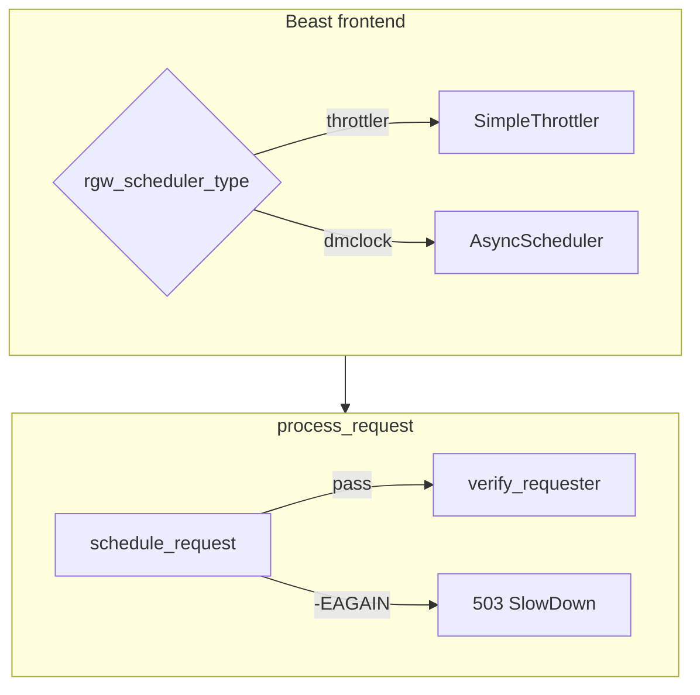

# dmclock / scheduler architecture

Scheduling and QoS at the RGW edge: from **`SimpleThrottler`** (production default) to **dmclock** (experimental). Compare with [tenant rate limits](rate-limit-architecture.md).

| File | Role |
|------|------|
| `rgw_dmclock.h` | `client_id`, `scheduler_t`, scheduler type |
| `rgw_dmclock_scheduler.h` | `Scheduler`, `SchedulerCompleter` (RAII) |
| `rgw_dmclock_async_scheduler.*` | `AsyncScheduler` (Beast) + `SimpleThrottler` |
| `rgw_process.cc` | `schedule_request()` — enforcement point |
| `rgw_asio_frontend.cc` | Builds scheduler in Beast frontend |

| Mechanism | When | Metric | Scope |
|-----------|------|--------|-------|
| **dmclock / throttler** | Before auth | Server pressure / op-class QoS | Per RGW |
| **Rate limit** | After `pre_exec` | Tenant quota (user/bucket) | Per RGW |

Both can return **503 SlowDown** (`-ERR_RATE_LIMITED`) — track separately in logs.

## Overview

## Key config

- `rgw_scheduler_type` — `throttler` (default), `dmclock`, `none`
- `rgw_max_concurrent_requests` — SimpleThrottler cap

## Full detail

The complete Persian deep-dive (code walkthrough, scenarios, edge cases) is in the synced upstream doc: see **فارسی** locale or `src/rgw/docs-extended/pages/architecture/dmclock-architecture.md`.

## Related

- [Scheduling architecture](scheduling-architecture.md)
- [Rate limit architecture](rate-limit-architecture.md)
- [Worker architecture](worker-architecture.md)
