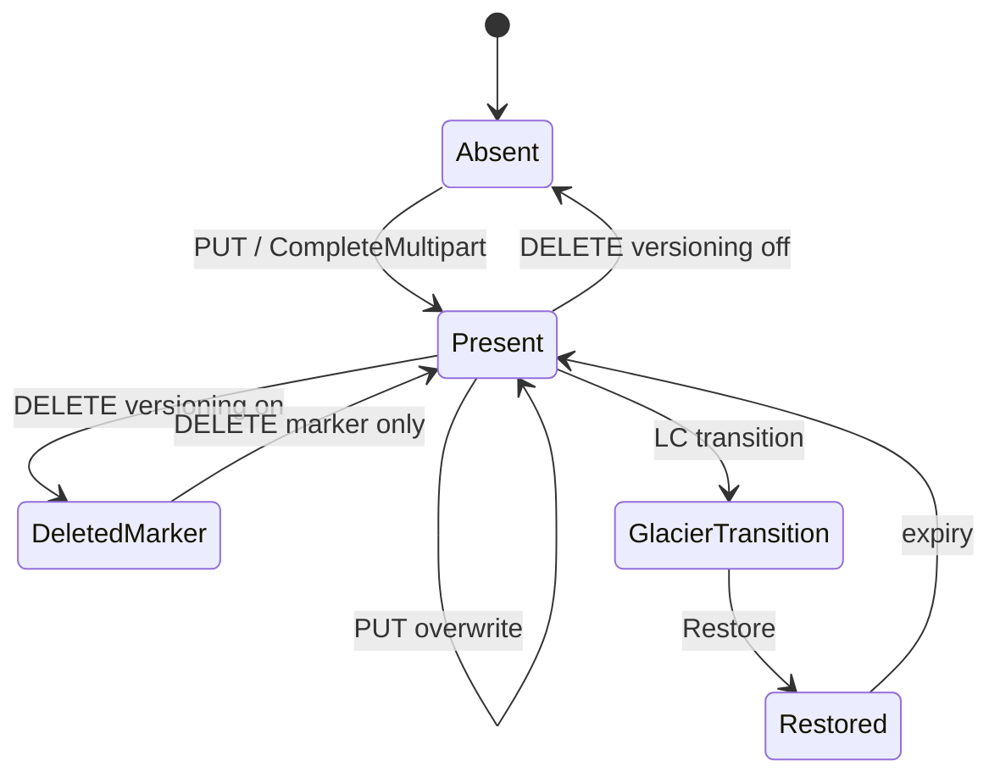

# چرخه عمر شیء

## حالت‌های منطقی

## آپلود ساده (PUT)

1. پارامترها و مجوزها تأیید می‌شوند
2. خط لوله `DataProcessor` (hash، فشرده‌سازی، رمزنگاری)
3. نوشتن در placement pool
4. ثبت در **bucket index**

## Multipart

| مرحله | API | ذخیره |
|-------|-----|--------|
| شروع | `InitMultipartUpload` | متادیتای upload |
| بخش‌ها | `UploadPart` | part objects |
| پایان | `CompleteMultipart` | manifest + index |
| لغو | `AbortMultipart` | پاک‌سازی partها |

## Versioning

با versioning فعال، DELETE معمولاً **delete marker** می‌سازد؛ نسخه‌های قبلی باقی می‌مانند تا LC یا حذف صریح.

## Lifecycle (LC)

`rgw_lc` قوانین transition، expiration و tiering را اجرا می‌کند (coroutine / worker پس‌زمینه).

## GC

اشیاء یتیم و partهای ناقص توسط **garbage collection** در `driver/rados/rgw_gc.*` جمع‌آوری می‌شوند.

## مستندات مرتبط

- [ماژول RADOS](../modules/rados-driver.md)
- [محدودیت‌های HA](critical-gaps-and-ha-limitations.md)
