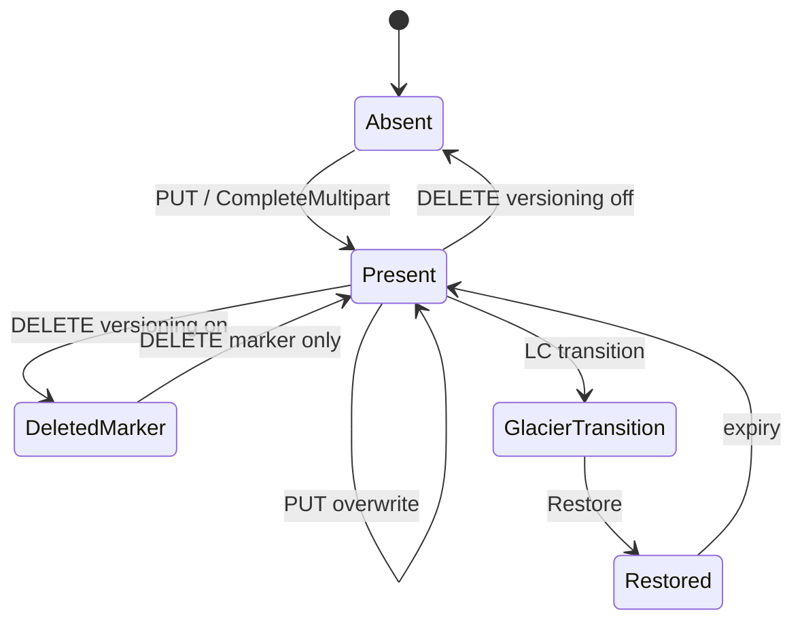

# Object lifecycle

## Logical states

## Simple upload (PUT)

1. Validate params and permissions
2. `DataProcessor` pipeline (hash, compression, encryption)
3. Write to placement pool
4. Record in **bucket index**

## Multipart

| Stage | API | Storage |
|-------|-----|---------|
| Start | `InitMultipartUpload` | upload metadata |
| Parts | `UploadPart` | part objects |
| Complete | `CompleteMultipart` | manifest + index |
| Abort | `AbortMultipart` | cleanup parts |

## Versioning

Delete with versioning enabled creates a **delete marker**; previous versions remain until lifecycle or explicit delete.

## Background work

- **GC** — remove unreferenced data
- **Lifecycle (LC)** — transitions and expiry
- **Reshard** — split hot bucket indexes

## Related

- [RADOS driver module](../modules/rados-driver.md)
- [Request pipeline](request-pipeline.md)
