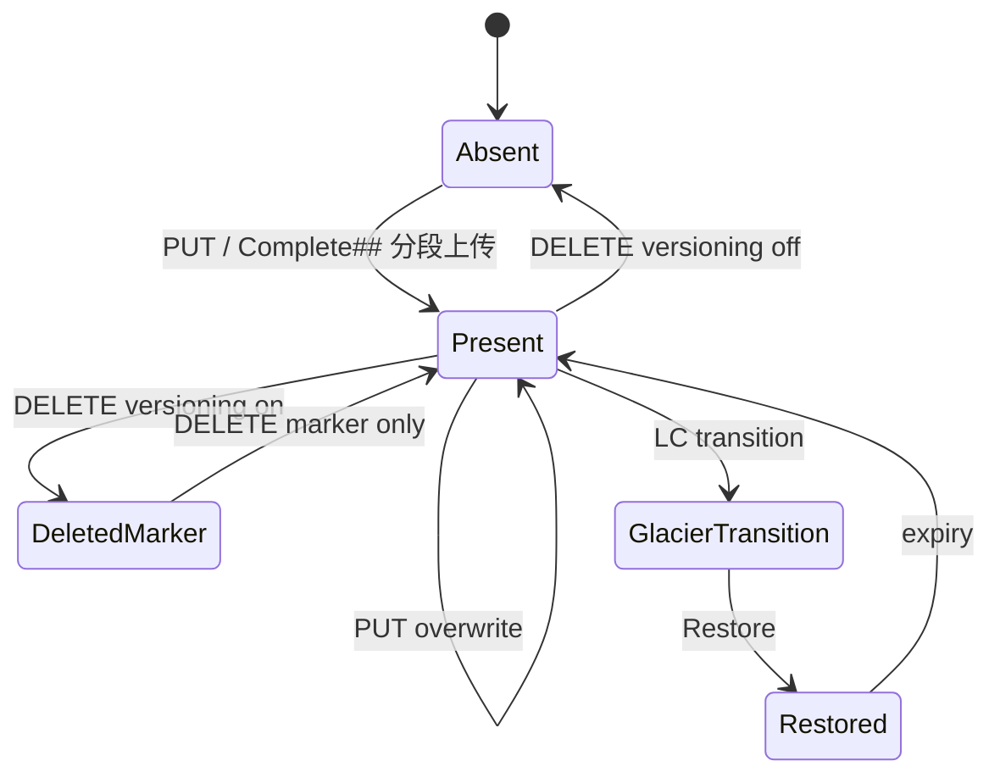

# 对象生命周期

## ## 逻辑状态

## ## 简单上传（PUT）

1. Validate params and permissions
2. `DataProcessor` pipeline (hash, compression, encryption)
3. Write to placement pool
4. Record in **bucket index**

## ## 分段上传

| Stage | API | Storage |
|-------|-----|---------|
| Start | `Init## 分段上传Upload` | upload metadata |
| Parts | `UploadPart` | part objects |
| Complete | `Complete## 分段上传` | manifest + index |
| Abort | `Abort## 分段上传` | cleanup parts |

## ## 版本控制

Delete with versioning enabled creates a **delete marker**; previous versions remain until lifecycle or explicit delete.

## ## 后台任务

- **GC** — remove unreferenced data
- **Lifecycle (LC)** — transitions and expiry
- **Reshard** — split hot bucket indexes

## 相关

- [RADOS driver module](../modules/rados-driver.md)
- [Request pipeline](request-pipeline.md)
