# معماری Rate Limit در RGW

این سند ساختار کامل **rate limiting** در Ceph RADOS Gateway را از لایه داده تا مسیر درخواست HTTP توضیح می‌دهد — با **تفسیر کد**، **سناریوهای عملی** و **رفتار edge case**.

| فایل | نقش |
|------|-----|
| `rgw_ratelimit.h` | موتور token bucket، نگهداری state در حافظه |
| `rgw_process.cc` | تابع `rate_limit()` — نقطه اعمال در pipeline |
| `rgw_rest.cc` | حسابداری bandwidth در `dump_body` / `recv_body` |
| `rgw_rest_ratelimit.{h,cc}` | Admin Ops API برای تنظیم/خواندن |
| `rgw_common.h` | ساختار `RGWRateLimitInfo` و attribute |
| `rgw_zone.h` | ذخیره global rate limit در `RGWPeriodConfig` |

!!! note "تفاوت با dmclock"
    RGW دو مکانیزم جدا دارد که هر دو می‌توانند `-ERR_RATE_LIMITED` (HTTP 503 SlowDown) برگردانند:

    | مکانیزم | محل در pipeline | معیار |
    |---------|-----------------|-------|
    | **dmclock** | قبل از auth (`schedule_request`) | QoS/اولویت سرور |
    | **rate limit** | بعد از auth و `pre_exec` (`rate_limit`) | سهمیه per-user/bucket |

    مستند کامل: [dmclock](dmclock-architecture.md) · [rate limit](rate-limit-architecture.md)

    این سند فقط **rate limit per-user/bucket** را پوشش می‌دهد.

---

## نمای کلی

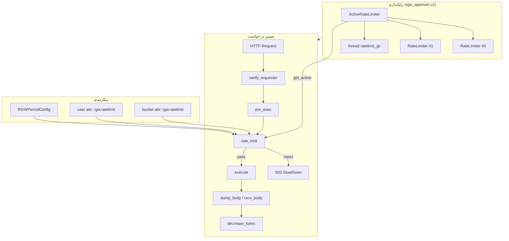
```mermaid
flowchart TB
  subgraph startup ["راه‌اندازی (rgw_appmain.cc)"]
    ARL[ActiveRateLimiter]
    RL0[RateLimiter #0]
    RL1[RateLimiter #1]
    GC[thread ratelimit_gc]
    ARL --> RL0
    ARL --> RL1
    ARL --> GC
  end

  subgraph request ["مسیر درخواست"]
    REQ[HTTP Request] --> AUTH[verify_requester]
    AUTH --> PRE[pre_exec]
    PRE --> RL_CHECK[rate_limit]
    RL_CHECK -->|reject| ERR[503 SlowDown]
    RL_CHECK -->|pass| EXEC[execute]
    EXEC --> IO[dump_body / recv_body]
    IO --> DEC[decrease_bytes]
  end

  subgraph config ["پیکربندی"]
    GLOBAL[RGWPeriodConfig]
    USER_ATTR["user attr: rgw.ratelimit"]
    BUCKET_ATTR["bucket attr: rgw.ratelimit"]
    GLOBAL --> RL_CHECK
    USER_ATTR --> RL_CHECK
    BUCKET_ATTR --> RL_CHECK
  end

  startup --> request
  ARL -->|get_active| RL_CHECK
```

**ایده اصلی:** هر RGW یک **token bucket در حافظه** per user و per bucket نگه می‌دارد. قبل از اجرای عملیات، یک token ops مصرف می‌شود؛ حین انتقال داده، token bytes کم می‌شود. اگر سهمیه تمام شود → `503 SlowDown`.

Rate limit **per-RGW** است: state بین gatewayها share **نمی‌شود**. برای cluster با N gateway فعال، سقف config را بر N تقسیم کنید.

---

## مدل داده: `RGWRateLimitInfo`

### تعریف ساختار

```cpp linenums="575" title="rgw_common.h — RGWRateLimitInfo"
[`rgw_common.h`](https://github.com/ceph/ceph/blob/main/src/rgw/rgw_common.h#L575-L621)
```

### تفسیر فیلدها

| فیلد | واحد | معنی عملیاتی |
|------|------|--------------|
| `max_read_ops` | ops / interval | سقف GET/HEAD در هر `rgw_ratelimit_interval` |
| `max_write_ops` | ops / interval | سقف PUT/POST/… (همه غیر read/list/delete) |
| `max_list_ops` | ops / interval | سقف LIST bucket (GET با query list) |
| `max_delete_ops` | ops / interval | سقف DELETE تکی |
| `max_read_bytes` | bytes / interval | حجم خروجی (download) |
| `max_write_bytes` | bytes / interval | حجم ورودی (upload) |
| `enabled` | bool | بدون این، هیچ محدودیتی اعمال **نمی‌شود** |

**قانون صفر = نامحدود:** `max_* = 0` یعنی آن بعد throttle **نمی‌شود**. برای فعال‌سازی واقعی باید `enabled=true` **و** حداقل یک `max_* > 0` باشد.

**ذخیره‌سازی:** attribute `"rgw.ratelimit"` (`RGW_ATTR_RATELIMIT`) روی user یا bucket؛ global در `RGWPeriodConfig` داخل period realm.

### نسخه‌بندی encode

ساختار encode نسخه ۲ دارد. فیلدهای `max_list_ops` و `max_delete_ops` فقط در `struct_v >= 2` decode می‌شوند؛ period/user/bucket قدیمی بدون این فیلدها → مقدار ۰ (نامحدود برای list/delete).

### سناریو پیکربندی: سه لایه limit

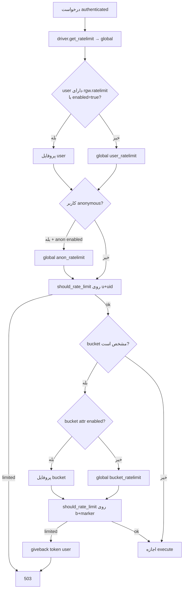
```mermaid
flowchart TD
  START[درخواست authenticated] --> LOAD_G[driver.get_ratelimit → global]
  LOAD_G --> USER_ATTR{user دارای rgw.ratelimit<br/>با enabled=true?}
  USER_ATTR -->|بله| U_CFG[پروفایل user]
  USER_ATTR -->|خیر| U_G[global user_ratelimit]
  U_CFG --> ANON{کاربر anonymous?}
  U_G --> ANON
  ANON -->|بله + anon enabled| ANON_CFG[global anon_ratelimit]
  ANON -->|خیر| CHECK_U[should_rate_limit روی u+uid]
  ANON_CFG --> CHECK_U
  CHECK_U -->|limited| REJECT[503]
  CHECK_U -->|ok| BUCKET{bucket مشخص است?}
  BUCKET -->|بله| B_ATTR{bucket attr enabled?}
  B_ATTR -->|بله| B_CFG[پروفایل bucket]
  B_ATTR -->|خیر| B_G[global bucket_ratelimit]
  B_CFG --> CHECK_B[should_rate_limit روی b+marker]
  B_G --> CHECK_B
  CHECK_B -->|limited| GIVEBACK[giveback token user]
  GIVEBACK --> REJECT
  CHECK_B -->|ok| PASS[اجازه execute]
  BUCKET -->|خیر| PASS
```

**مثال عددی:**

- Global user: `max_read_ops=100`, `enabled=true`
- User `alice` attr: `max_read_ops=20`, `enabled=true` → alice محدود به **20** است
- User `bob` بدون attr → محدود به **100** global
- Bucket `logs` attr: `max_read_ops=5`, `enabled=true` → هر درخواست read روی `logs` **هم** user **هم** bucket چک می‌شود

---

## لایه‌های پیکربندی (کد)

### Global — `RGWPeriodConfig`

```cpp linenums="430" title="rgw_zone.h — RGWPeriodConfig"
[`rgw_zone.h`](https://github.com/ceph/ceph/blob/main/src/rgw/rgw_zone.h#L430-L433)
```

```cpp linenums="2482" title="driver/rados/rgw_sal_rados.cc — get_ratelimit"
[`driver/rados/rgw_sal_rados.cc`](https://github.com/ceph/ceph/blob/main/src/rgw/driver/rados/rgw_sal_rados.cc#L2482-L2487)
```

هر RGW period فعلی zone را cache دارد؛ `get_ratelimit` سه پروفایل global را برمی‌گرداند. تغییر global در multisite نیاز به `period update --commit` دارد.

### Per-user override

```cpp linenums="130" title="rgw_process.cc — override user limit"
[`rgw_process.cc`](https://github.com/ceph/ceph/blob/main/src/rgw/rgw_process.cc#L130-L132)
```

فقط `enabled=true` در attribute باعث override می‌شود. اگر admin limit را set کند ولی `enabled=false` بگذارد، global همچنان حاکم است.

### Anonymous

```cpp linenums="140" title="rgw_process.cc — anonymous global"
[`rgw_process.cc`](https://github.com/ceph/ceph/blob/main/src/rgw/rgw_process.cc#L140-L142)
```

برای درخواست‌های بدون احراز هویت S3، user id برابر `RGW_USER_ANON_ID` است و `anon_ratelimit` global (اگر enabled) جایگزین user limit می‌شود.

---

## موتور token bucket — تفسیر کامل

### ساختار داخلی `RateLimiterEntry`

```cpp linenums="20" title="rgw_ratelimit.h — counters"
[`rgw_ratelimit.h`](https://github.com/ceph/ceph/blob/main/src/rgw/rgw_ratelimit.h#L20-L30)
```

هر entry **۶ شمارنده مستقل** دارد:

| شمارنده | نوع محدودیت |
|---------|-------------|
| `read.ops` / `read.bytes` | GET, HEAD |
| `write.ops` / `write.bytes` | PUT, POST, … |
| `list.ops` | LIST bucket |
| `del.ops` | DELETE |

ops و bytes **مستقل** هستند: رسیدن به سقف bytes، ops را block نمی‌کند (مگر هر دو سقف تنظیم شده باشند).

### Fixed-point — چرا ×1000؟

```cpp linenums="18" title="rgw_ratelimit.h — fixed-point scale"
[`rgw_ratelimit.h`](https://github.com/ceph/ceph/blob/main/src/rgw/rgw_ratelimit.h#L18-L18)
```

کامنت داخل کد سناریوی canonical را توضیح می‌دهد:

> کاربر `max_read_ops=1` per minute دارد. token را مصرف می‌کند. ۱ ثانیه بعد درخواست جدید می‌فرستد.
> بدون fixed-point → ۰ token (integer truncation).
> با fixed-point → `0.016 × 1000 = 16` واحد اضافه می‌شود؛ در مقایسه `16/1000 = 0` → هنوز block؛ بعد از ~۶۰ ثانیه → ۱ op کامل.

**تبدیل:** `read_ops()` = `read.ops / 1000` (بخش صحیح token).

### Refill — `increase_tokens`

```cpp linenums="113" title="rgw_ratelimit.h — increase_tokens"
[`rgw_ratelimit.h`](https://github.com/ceph/ceph/blob/main/src/rgw/rgw_ratelimit.h#L113-L147)
```

**گام‌به‌گام:**

1. **`first_run`:** تمام باکت‌ها = `max_* × 1000`. کاربر جدید با «سقف کامل» شروع می‌کند (نه صفر).
2. **`minimum_time_reached`:** حداقل `interval/1000` ثانیه باید گذشته باشد تا refill انجام شود (جلوگیری از از دست رفتن token به خاطر rounding).
3. **محاسبه `time_in_ms`:** نسبت زمان سپری‌شده به `rgw_ratelimit_interval`، scaled به fixed-point.
4. **اضافه + cap:** `min(max × 1000, فعلی + max × time_in_ms)` — burst حداکثر یک interval کامل.

**فرمول refill (ساده‌شده):**

```
tokens_added = max_limit × (elapsed_sec / rgw_ratelimit_interval) × 1000
new_counter  = min(max_limit × 1000, current + tokens_added)
```

### بررسی ops — `should_rate_limit_read`

```cpp linenums="56" title="rgw_ratelimit.h — should_rate_limit_read"
[`rgw_ratelimit.h`](https://github.com/ceph/ceph/blob/main/src/rgw/rgw_ratelimit.h#L56-L66)
```

**تفسیر شرط reject (`return true`):**

| شرط | معنی |
|-----|------|
| `(read_ops() - 1 < 0) && ops_limit > 0` | کمتر از ۱ op کامل مانده |
| `read_bytes() < 0 && bw_limit > 0` | بدهی bandwidth (از transfer قبلی) |

**نکته مهم:** اگر reject شود، `read.ops -= 1000` اجرا **نمی‌شود** — token ops هدر نمی‌رود. فقط درخواست‌های **پذیرفته‌شده** ops مصرف می‌کنند.

همین الگو برای write/list/delete تکرار شده (`should_rate_limit_write`, `_list`, `_delete`).

### نقطه ورود — `should_rate_limit` در entry

```cpp linenums="150" title="rgw_ratelimit.h — should_rate_limit (entry)"
[`rgw_ratelimit.h`](https://github.com/ceph/ceph/blob/main/src/rgw/rgw_ratelimit.h#L150-L165)
```

ترتیب: **lock → refill → check**. همه در یک mutex (`ts_lock`) تا race بین refill و consume نباشد.

### Bandwidth — `decrease_bytes`

```cpp linenums="166" title="rgw_ratelimit.h — decrease_bytes"
[`rgw_ratelimit.h`](https://github.com/ceph/ceph/blob/main/src/rgw/rgw_ratelimit.h#L166-L175)
```

- هر chunk I/O (در `dump_body`/`recv_body`) `amount × 1000` از `read.bytes` یا `write.bytes` کم می‌کند.
- **کف بدهی:** `-2 × max_*_bytes × 1000` — حداکثر ۲ interval بدهی (۱۲۰ ثانیه با interval=60).
- bytes **بعد از** پذیرش درخواست حساب می‌شود؛ درخواست جاری کامل می‌شود، درخواست بعدی block می‌شود.

---

## سناریو ۱ — محدودیت ops (۱ read op per minute)

**پیکربندی:** `enabled=true`, `max_read_ops=1`, `rgw_ratelimit_interval=60`

| زمان | رویداد | `read.ops` (fixed) | `read_ops()` | نتیجه |
|------|--------|-------------------|--------------|-------|
| T+0s | اولین GET | 1000 → 0 (مصرف) | 1→0 | **pass** |
| T+1s | GET دوم | refill ≈ +16 | 0 | **reject** (503) |
| T+61s | GET سوم | refill ≈ +1000 (cap) | 1→0 | **pass** |

```cpp linenums="100" title="rgw_ratelimit.h — minimum_time_reached"
[`rgw_ratelimit.h`](https://github.com/ceph/ceph/blob/main/src/rgw/rgw_ratelimit.h#L100-L110)
```

بین T+1s و T+61s، refillهای جزئی انباشته می‌شوند ولی تا رسیدن به ۱ op کامل، `read_ops() - 1 < 0` باقی می‌ماند.

---

## سناریو ۲ — User limit vs Bucket limit (OR + giveback)

**پیکربندی:**

- User `alice`: `max_read_ops=10`, `enabled=true`
- Bucket `data`: `max_read_ops=2`, `enabled=true`

| مرحله | عمل | توضیح |
|-------|-----|-------|
| 1 | GET روی `data` — درخواست ۱ | user: 10→9 ✓, bucket: 2→1 ✓ |
| 2 | GET روی `data` — درخواست ۲ | user: 9→8 ✓, bucket: 1→0 ✓ |
| 3 | GET روی `data` — درخواست ۳ | user: 8→7 ✓, **bucket: reject** |
| 3b | giveback | token user (7→8) برگردانده می‌شود چون محدودیت از bucket بود |

```cpp linenums="143" title="rgw_process.cc — user/bucket check"
[`rgw_process.cc`](https://github.com/ceph/ceph/blob/main/src/rgw/rgw_process.cc#L143-L172)
```

**منطق:**

- ابتدا **همیشه** user چک می‌شود (و token مصرف می‌شود).
- bucket فقط اگر user pass کرد چک می‌شود.
- اگر bucket fail کرد → `giveback_tokens` برای user تا alice بی‌دلیل penalize نشود.
- اگر user fail کرد → bucket اصلاً چک نمی‌شود.

**سناریوی معکوس:** user به ۰ رسیده، bucket هنوز سهمیه دارد → **reject** (user محدودکننده است، givebackی نیست).

---

## سناریو ۳ — Bandwidth debt (GET فایل بزرگ)

**پیکربندی:** `max_read_bytes=1`, `enabled=true`, interval=60

| مرحله | رویداد | رفتار |
|-------|--------|-------|
| 1 | GET object 2GB | ops check: pass (ops نامحدود) |
| 2 | `dump_body` stream | `decrease_bytes(2GB)` → `read.bytes` heavily negative |
| 3 | GET بعدی | `read_bytes() < 0` → **reject** قبل از transfer |
| 4 | T+121s | refill جبران بدهی (cap at -2×limit) → pass مجدد |

```cpp linenums="795" title="rgw_rest.cc — decrease_bytes در dump_body"
[`rgw_rest.cc`](https://github.com/ceph/ceph/blob/main/src/rgw/rgw_rest.cc#L795-L799)
```

**نکته عملیاتی:** transfer بزرگ **کامل** می‌شود (accounting بعد از accept). کاربر تا ۲ interval block می‌ماند حتی اگر object یک بار download شده باشد.

---

## سناریو ۴ — LIST جدا از GET

**پیکربندی:** `max_list_ops=1`, `max_read_ops=10`, هر دو enabled

| درخواست | `request_params` | OpType | باکت |
|---------|------------------|--------|------|
| `GET /bucket/obj` | (خالی) | Read | `read.ops` |
| `GET /bucket?list-type=2&prefix=foo` | شامل `list-type=` | List | `list.ops` |
| `GET /bucket?delimiter=/` | شامل `delimiter=` | List | `list.ops` |

```cpp linenums="210" title="rgw_ratelimit.h — op_type"
[`rgw_ratelimit.h`](https://github.com/ceph/ceph/blob/main/src/rgw/rgw_ratelimit.h#L210-L228)
```

LIST فقط وقتی `max_list_ops > 0` باشد تشخیص داده می‌شود. اگر list limit=0 (نامحدود)، GET list به عنوان **Read** حساب می‌شود.

**سناریو:** ۱ list op مصرف شد → GET object عادی همچنان از `max_read_ops` استفاده می‌کند (باکت جدا).

---

## سناریو ۵ — Cluster چند RGW

**خواسته:** 100 read ops/min برای user در کل cluster
**RGW فعال:** 4 instance

```
max_read_ops_per_rgw = 100 / 4 = 25
```

هر RGW state مستقل دارد. LB round-robin → ~100 cluster-wide. LB sticky به یک RGW → effective limit = 25.

---

## سناریو ۶ — GC و memory pressure

```cpp linenums="198" title="rgw_ratelimit.h — hash map"
[`rgw_ratelimit.h`](https://github.com/ceph/ceph/blob/main/src/rgw/rgw_ratelimit.h#L198-L203)
```

وقتی `ratelimit_entries.size() > 1.8M` (90% of 2M):

```cpp linenums="232" title="rgw_ratelimit.h — find_or_create trigger"
[`rgw_ratelimit.h`](https://github.com/ceph/ceph/blob/main/src/rgw/rgw_ratelimit.h#L232-L248)
```

1. `replacing = true` → notify thread `ratelimit_gc`
2. GC: `current_active ^= 1` — درخواست‌های جدید به map تازه
3. منتظر می‌ماند تا passive `use_count() == 1` (هیچ request فعالی ندارد)
4. `passive->clear()` — تمام counters صفر می‌شوند
5. `replacing = false`

```cpp linenums="309" title="rgw_ratelimit.h — ActiveRateLimiter"
[`rgw_ratelimit.h`](https://github.com/ceph/ceph/blob/main/src/rgw/rgw_ratelimit.h#L309-L339)
```

**اثر:** بعد از GC، همه user/bucket دوباره با `first_run` (سقف کامل) شروع می‌کنند — **موقت burst** ممکن است.

---

## `RateLimiter` — لایه hash map

### کلیدها و فیلتر

```cpp linenums="266" title="rgw_ratelimit.h — should_rate_limit (RateLimiter)"
[`rgw_ratelimit.h`](https://github.com/ceph/ceph/blob/main/src/rgw/rgw_ratelimit.h#L266-L276)
```

| شرط | اثر |
|-----|-----|
| `key.empty()` | skip — بدون limit |
| `key.length() == 1` | skip — برای تست GC از keyهای `-1`, `0`, … |
| `!ratelimit_info->enabled` | skip |

### `decrease_bytes` در RateLimiter

```cpp linenums="283" title="rgw_ratelimit.h — decrease_bytes (RateLimiter)"
[`rgw_ratelimit.h`](https://github.com/ceph/ceph/blob/main/src/rgw/rgw_ratelimit.h#L283-L300)
```

- LIST/DELETE روی bytes اثر ندارند.
- اگر `max_read_bytes=0` → early return (bytes نامحدود).

---

## مسیر درخواست — timeline کامل

### ۱. Bootstrap

```cpp linenums="300" title="rgw_process.cc — attach active limiter"
[`rgw_process.cc`](https://github.com/ceph/ceph/blob/main/src/rgw/rgw_process.cc#L300-L300)
```

هر `req_state` اشاره‌گر به `RateLimiter` فعال (shared_ptr) می‌گیرد. GC می‌تواند active را عوض کند؛ requestهای در حال اجرا passive را نگه می‌دارند.

### ۲. نقطه enforce

```cpp linenums="260" title="rgw_process.cc — enforce rate limit"
[`rgw_process.cc`](https://github.com/ceph/ceph/blob/main/src/rgw/rgw_process.cc#L260-L263)
```

**بعد از:** `init_permissions`, `retarget`, `read_permissions`, `pre_exec`
**قبل از:** `execute()`

معاف: health check، system request (replication/admin داخلی).

### ۳. تابع کامل `rate_limit`

```cpp linenums="95" title="rgw_process.cc — rate_limit (شروع)"
[`rgw_process.cc`](https://github.com/ceph/ceph/blob/main/src/rgw/rgw_process.cc#L95-L173)
```

**تفسیر خط‌به‌خط:**

| خطوط | کار |
|------|-----|
| 97–98 | health/system → بدون limit |
| 105–107 | بارگذاری global از period |
| 108–112 | ساخت کلید `u{uid}` و `b{marker}` |
| 115–122 | STS role: refresh attrs قبل از decode |
| 123–139 | decode user attr، override اگر enabled |
| 140–142 | anonymous → anon global |
| 144 | check user + مصرف token |
| 146–165 | decode bucket attr، check bucket اگر user ok |
| 167–169 | giveback اگر فقط bucket limited |
| 170–172 | ذخیره در `s->user_ratelimit` / `bucket_ratelimit` برای I/O بعدی |

### ۴. پاسخ HTTP

```cpp title="rgw_common.cc — HTTP mapping"
{ ERR_RATE_LIMITED, {503, "SlowDown"}},
```

S3 clients باید exponential backoff کنند (AWS SlowDown semantics).

---

## سناریو ۷ — PUT upload با ops + bytes

**پیکربندی:** `max_write_ops=5`, `max_write_bytes=1MB`, interval=60

| مرحله | رویداد |
|-------|--------|
| 1 | PUT 10MB — ops: pass (5→4) |
| 2 | `recv_body` chunks | هر chunk `decrease_bytes` → bytes منفی |
| 3 | PUT بعدی (فوری) | ops: pass (4→3), **bytes: reject** (`write_bytes() < 0`) |
| 4 | بعد از refill | هر دو dimension جبران می‌شوند |

ops و bytes **هر دو** باید pass کنند (`should_rate_limit_write` هر دو را AND می‌کند).

---

## سناریو ۸ — enabled=false vs max=0

| حالت | `enabled` | `max_read_ops` | نتیجه |
|------|-----------|----------------|-------|
| A | false | 100 | **بدون limit** (should_rate_limit early return) |
| B | true | 0 | **نامحدود ops** (شرط `ops_limit > 0` false) |
| C | true | 100 | limit فعال |
| D | false | 0 | بدون limit |

---

## پیکربندی و مدیریت

### Option

| Option | پیش‌فرض | توضیح |
|--------|---------|-------|
| `rgw_ratelimit_interval` | 60 sec | پنجره accumulation؛ token bucket window |

### CLI

```bash
# user — limit 50 read ops per interval per RGW
radosgw-admin ratelimit set --ratelimit-scope=user --uid=alice \
  --max-read-ops=50 --enabled=true

# bucket
radosgw-admin ratelimit set --ratelimit-scope=bucket --bucket=logs \
  --max-read-ops=10 --max-read-bytes=1048576 --enabled=true

# global (multisite)
radosgw-admin global ratelimit set --ratelimit-scope=anon \
  --max-read-ops=5 --enabled=true
radosgw-admin period update --commit
```

### Admin Ops REST

| Operation | متد | Capability |
|-----------|-----|------------|
| Get | GET `/{admin}/ratelimit?...` | `ratelimit=read` |
| Set | POST `/{admin}/ratelimit?...` | `ratelimit=write` |

Set global → forward به master zonegroup + `write_period_config`.

---

## جدول edge case (از unit test)

| سناریو | رفتار مورد انتظار | تست |
|--------|-------------------|-----|
| `enabled=false` | همیشه pass | `op_limit_not_enabled` |
| reject ops | token مصرف **نمی‌شود** | `reject_op_over_limit` |
| giveback بعد از reject bucket | user token برمی‌گردد | `accept_op_after_giveback` |
| refill 61s با limit=1/min | pass | `accept_op_after_refill` |
| bytes debt > 2×interval | بعد refill pass | `check_bw_debt_at_max_120secs` |
| high bytes, low ops | ops همچنان limit | `check_that_bw_limit_not_affect_ops` |
| read limit ≠ write | مستقل | `read_limit_does_not_affect_writes` |
| list limit ≠ read | مستقل | `list_limit_does_not_affect_reads` |
| GC at 2M keys | active instance عوض | `GC_IS_WORKING` |

---

## مشکلات طراحی و راه‌کارها

rate limit داخلی RGW برای **throttle سبک per-gateway** طراحی شده، نه invoice دقیق tenant یا سقف سخت non-bypassable. در این بخش **همه** محدودیت‌های شناخته‌شده — از معماری distributed state تا باگ‌های edge case — را جمع می‌کنیم. هر مورد در **تحلیل کامل — موارد ۱ تا ۲۱** با سناریو، کد، نمودار، و راه‌کار عملیاتی باز شده است.

### طبقه‌بندی کامل مشکلات

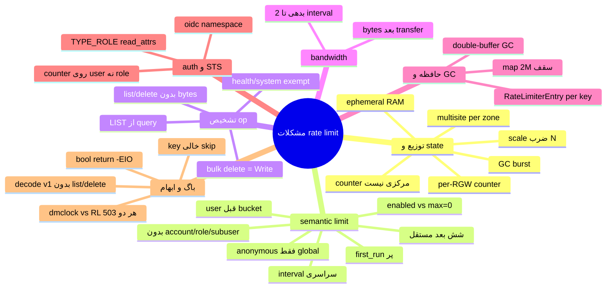
```mermaid
mindmap
  root((مشکلات rate limit))
    توزیع و state
      per-RGW counter
      scale ضرب N
      multisite per zone
      ephemeral RAM
      GC burst
      counter مرکزی نیست
    semantic limit
      user قبل bucket
      enabled vs max=0
      شش بعد مستقل
      first_run پر
      interval سراسری
      anonymous فقط global
      بدون account/role/subuser
    تشخیص op
      LIST از query
      bulk delete = Write
      list/delete بدون bytes
      health/system exempt
    bandwidth
      bytes بعد transfer
      بدهی تا 2 interval
    حافظه و GC
      RateLimiterEntry per key
      map 2M سقف
      double-buffer GC
    auth و STS
      TYPE_ROLE read_attrs
      counter روی user نه role
      oidc namespace
    باگ و ابهام
      bool return -EIO
      dmclock vs RL هر دو 503
      decode v1 بدون list/delete
      key خالی skip
```

| # | دسته | مشکل | راه‌کار خلاصه |
|---|------|------|----------------|
| ۱ | توزیع | counter per-RGW + LB rotation | limit ÷ N؛ counter مرکزی |
| ۲ | توزیع | سقف cluster = limit × N | recalc در autoscale |
| ۳ | توزیع | multisite — مصرف replicate نمی‌شود | limit per zone؛ gateway |
| ۴ | تشخیص | LIST فقط با query pattern | `max_read_ops` هم؛ dmclock |
| ۵ | تشخیص | Multi-Object Delete = Write | `max_write_ops` |
| ۶ | حافظه | GC map → reset همه counter | selective enable |
| ۷ | bandwidth | bytes بعد از transfer | ops limit؛ pre-check size |
| ۸ | semantic | user قبل bucket | user limit بالاتر |
| ۹ | config | global period vs RAM counter | period commit؛ restart/GC |
| ۱۰ | STS | session token — user نه role | limit روی uid؛ read_attrs |
| ۱۱ | semantic | `enabled=false` → بدون limit | `enabled=true` + max>0 |
| ۱۲ | semantic | `max_*=0` → نامحدود آن بعد | هر بعد را صریح set |
| ۱۳ | semantic | read/write/list/delete مستقل | همه بعدها را تنظیم |
| ۱۴ | state | `first_run` — entry جدید سقف کامل | در burst بعد GC |
| ۱۵ | معافیت | health check / system request | monitoring جدا |
| ۱۶ | QoS | dmclock (pre-auth) vs RL (post-auth) | log/trace؛ دو لایه |
| ۱۷ | باگ | decode error → 503 اشتباه | repair attr؛ fix کد |
| ۱۸ | نسخه | struct_v<2 بدون list/delete | migrate attr |
| ۱۹ | config | `rgw_ratelimit_interval` سراسری | ÷ N؛ interval یکسان realm |
| ۲۰ | کلید | key خالی/کوتاه → skip limit | uid معتبر |
| ۲۱ | مدل | بدون limit account/role/subuser | user یا لایه بیرونی |

### پیش‌زمینه: config و counter دو لایه جدا

| چیز | کجا ذخیره می‌شود؟ | مثل چه چیزی است؟ |
|-----|-------------------|------------------|
| **تنظیمات limit** (`RGWRateLimitInfo`) | RADOS — روی user/bucket یا period | «قانون: هر دقیقه ۱۰۰ درخواست» — روی کاغذ ماندگار |
| **شمارنده مصرف** (token counter) | RAM هر `radosgw` | «تعداد بلیت باقی‌مانده امروز» — فقط در حافظه همان gateway |

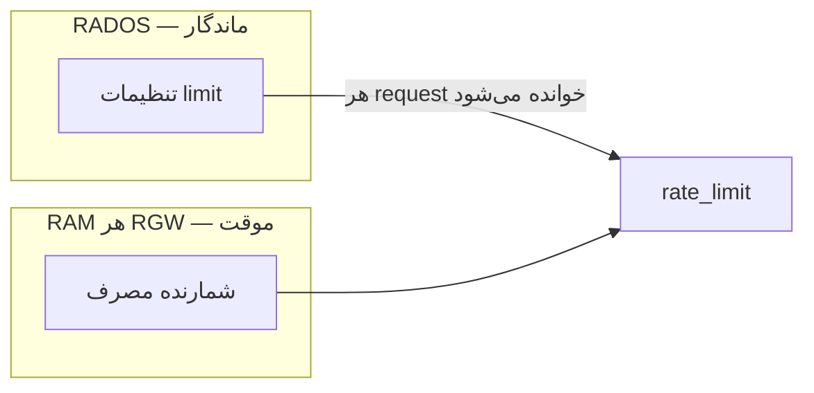
```mermaid
flowchart LR
  subgraph rados ["RADOS — ماندگار"]
    CFG[تنظیمات limit]
  end
  subgraph ram ["RAM هر RGW — موقت"]
    CTR[شمارنده مصرف]
  end
  CFG -->|هر request خوانده می‌شود| RL[rate_limit]
  CTR --> RL
```

**نتیجه:** config در RADOS ماندگار است؛ counter در RAM هر gateway موقت است — پایهٔ اکثر مشکلات توزیع (۱–۳، ۶، ۹، ۱۴).

---

## تحلیل کامل محدودیت‌ها — موارد ۱ تا ۲۱

در ادامه هر یک از **۲۱ محدودیت** فهرست بالا را با سناریوی production، تحلیل کد، و — در جاهای لازم — نمودار شرح می‌دهیم. متن به‌صورت پیوسته نوشته شده تا بتوانید هر مورد را مستقل بخوانید؛ در عین حال مشکلات توزیع (۱–۳)، semantic (۸، ۱۱–۱۳)، و STS (۱۰) با هم در یک cluster واقعی هم‌زمان دیده می‌شوند.

---

### ۱. محدودیت per-RGW، LIST سنگین، و چرخش بین gatewayها

فرض کنید چهار `radosgw` پشت Load Balancer دارید و روی user سقف `max_list_ops=10` در هر interval گذاشته‌اید. client با round-robin درخواست می‌زند: درخواست اول به RGW-1 می‌رود و یک token list مصرف می‌شود؛ درخواست دوم به RGW-2 — آنجا hash map مستقل است و counter از صفر شروع می‌کند. از دید **کل cluster**، user می‌تواند تا حدود **۴ × ۱۰ = ۴۰** list op در همان پنجره بفرستد، نه ۱۰. این رفتار ریشه در طراحی دارد: `ActiveRateLimiter` برای هر process یک `RateLimiter` فعال در RAM نگه می‌دارد و state بین gatewayها **sync نمی‌شود**.

همین user روی bucket بسیار بزرگ `GET ?list-type=2&...` می‌زند. rate limit فقط **یک** op token از `list.ops` می‌گیرد، در حالی که RGW ممکن است ثانیه‌ها روی bucket index کار کند و CPU/RADOS تحت فشار برود. client — یا مهاجم — همان LIST را به gateway بعدی می‌فرستد؛ آنجا counter تازه است و بار ادامه پیدا می‌کند. از نظر **منابع سرور** RGW «در کما» می‌رود؛ از نظر **rate limit** فقط یک op شمرده شده. برای محافظت واقعی LIST DoS به `max_list_ops` پایین **و** [dmclock](dmclock-architecture.md) (فشار pre-auth) نیاز دارید.

اگر `max_read_ops=1` با `enabled=true` بگذارید، بین دو restart یا GC روی **همان RGW** بعد از یک درخواست block می‌شود. بعد از restart process یا GC map (مورد ۶)، `first_run` token bucket را دوباره پر می‌کند — **burst موقت**. مقدار **۰** در config یعنی آن بعد نامحدود (`ops_limit > 0` شرط reject).

```cpp linenums="217" title="rgw_ratelimit.h — تشخیص LIST"
[`rgw_ratelimit.h`](https://github.com/ceph/ceph/blob/main/src/rgw/rgw_ratelimit.h#L217-L219)
```

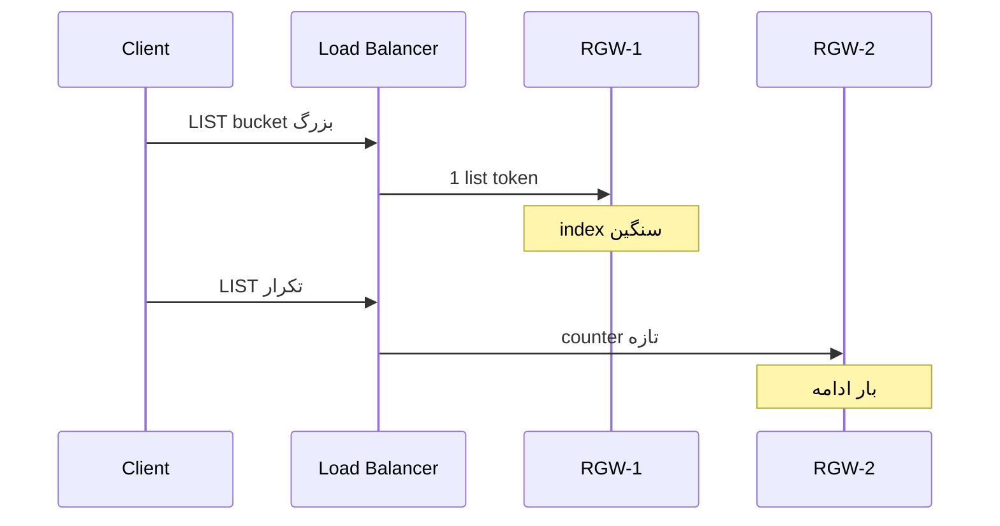
```mermaid
sequenceDiagram
  participant A as Client
  participant LB as Load Balancer
  participant R1 as RGW-1
  participant R2 as RGW-2
  A->>LB: LIST bucket بزرگ
  LB->>R1: 1 list token
  Note over R1: index سنگین
  A->>LB: LIST تکرار
  LB->>R2: counter تازه
  Note over R2: بار ادامه
```

**راه‌کار:** limit config را **÷ N** (تعداد RGW فعال) تنظیم کنید؛ `max_list_ops` را برای LIST واقعی پایین بگذارید؛ dmclock را فعال کنید. برای SLA سخت tenant به counter مرکزی (Redis/hybrid) نیاز است.

---

### ۲. سقف cluster = limit × تعداد RGW

هدف عملیاتی اغلب این است: «کل cluster حداکثر ۱۰۰ read op در دقیقه بپذیرد.» admin روی global یا user `max_read_ops=100` می‌گذارد و چهار RGW دارد. در عمل **هر** RGW تا ۱۰۰ op در window خود می‌پذیرد — cluster تا **۴۰۰** op. autoscale دو RGW بدون recalc config: سقف cluster ناگهان **۶۰۰** می‌شود. مستندات upstream Ceph صریح recommend می‌کند: **limit ÷ N**.

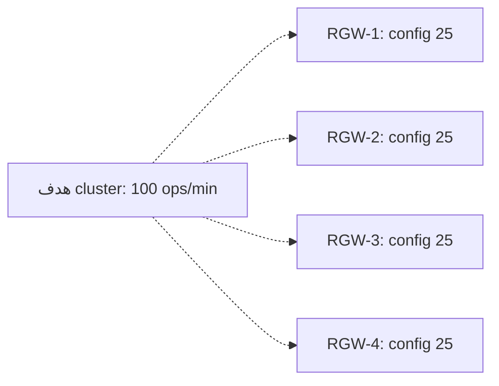
```mermaid
flowchart LR
  T["هدف cluster: 100 ops/min"]
  R1["RGW-1: config 25"]
  R2["RGW-2: config 25"]
  R3["RGW-3: config 25"]
  R4["RGW-4: config 25"]
  T -.-> R1 & R2 & R3 & R4
```

**راه‌کار:** در runbook autoscale، هر بار اضافه/کم شدن RGW، `limit ÷ N` را recalc کنید. فرمول: `limit_per_rgw = سقف_مطلوب_cluster / N`.

---

### ۳. multisite — counter per region/zone

در realm دو zone دارید؛ global rate limit در `RGWPeriodConfig` تنظیم و با `period update --commit` replicate شده. user روی endpoint zone A تا سقف read op می‌رسد و 503 SlowDown می‌گیرد. همان access key را به endpoint zone B می‌زند — آنجا counter در RAM تازه است و درخواست‌ها دوباره pass می‌شوند. **config** (قوانین limit) در period replicate می‌شود؛ **مصرف** (token counter) replicate **نمی‌شود**.

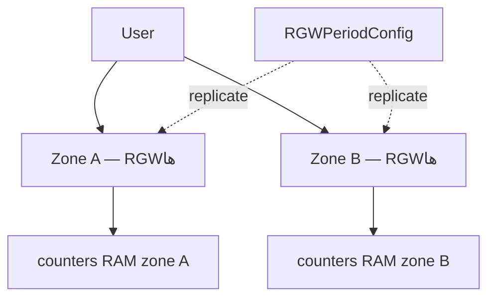
```mermaid
flowchart TB
  U[User] --> ZA[Zone A — RGWها]
  U --> ZB[Zone B — RGWها]
  ZA --> CA[counters RAM zone A]
  ZB --> CB[counters RAM zone B]
  P[RGWPeriodConfig] -.->|replicate| ZA
  P -.->|replicate| ZB
```

**راه‌کار:** در طراحی multisite limit را per zone در نظر بگیرید، gateway/API مرکزی بگذارید، یا bypass بین zone را در مدل تهدید بپذیرید.

---

### ۴. تفکیک operation — LIST از query، بقیه از method

تابع `op_type` نوع عملیات را برای rate limit تعیین می‌کند. LIST فقط وقتی شناخته می‌شود که method `GET` باشد **و** query string شامل یکی از `list-type=`، `prefix=`، یا `delimiter=` باشد. `GET /bucket` بدون این patternها → **Read**؛ `GET /bucket?marker=abc` بدون `list-type` → باز **Read**. admin فقط `max_list_ops=5` گذاشته و `max_read_ops=0` (نامحدود): client با LIST «پنهان» (GET بدون pattern list) سقف list را دور می‌زند و در عوض under `max_read_ops` نامحدود قرار می‌گیرد.

```cpp linenums="210" title="rgw_ratelimit.h — op_type"
[`rgw_ratelimit.h`](https://github.com/ceph/ceph/blob/main/src/rgw/rgw_ratelimit.h#L210-L228)
```

| درخواست نمونه | OpType | limit اعمال‌شده |
|---------------|--------|-----------------|
| `GET /b?list-type=2` | List | `max_list_ops` |
| `GET /b` | Read | `max_read_ops` |
| `DELETE /b/obj` | Delete | `max_delete_ops` (اگر >0) |
| `POST /b?delete` | Write | `max_write_ops` |

**راه‌کار:** برای پوشش LIST واقعی و شبه-LIST، `max_read_ops` را هم تنظیم کنید و patternهای query را در monitoring لحاظ کنید.

---

### ۵. Multi-Object Delete — یک write op برای هزاران delete

S3 API دو مسیر حذف دارد که از نظر rate limit کاملاً متفاوت رفتار می‌کنند. در DELETE تکی، client برای هر object یک درخواست `DELETE /bucket/key` می‌زند — اگر `max_delete_ops=10` روی bucket فعال باشد، یازدهمین DELETE با 503 SlowDown مواجه می‌شود. اما در Multi-Object Delete، client یک درخواست `POST /bucket?delete` با body XML حاوی هزار `<Object><Key>...</Key></Object>` می‌فرستد. تابع `op_type` در `rgw_ratelimit.h` method را `POST` می‌بیند و query string شامل `delete` است؛ بنابراین نوع عملیات **Write** است، نه Delete. نتیجه: **یک** token از `write.ops` مصرف می‌شود و RGW هزار object را در پشت صحنه حذف می‌کند — `max_delete_ops` اصلاً evaluate نمی‌شود.

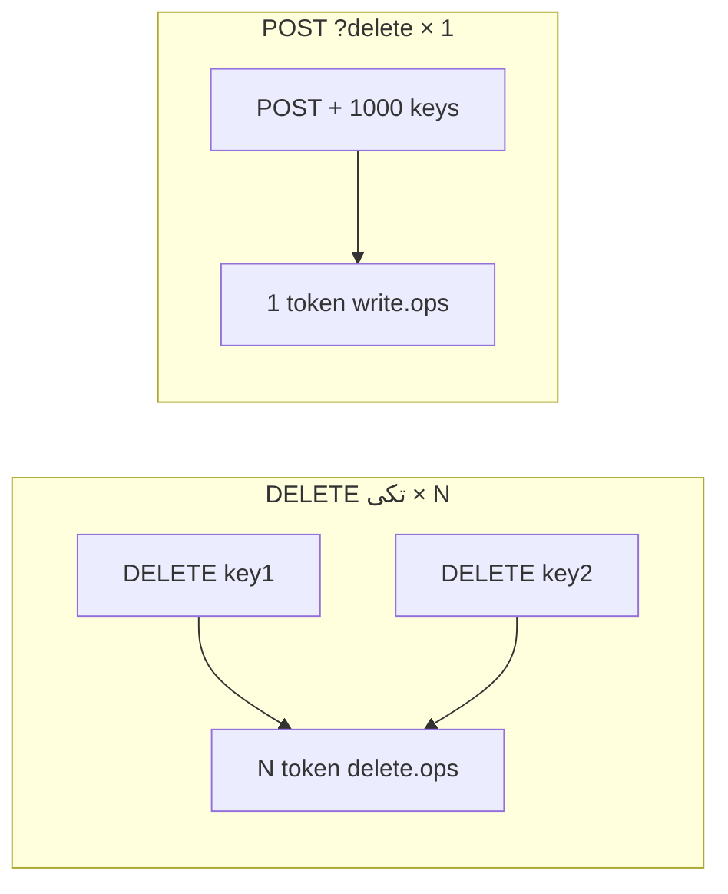
```mermaid
flowchart LR
  subgraph single ["DELETE تکی × N"]
    D1[DELETE key1] --> T1[N token delete.ops]
    D2[DELETE key2] --> T1
  end
  subgraph bulk ["POST ?delete × 1"]
    P[POST + 1000 keys] --> W[1 token write.ops]
  end
```

برای admin که فقط `max_delete_ops` را پایین گذاشته و `max_write_ops=0` (نامحدود) فراموش کرده، bulk delete عملاً throttle نمی‌شود. این رفتار از design `op_type` ناشی می‌شود، نه باگ — bulk delete در مدل HTTP یک write operation است.

**راه‌کار:** bulk delete را با `max_write_ops` محدود کنید؛ برای حذف انبوه سقف write ops پایین‌تر از delete ops در نظر بگیرید.

---

### ۶. `RateLimiterEntry` per user/bucket، GC، و double-buffer

هر user/bucket فعال که limit می‌خورد یک entry در `unordered_map` می‌سازد (~۲M سقف). وقتی map از ۹۰٪ پر شود، thread GC `ActiveRateLimiter` فعال می‌شود: instance فعال عوض می‌شود، instance قدیمی passive می‌ماند تا `use_count` درخواست‌های در حال اجرا تمام شود، سپس `clear()` — **همه counter صفر**. `first_run` دوباره token کامل می‌دهد → **burst** برای همه tenantها. با global `enabled=true` روی همه userها، map سریع پر و GC **مکرر** می‌شود.

```cpp linenums="20" title="rgw_ratelimit.h — RateLimiterEntry"
[`rgw_ratelimit.h`](https://github.com/ceph/ceph/blob/main/src/rgw/rgw_ratelimit.h#L20-L30)
```

```cpp linenums="234" title="rgw_ratelimit.h — trigger GC"
[`rgw_ratelimit.h`](https://github.com/ceph/ceph/blob/main/src/rgw/rgw_ratelimit.h#L234-L237)
```

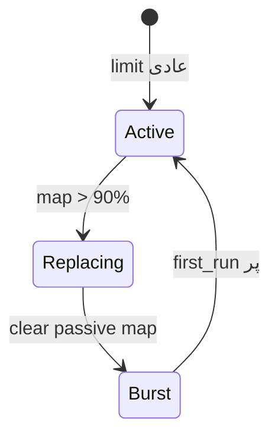
```mermaid
stateDiagram-v2
  [*] --> Active: limit عادی
  Active --> Replacing: map > 90%
  Replacing --> Burst: clear passive map
  Burst --> Active: first_run پر
```

**راه‌کار:** rate limit را **selective** نگه دارید — global `enabled=false` و limit فقط روی tenantهای حساس. tenant زیاد + global enabled = ناپایداری طولانی.

---

### ۷. limit bytes بعد از اتمام read/write

`max_write_bytes=1MB` در interval و `max_write_ops=0` (نامحدود ops). user PUT 999KB می‌زند — pass. بلافاصله PUT 10GB: **ops** pass (نامحدود)، transfer 10GB **کامل** انجام می‌شود. در `decrease_bytes` حین `recv_body` هر chunk از `write.bytes` کم می‌شود (fixed-point ×1000). PUT بعدی تا refill (~۲ interval بدهی) block می‌شود. ops در `rate_limit()` **قبل از** `execute()` چک می‌شوند؛ bytes **حین/بعد** stream.

```cpp linenums="795" title="rgw_rest.cc — decrease_bytes"
[`rgw_rest.cc`](https://github.com/ceph/ceph/blob/main/src/rgw/rgw_rest.cc#L795-L799)
```

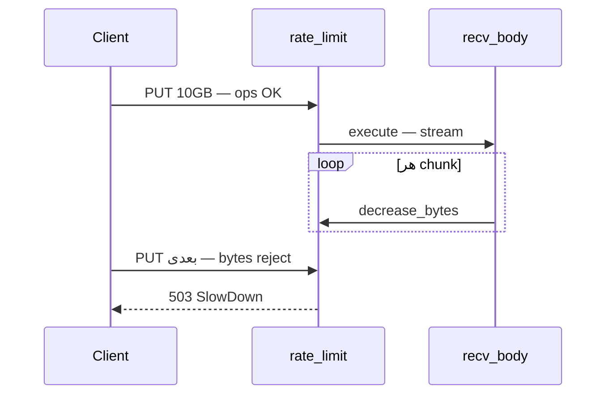
```mermaid
sequenceDiagram
  participant C as Client
  participant RL as rate_limit
  participant IO as recv_body
  C->>RL: PUT 10GB — ops OK
  RL->>IO: execute — stream
  loop هر chunk
    IO->>RL: decrease_bytes
  end
  C->>RL: PUT بعدی — bytes reject
  RL-->>C: 503 SlowDown
```

**راه‌کار:** `max_write_ops` / `max_read_ops` را هم فعال کنید؛ برای سقف سخت قبل از transfer به pre-check size (تغییر کد) نیاز است.

---

### ۸. user قبل از bucket — سقف bucket بالاتر عملاً نمی‌رسد

روی user `alice` سقف `max_read_ops=100` و روی bucket `logs` سقف `max_read_ops=1000` گذاشته‌اید — انتظار دارید alice روی `logs` تا ۱۰۰۰ read در دقیقه بزند. alice GET روی `logs` می‌زند: درخواست ۱۰۱ام **503 SlowDown** می‌گیرد، در حالی که counter bucket هنوز ~۹۰۰ token دارد.

`rate_limit()` ابتدا global و user/bucket attr را decode می‌کند. برای هر درخواست **ابتدا user** با `should_rate_limit` روی کلید `u{uid}` ارزیابی می‌شود؛ در صورت pass یک token ops **مصرف** می‌شود. **فقط** اگر user pass کند، bucket روی `b{marker}` چک می‌شود. اگر bucket reject کند، token user با `giveback_tokens` برمی‌گردد. اگر user reject کند، bucket **اصلاً** evaluate نمی‌شود.

```cpp linenums="143" title="rgw_process.cc — user/bucket"
[`rgw_process.cc`](https://github.com/ceph/ceph/blob/main/src/rgw/rgw_process.cc#L143-L172)
```

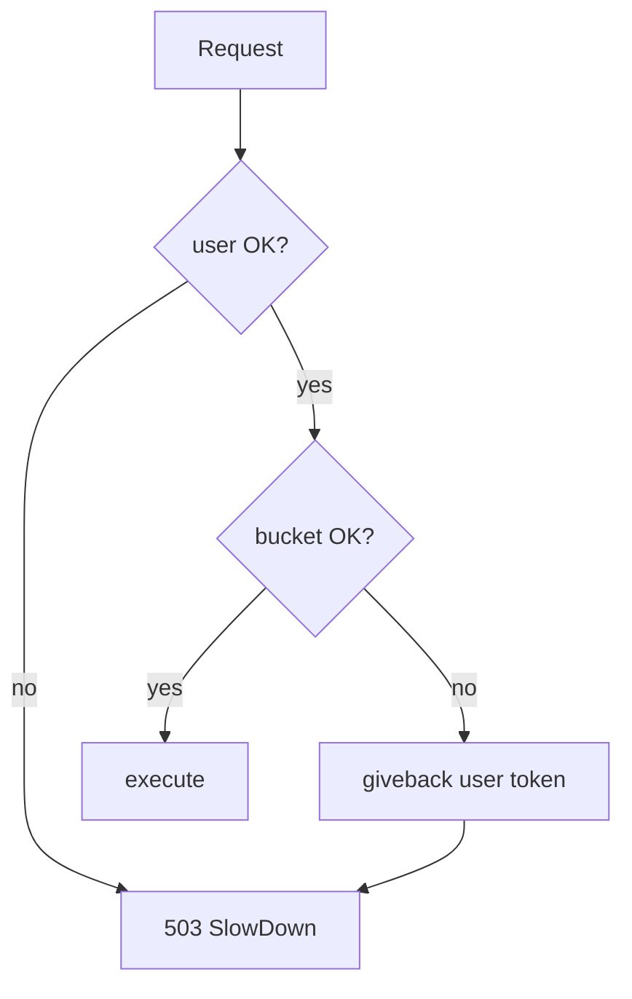
```mermaid
flowchart TD
  R[Request] --> U{user OK?}
  U -->|no| X[503 SlowDown]
  U -->|yes| B{bucket OK?}
  B -->|no| G[giveback user token]
  G --> X
  B -->|yes| OK[execute]
```

ترتیب ارزیابی باعث می‌شود سقف bucket **بالاتر** از user هرگز به کار نیفتد — سقف عملی **min(سقف user، سقف bucket)** است. برای bucket خاص با سقف بالاتر، user limit را بالاتر بگذارید یا روی آن user limit نگذارید.

---

### ۹. global realm، period، و counter RAM

admin global user rate limit را از ۱۰۰ به ۵۰ read ops تغییر می‌دهد. با `radosgw-admin global ratelimit set` و `period update --commit` config در RADOS ذخیره و در multisite replicate می‌شود. RGWهای در حال اجرا period را می‌خوانند — **restart معمولاً لازم نیست**. اما counter مصرف‌شده در RAM همان processها تا restart یا GC (مورد ۶) reset **نمی‌شود** — alice که نیمه سقف مصرف کرده همان counter را نگه می‌دارد.

| لایه | محل | نحوه تغییر |
|------|-----|------------|
| config global | `RGWPeriodConfig` در period | `period update --commit` |
| config user/bucket | attr `rgw.ratelimit` | admin API |
| مصرف runtime | RAM هر RGW | ephemeral |

**راه‌کار:** تغییر policy روی config فوری است؛ برای «شروع از صفر» counter به restart/GC وابسته است.

---

### ۱۰. STS و credentials موقت

سرویس Kubernetes با IAM user `ci-bot` `AssumeRole` می‌زند و با session token S3 می‌زند. admin روی `ci-bot` `max_write_ops=50` گذاشته — انتظار throttle **per role**. در عمل counter روی **`u{ci-bot}`** است؛ همه podها و roleها **یک سبد token** share می‌کنند. هر درخواست S3 با session token (`TYPE_ROLE`) یک `read_attrs` اضافه به RADOS می‌زند چون `RoleApplier::load_acct_info` فقط `get_user` می‌کند بدون attrs.

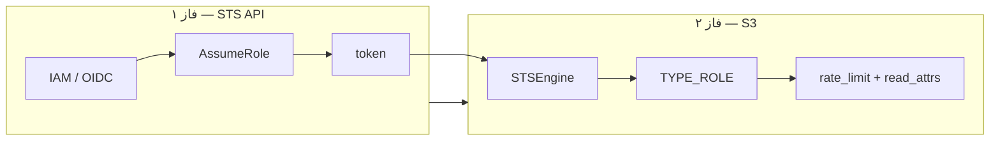
```mermaid
flowchart LR
  subgraph p1 [فاز ۱ — STS API]
    IAM[IAM / OIDC] --> AR[AssumeRole]
    AR --> TOK[token]
  end
  subgraph p2 [فاز ۲ — S3]
    TOK --> STSE[STSEngine]
    STSE --> RA[TYPE_ROLE]
    RA --> RL[rate_limit + read_attrs]
  end
  p1 --> p2
```

```cpp linenums="115" title="rgw_process.cc — STS read_attrs"
[`rgw_process.cc`](https://github.com/ceph/ceph/blob/main/src/rgw/rgw_process.cc#L115-L122)
```

```cpp linenums="1252" title="rgw_auth.cc — RoleApplier"
[`rgw_auth.cc`](https://github.com/ceph/ceph/blob/main/src/rgw/rgw_auth.cc#L1252-L1257)
```

اگر `read_attrs` fail شود، فقط global limit اعمال می‌شود (log `failed to read user attrs`). WebIdentity: uid واقعی اغلب `oidc$sub` — limit باید روی همان uid set شود. `GetSessionToken` معمولاً `TYPE_RGW` می‌ماند — بدون branch `read_attrs`.

**راه‌کار:** global + per-user limit روی uid واقعی؛ dmclock؛ limit روی role ARN مستقیم پشتیبانی نمی‌شود.

---

### ۱۱. semantic پیکربندی — `enabled` و `max_*=0`

دو حالت رایج در production باعث می‌شود admin فکر کند limit فعال است ولی client هیچ 503 نمی‌بیند. در حالت اول، `radosgw-admin ratelimit set --max-read-ops=100` اجرا شده ولی `--enabled` فراموش شده — مقدار پیش‌فرض `enabled=false` است. در `should_rate_limit`، اگر `!enabled` باشد تابع فوراً `false` برمی‌گرداند و هیچ token مصرف یا reject نمی‌شود. در حالت دوم، `enabled=true` set شده ولی همه `max_*` صفر مانده‌اند — در Ceph rate limit، **۰ یعنی نامحدود** برای آن بعد (reject فقط وقتی `ops_limit > 0` یا `bytes_limit > 0`).

```cpp linenums="266" title="rgw_ratelimit.h — should_rate_limit enabled guard"
[`rgw_ratelimit.h`](https://github.com/ceph/ceph/blob/main/src/rgw/rgw_ratelimit.h#L266-L271)
```

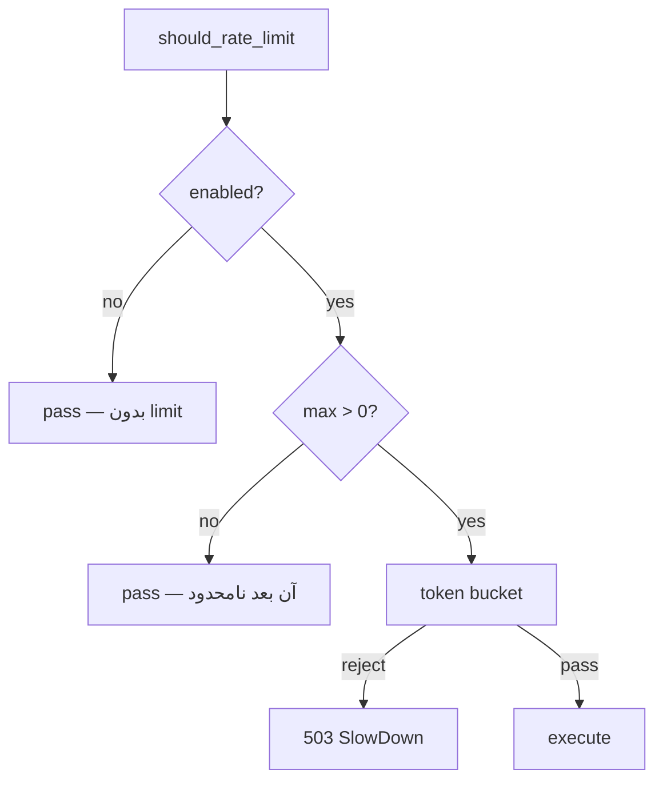
```mermaid
flowchart TD
  R[should_rate_limit] --> E{enabled?}
  E -->|no| OK[pass — بدون limit]
  E -->|yes| L{max > 0?}
  L -->|no| OK2[pass — آن بعد نامحدود]
  L -->|yes| CHK[token bucket]
  CHK -->|reject| X[503 SlowDown]
  CHK -->|pass| OK3[execute]
```

برای audit، همیشه `ratelimit get --uid=...` را با `--enabled` و همه `max_*` با هم چک کنید. limit «فعال» یعنی **`enabled=true` + حداقل یک `max_* > 0`**.

**راه‌کار:** در runbook tenant onboarding، checklist دو مرحله‌ای: enabled + حداقل یک max غیرصفر.

---

### ۱۲. شش بعد مستقل ops و bytes

`RateLimiterEntry` برای هر user/bucket شش شمارنده جدا نگه می‌دارد: `read.ops` و `read.bytes`، `write.ops` و `write.bytes`، `list.ops`، و `del.ops`. در `rate_limit()` فقط بعد مربوط به `op_type` همان request evaluate می‌شود — read limit روی write اثر ندارد، list limit روی read اثر ندارد، و bandwidth (bytes) از ops مستقل است. admin فقط `max_list_ops=10` set کرده: client می‌تواند PUT/GET نامحدود بزند چون `max_write_ops=0` و `max_read_ops=0` یعنی نامحدود. برعکس، `max_read_bytes` به بدهی ۲×interval رسیده (`check_bw_debt_at_max_120secs` در unit test) ولی `max_read_ops=0`: GETهای کوچک از نظر ops همچنان pass می‌شوند.

در `decrease_bytes` (`rgw_rest.cc`) فقط Read و Write bytes accounting می‌شود — List و Delete اصلاً وارد bandwidth limit نمی‌شوند. LIST سنگین فقط یک list op می‌خورد (مورد ۴) ولی می‌تواند CPU/RADOS زیاد مصرف کند بدون فشار روی `read.bytes`.

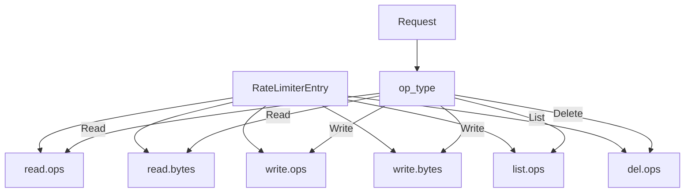
```mermaid
flowchart TB
  E[RateLimiterEntry]
  E --> RO[read.ops]
  E --> RB[read.bytes]
  E --> WO[write.ops]
  E --> WB[write.bytes]
  E --> LO[list.ops]
  E --> DO[del.ops]
  REQ[Request] --> OT[op_type]
  OT -->|Read| RO & RB
  OT -->|Write| WO & WB
  OT -->|List| LO
  OT -->|Delete| DO
```

**راه‌کار:** برای محافظت کامل هر بعد (ops و bytes برای read/write، list، delete) را صریح configure کنید؛ به موارد ۴ و ۵ برای bulk delete و LIST پنهان توجه کنید.

---

### ۱۳. `first_run` — entry جدید با سقف کامل token

token bucket در RGW رفتار «leaky» دارد: با گذشت interval، tokenها refill می‌شوند. اما وقتی entry **جدید** در hash map ساخته می‌شود — اولین contact user بعد از GC، restart process، یا user تازه‌ای که تا الان limit نخورده — flag `first_run` در `increase_tokens` true است. در این حالت همه باکت‌ها (read/write/list/delete ops و bytes) **بلافاصله** به `max × 1000` (fixed-point) set می‌شوند. user با **سقف کامل** interval شروع می‌کند و می‌تواند burst تا همان سقف config بزند، نه رفتار تدریجی از صفر.

این با GC (مورد ۶) ترکیب می‌شود: وقتی map از ۹۰٪ پر شود و GC اجرا شود، **همه** tenantهای فعال entry جدید با `first_run` می‌گیرند — burst هم‌زمان cluster-wide روی همان RGW. برای tenant با `max_read_ops=1000`، بلافاصله بعد از GC می‌تواند ۱۰۰۰ read در یک burst بزند.

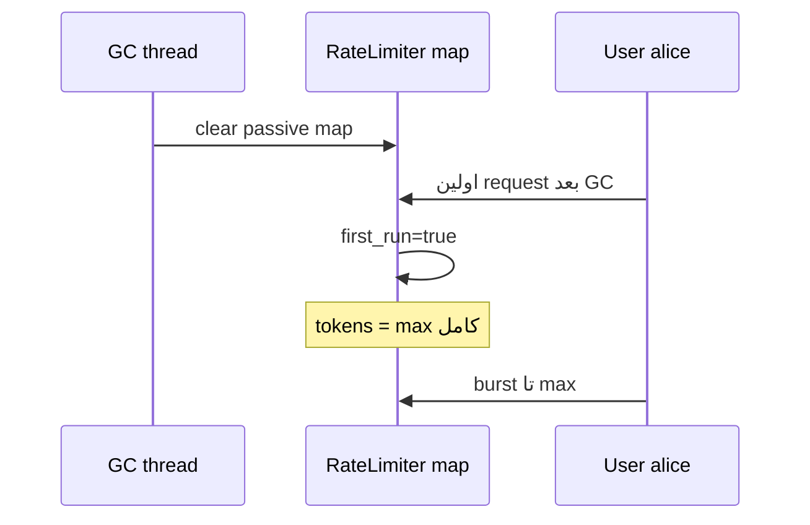
```mermaid
sequenceDiagram
  participant GC as GC thread
  participant M as RateLimiter map
  participant U as User alice
  GC->>M: clear passive map
  U->>M: اولین request بعد GC
  M->>M: first_run=true
  Note over M: tokens = max کامل
  U->>M: burst تا max
```

**راه‌کار:** در SLA و capacity planning burst بعد از GC یا اولین contact user را لحاظ کنید؛ rate limit selective نگه دارید تا GC مکرر نشود.

---

### ۱۴. معافیت health check و system request

قبل از decode attr و evaluate user/bucket، `rate_limit()` در `rgw_process.cc` دو شرط early-exit دارد: اگر request از نوع health check باشد (`s->op == OP_GET && s->info.request_uri == "/healthcheck"`) یا system request (`s->system_request`)، تابع **false** برمی‌گرداند — یعنی rate limit اصلاً اعمال نمی‌شود. Load Balancer معمولاً هر چند ثانیه `/healthcheck` می‌زند؛ replication داخلی و admin operations با flag system از throttle معاف‌اند.

```cpp linenums="97" title="rgw_process.cc — exempt"
[`rgw_process.cc`](https://github.com/ceph/ceph/blob/main/src/rgw/rgw_process.cc#L97-L98)
```

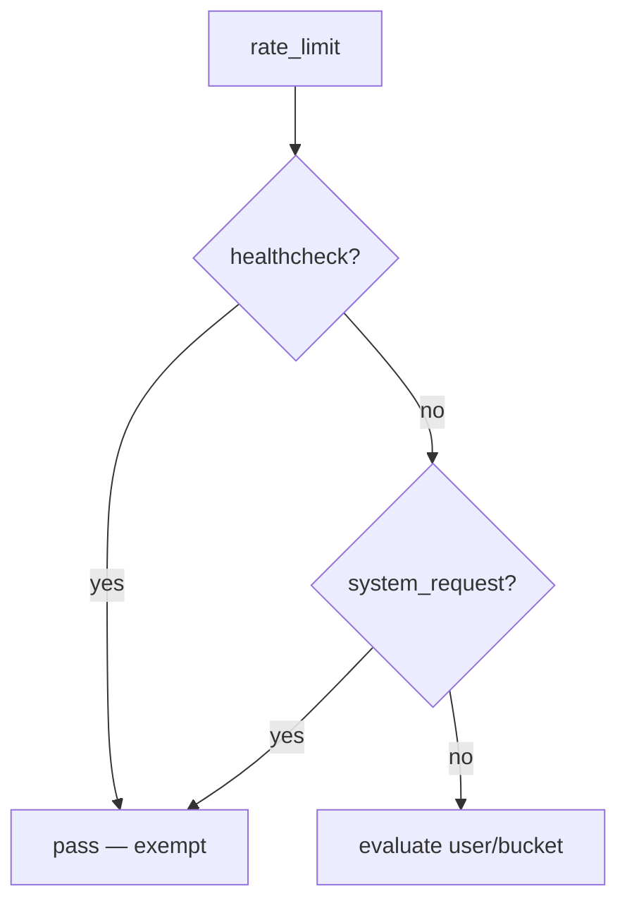
```mermaid
flowchart TD
  R[rate_limit] --> H{healthcheck?}
  H -->|yes| PASS[pass — exempt]
  H -->|no| S{system_request?}
  S -->|yes| PASS
  S -->|no| EVAL[evaluate user/bucket]
```

این رفتار عمدی است — throttle کردن health check باعث false negative در LB و restart بی‌مورد RGW می‌شود. اما در capacity planning باید این traffic را جدا از tenant quota در نظر بگیرید: health check ops در سقف user شمرده **نمی‌شود**.

**راه‌کار:** health و system traffic را در monitoring و autoscaling جدا track کنید.

---

### ۱۵. dmclock و rate limit — دو منبع 503 SlowDown

client 503 می‌گیرد. اگر block **قبل از auth** بود → **dmclock** (`schedule_request` در `process_request`). اگر **بعد از auth** و `pre_exec` → **rate limit** (`rate_limit()`). هر دو `-ERR_RATE_LIMITED` → HTTP 503 SlowDown — از بیرون indistinguishable.

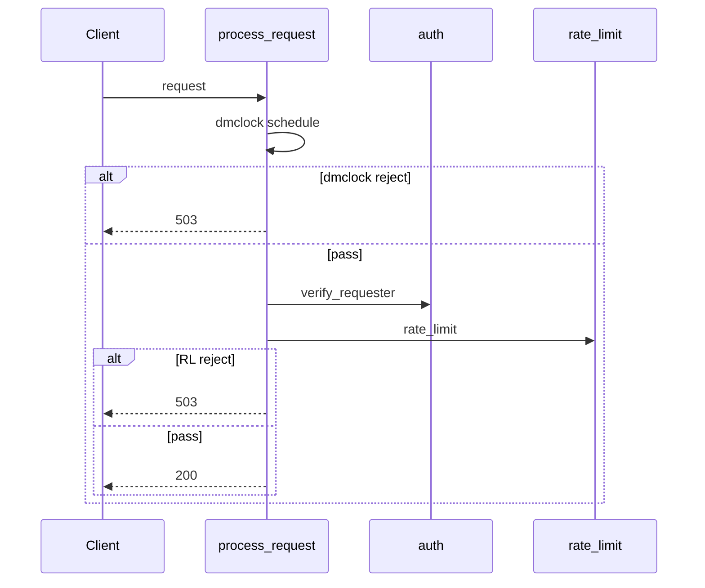
```mermaid
sequenceDiagram
  participant C as Client
  participant P as process_request
  participant A as auth
  participant RL as rate_limit
  C->>P: request
  P->>P: dmclock schedule
  alt dmclock reject
    P-->>C: 503
  else pass
    P->>A: verify_requester
    P->>RL: rate_limit
    alt RL reject
      P-->>C: 503
    else pass
      P-->>C: 200
    end
  end
```

**راه‌کار:** [dmclock](dmclock-architecture.md) برای فشار **سرور**؛ rate limit برای سهمیه **tenant**. trace در دو نقطه pipeline.

---

### ۱۶. باگ decode — `bool rate_limit()` و `-EIO`

attr `rgw.ratelimit` corrupt است. در catch decode، `return -EIO` از تابع **`bool`** — truthy → client **همیشه** 503 بدون rate-limit واقعی.

```cpp linenums="133" title="rgw_process.cc — decode error"
[`rgw_process.cc`](https://github.com/ceph/ceph/blob/main/src/rgw/rgw_process.cc#L133-L136)
```

**راه‌کار:** `ratelimit get --uid=...`؛ repair attr. fix upstream: `return false`.

---

### ۱۷. نسخه encode — struct_v قدیمی بدون list/delete

`RGWRateLimitInfo` در encode/decode نسخه‌بندی دارد (`struct_v`). نسخه ۱ فقط فیلدهای read/write ops و bytes را دارد؛ `max_list_ops` و `max_delete_ops` از **struct_v=2** به بعد encode می‌شوند. cluster که از Ceph قدیمی upgrade شده و attr user/bucket/period را **بدون re-set** نگه داشته، ممکن است struct_v=1 در RADOS داشته باشد. در decode، فیلدهای list/delete فقط برای `struct_v >= 2` خوانده می‌شوند — در غیر این صورت مقدار **۰** می‌ماند که semantic آن **نامحدود** است.

admin در dashboard `max_list_ops=5` می‌بیند (اگر UI از config جدید بخواند) ولی runtime effective صفر است — LIST عملاً throttle نمی‌شود. این mismatch بین «آنچه admin فکر می‌کند set شده» و «آنچه RGW decode می‌کند» یکی از علل رایج «list limit کار نمی‌کند» بعد upgrade است.

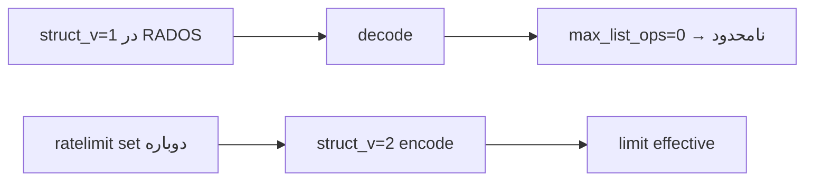
```mermaid
flowchart LR
  V1["struct_v=1 در RADOS"]
  V1 --> D[decode]
  D --> Z["max_list_ops=0 → نامحدود"]
  V2["ratelimit set دوباره"]
  V2 --> V2E["struct_v=2 encode"]
  V2E --> OK["limit effective"]
```

**راه‌کار:** بعد از upgrade به نسخه‌ای با list/delete limit، `ratelimit set` را دوباره روی user/bucket/period اجرا کنید تا attr با struct_v=2 encode شود.

---

### ۱۸. interval سراسری — `rgw_ratelimit_interval`

پنجره accumulation token bucket برای **همه** user و bucket از یک option سراسری می‌آید: `rgw_ratelimit_interval` (پیش‌فرض ۶۰ ثانیه) در `CephContext`. tenant نمی‌تواند interval اختصاصی در attr داشته باشد. اگر دو site با `rgw_ratelimit_interval` متفاوت در ceph.conf داشته باشند، همان عدد config روی RGW همان site اعمال می‌شود — سقف ops «در دقیقه» بین siteها یکسان به نظر می‌رسد ولی window واقعی فرق دارد.

**راه‌کار:** interval را در realm یکسان نگه دارید؛ هنگام مقایسه limit بین clusterها window را هم compare کنید.

---

### ۱۹. کلید نامعتبر — skip خاموش rate limit

کلید counter از `ratelimit_user_name = "u" + uid` و `ratelimit_bucket_marker = "b" + marker` ساخته می‌شود. در `RateLimiter::should_rate_limit` اگر `key.empty()` یا `key.length() == 1` باشد، تابع **false** برمی‌گرداند — یعنی **هیچ limitی** اعمال نمی‌شود، بدون log خطا به client. این edge case در authهای نادر یا uid نامعتبر رخ می‌دهد.

```cpp linenums="268" title="rgw_ratelimit.h — key guard"
[`rgw_ratelimit.h`](https://github.com/ceph/ceph/blob/main/src/rgw/rgw_ratelimit.h#L268-L271)
```

**راه‌کار:** uid و bucket marker باید معتبر باشند؛ در log level 21 کلید `ratelimit_user_name` را verify کنید.

---

### ۲۰. multipart — ops per request، bytes per chunk

upload multipart سه نوع درخواست HTTP جدا دارد: InitiateMultipartUpload، UploadPart (تکرارشونده)، CompleteMultipartUpload. اگر `max_write_ops` فعال باشد، **هر کدام یک write op** جداگانه مصرف می‌کند — upload یک object بزرگ با ۱۰۰ part می‌تواند ۱۰۲ write op باشد. bytes در هر Part حین `recv_body` chunk به chunk از `write.bytes` کم می‌شود؛ semantics همان مورد ۷ — part 5GB می‌تواند کامل upload شود و بعد بدهی bytes درخواست بعدی را block کند.

**راه‌کار:** سقف ops را با تعداد partهای مورد انتظار tune کنید؛ برای objectهای بزرگ `max_write_bytes` و ops را با هم set کنید.

---

### ۲۱. بدون limit سطح account، role، یا subuser

مدل rate limit RGW فقط سه scope config دارد: global (period)، user (`--uid`)، bucket (`--bucket`)، به‌علاوه anonymous global. **account** به‌عنوان entity جدا limit ندارد — باید روی هر user member account limit بگذارید یا از لایه بیرونی استفاده کنید. **role** ARN در hash map نیست؛ فقط user پشت STS (مورد ۱۰). **subuser** کلید جدا ندارد — همه درخواست‌های subuser به `u{parent_uid}` map می‌شوند.

**راه‌کار:** برای سقف account-wide یا per-role از API gateway، WAF، یا limit روی IAM users مجاز به AssumeRole استفاده کنید.

---

## جمع‌بندی نقد

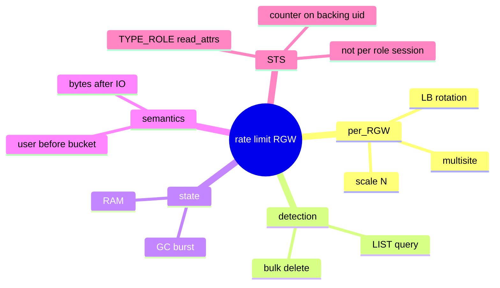
```mermaid
mindmap
  root((rate limit RGW))
    per_RGW
      LB rotation
      scale N
      multisite
    detection
      LIST query
      bulk delete
    state
      RAM
      GC burst
    semantics
      bytes after IO
      user before bucket
    STS
      TYPE_ROLE read_attrs
      counter on backing uid
      not per role session
```

| انتظار | واقعیت |
|--------|--------|
| سقف دقیق cluster-wide | ❌ بدون counter مرکزی |
| محافظ LIST DoS | ⚠️ 1 op token |
| quota bytes قبل transfer | ❌ |
| limit پایدار long-term | ❌ GC/restart |
| throttle per assumed-role | ❌ فقط per backing user |

rate limit فعلی برای **throttle سبک per-gateway** مناسب است؛ برای **سقف سخت non-bypassable** در cluster/multisite بزرگ **کافی نیست** بدون لایه اضافه (Redis، WAF، dmclock). با **STS گسترده**، هزینه `read_attrs` و عدم تفکیک role/session را در ظرفیت‌سنجی لحاظ کنید.

---

## راهنمای تشخیص در production

وقتی rate limit در cluster «درست به نظر نمی‌رسد»، علامت‌ها معمولاً به یکی از **۲۱ محدودیت** بخش «تحلیل کامل» برمی‌گردند. در ادامه الگوهای رایج production را به‌صورت پیوسته شرح می‌دهیم.

**Cluster بیش از limit config‌شده درخواست قبول می‌کند** (مورد ۱ و ۲): counter در RAM هر `radosgw` جداست. با Load Balancer، client بعد از رسیدن به سقف روی یک gateway، درخواست بعدی را به instance دیگر می‌فرستد. اگر N gateway دارید و limit را ÷ N نکرده‌اید، سقف cluster عملاً N برابر config است.

**LIST سنگین RGW را down می‌کند ولی rate limit کم می‌خورد** (مورد ۱ و ۴): یک `GET` با `list-type=2` فقط یک token از `max_list_ops` مصرف می‌کند. `GET` بدون pattern list به‌عنوان Read شمرده می‌شود — `max_read_ops` را هم تنظیم کنید و **dmclock** را برای فشار سرور فعال کنید.

**بعد از restart یا GC، burst ناگهانی** (مورد ۶ و ۱۳): GC map یا restart counterها را صفر می‌کند؛ `first_run` entry جدید را با سقف کامل token پر می‌کند. rate limit را selective نگه دارید.

**bypass از zone دیگر** (مورد ۳): config replicate می‌شود؛ مصرف نه. limit را per zone در طراحی لحاظ کنید.

**bulk delete بی‌limit delete ops** (مورد ۵): Multi-Object Delete به‌عنوان Write حساب می‌شود — `max_write_ops` را تنظیم کنید.

**bucket limit بالاتر اعمال نمی‌شود** (مورد ۸): user اول چک می‌شود. سقف عملی min(user, bucket) است — user limit را بالاتر از bucket بگذارید.

**upload بزرگ بعد block** (مورد ۷ و ۲۰): bytes بعد از transfer؛ multipart هر part یک write op — ops و bytes را با هم set کنید.

**تغییر global** (مورد ۹): `period update --commit`؛ counter همچنان RAM است.

**limit set شده ولی هیچ 503 نمی‌بینید** (مورد ۱۱): `enabled=false` یا همه `max_*=0` — هر دو pass می‌دهند.

**فقط list limit دارید ولی PUT نامحدود** (مورد ۱۲): شش بعد مستقل‌اند — read/write/list/delete/bytes جدا configure می‌شوند.

**503 بدون دلیل واضح** (مورد ۱۵ و ۱۶): dmclock قبل auth در مقابل rate limit بعد auth؛ attr corrupt در decode.

**list/delete limit بعد upgrade کار نمی‌کند** (مورد ۱۷): struct_v قدیمی — `ratelimit set` را دوباره اجرا کنید.

**interval بین siteها فرق دارد** (مورد ۱۸): `rgw_ratelimit_interval` global است نه per-tenant.

**STS / session token** (مورد ۱۰ و ۲۱): `read_attrs` fail یا uid اشتباه — log `failed to read user attrs`. limit روی IAM/OIDC user با uid واقعی؛ role/account/subuser scope جدا نیست.

---

## counter در RADOS: تفکیک config و مصرف

یکی از سوالات طراحی این است که آیا **شمارنده runtime** rate limit باید در RADOS باشد. پاسخ کوتاه: **تنظیمات limit بله؛ شمارنده هر request خیر** — با nuance برای hybrid.

### آنچه همین الان در RADOS است

`RGWRateLimitInfo` روی user attr، bucket attr، یا `RGWPeriodConfig` (global) ذخیره می‌شود. این داده کم‌تغییر است و replicate در multisite منطقی است.

### آنچه عمداً در RAM است

token counter در `RateLimiterEntry` داخل hash map هر process نگه داشته می‌شود — per-RGW، ephemeral، بعد از restart/GC صفر.

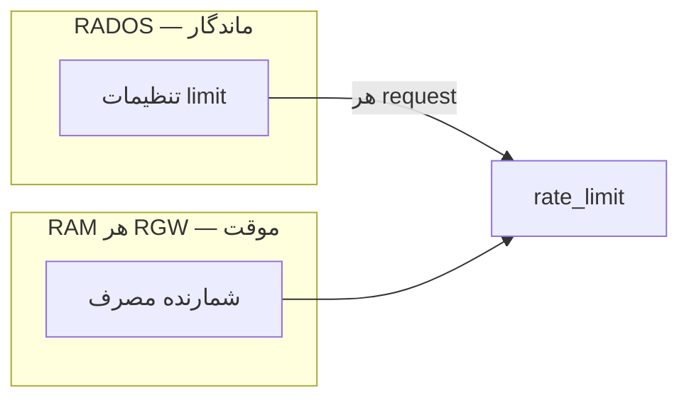
```mermaid
flowchart LR
  subgraph rados ["RADOS — ماندگار"]
    CFG[تنظیمات limit]
  end
  subgraph ram ["RAM هر RGW — موقت"]
    CTR[شمارنده مصرف]
  end
  CFG -->|هر request| RL[rate_limit]
  CTR --> RL
```

### چرا شمارنده مستقیم RADOS برای هر request منطقی نیست

هر request یک یا چند trip RADOS اضافه می‌زند — latency بالا و hotspot روی object. برای bandwidth بدتر است: GET 1GB با chunk 4MB ≈ ۲۵۰ update RADOS فقط برای bytes.

### گزینه‌های طراحی جایگزین

```mermaid
flowchart TB
  subgraph A ["❌ بد"]
    A1[هر chunk → RADOS]
  end
  subgraph B ["⚠️ متوسط"]
    B1[RAM سریع] -->|هر چند ثانیه sync| B2[RADOS]
  end
  subgraph C ["✅ بهتر برای ops"]
    C1[RAM] --> C2[Redis INCR]
  end
  subgraph D ["✅ ساده‌ترین — همین الان"]
    D1[limit ÷ N RGW + LB]
  end
```

**Pure RADOS** فقط در cluster کم‌ترافیک قابل بحث است. **Hybrid RAM+RADOS** شمارش محلی + sync دوره‌ای — تقریب کافی. **Redis** برای SLA سخت tenant. **وضعیت فعلی + tuning** (`limit ÷ N`، selective enable، dmclock) برای اکثر productionها کافی است.

برای bandwidth متمرکز: در RAM جمع کنید، دوره‌ای sync کنید، یا با تغییر کد قبل از transfer اندازه را pre-check کنید.

---

## ماتریس توصیه

| نیاز شما | بهترین راه |
|----------|------------|
| محافظت ساده چند RGW | **فعلی** + limit ÷ N |
| quota دقیق cluster-wide | Redis یا CLS + cache |
| سقف سخت قبل از download | تغییر کد (pre-check size) |
| بدون burst بعد از restart | persistence (Redis) |
| محافظت با AssumeRole / WebIdentity | global + user uid + dmclock |

### یک جمله جمع‌بندی

> rate limit فعلی RGW مثل **باجه بلیت محلی در هر gateway** است — برای throttle سبک عالی است، برای **invoice دقیق tenant در scale cluster** به design اضافه (Redis/hybrid) نیاز دارید.

---

## محدودیت‌های عملیاتی (خلاصه)

Rate limit فعلی RGW برای throttle سبک per-gateway طراحی شده. **۲۱ محدودیت** در بخش «مشکلات طراحی» فهرست شده — از per-RGW و multisite تا `enabled`/max=0، dmclock vs RL، decode bug، multipart، و نبود limit account/role. برای SLA سخت به counter مرکزی (Redis) یا لایه بیرونی (WAF، dmclock) نیاز است.

---

## دیاگرام sequence کامل

```mermaid
sequenceDiagram
  participant C as Client
  participant P as rgw_process
  participant RL as RateLimiter
  participant E as RateLimiterEntry
  participant IO as rgw_rest I/O

  C->>P: HTTP request
  P->>P: auth, permissions, pre_exec
  P->>P: load global + user/bucket RGWRateLimitInfo
  P->>RL: should_rate_limit(user_key)
  RL->>E: lock → increase_tokens → check ops/bytes
  alt user limited
    P-->>C: 503 SlowDown
  else user ok
    P->>RL: should_rate_limit(bucket_key)
    alt bucket limited
      RL->>E: giveback_tokens(user)
      P-->>C: 503 SlowDown
    else ok
      P->>P: execute op
      P->>IO: dump_body / recv_body
      IO->>RL: decrease_bytes(user + bucket)
      P-->>C: 200 OK
    end
  end
```

---

## مستندات مرتبط

- [معماری dmclock / Scheduler](dmclock-architecture.md) — QoS pre-auth
- [معماری زمان‌بندی و QoS](scheduling-architecture.md) — خلاصه سه لایه
- [خط لوله درخواست](request-pipeline.md)
- [Worker architecture](worker-architecture.md)
- [ارجاع زنده به کد](../guides/source-code-in-docs.md)
- Upstream: `doc/radosgw/admin.rst` — Rate Limit Management
- Upstream: `doc/radosgw/adminops.rst` — Admin Ops API
