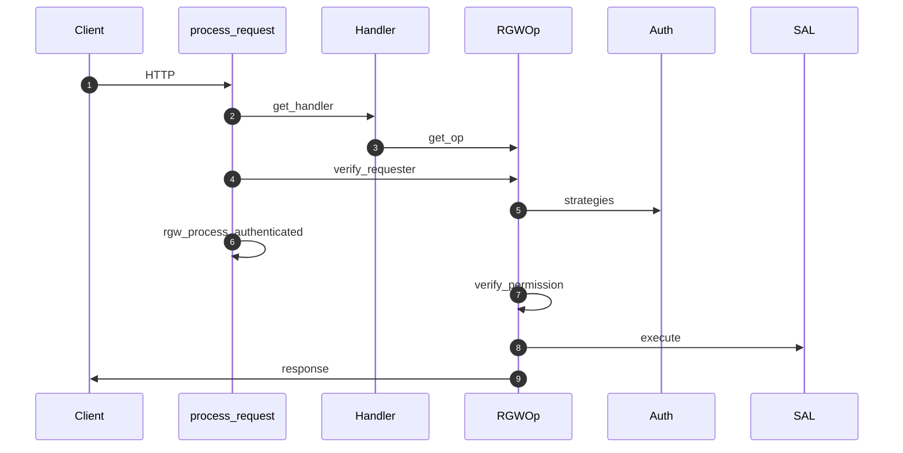

# خط لوله درخواست HTTP

## مراحل

درخواست از لبه تا ذخیره‌سازی این مراحل را طی می‌کند:

1. **پارس HTTP** — `RGWEnv`، هدرها، URI
2. **مسیریابی REST** — `RGWREST::get_handler()`
3. **انتخاب عملیات** — `RGWHandler_REST::get_op()`
4. **قلاب Lua** — `preRequest` (اختیاری)
5. **dmclock** — `schedule_request()`
6. **احراز هویت** — `verify_requester()`
7. **پس از احراز هویت** — `rgw_process_authenticated()`
8. **پاسخ و لاگ** — `complete()`, ops log, `postRequest`

## نقطه ورود

> **Source:** [`rgw_process.cc`](https://github.com/ceph/ceph/blob/main/src/rgw/rgw_process.cc#L278-L325)

## پس از احراز هویت

> **Source:** [`rgw_process.cc`](https://github.com/ceph/ceph/blob/main/src/rgw/rgw_process.cc#L175-L275)

## idempotency و تکرار

| عملیات | رفتار |
|--------|--------|
| GET/HEAD | ذاتاً idempotent |
| PUT شیء | overwrite با همان key |
| Multipart Complete | commit اتمی در ایندکس |
| DELETE | حذف منطقی/فیزیکی بسته به versioning |

در multisite، **bilog / datalog** برای replay و همگام‌سازی استفاده می‌شود؛ درخواست HTTP تکراری ممکن است دوباره نوشته شود مگر سیاست سمت کلاینت (مثلاً `If-Match`) اعمال شود.

## commit و یکپارچگی

- نوشتن شیء: head + stripeها در RADOS، سپس به‌روزرسانی ایندکس bucket (CLS)
- `CompleteMultipart`: ensamble manifest سپس یک commit ایندکس

## خطا و `abort_early`

هر شکست قبل از `execute` از `abort_early()` برای پاسخ خطای پروتکل استفاده می‌کند.

## مستندات مرتبط

- [نمودارهای توالی](sequence-diagrams.md)
- [ماژول مسیر درخواست](../modules/core-request-path.md)
