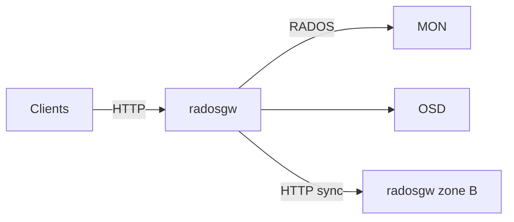

# توپولوژی زمان اجرا

## فرآیند `radosgw`

یک فرآیند `radosgw` معمولاً شامل:

1. اتصال به **Ceph cluster** (MON + OSD)
2. بارگذاری **realm / period / zone** (چندسایتی)
3. ساخت **SAL Driver** (معمولاً `RadosStore`)
4. ثبت درخت **REST API** بر اساس `rgw_enable_apis`
5. اجرای یک یا چند **frontend** (پیش‌فرض: `beast`)

بوت‌استرپ از `rgw::AppMain` در `rgw_appmain.cc` آغاز می‌شود.

## شبکه

| جریان | پورت / پروتکل | توضیح |
|-------|----------------|-------|
| کلاینت → RGW | HTTP/HTTPS (معمولاً 80/443 یا 7480) | S3/Swift |
| RGW → MON/OSD | پروتکل RADOS | خواندن/نوشتن اشیاء و متادیتا |
| Zone → Zone | HTTP بین زون‌ها | همگام‌سازی multisite (`RGWRESTConn`) |

## حجم‌ها و داده محلی

RGW معمولاً **stateless** در لبه است؛ state در RADOS نگه داشته می‌شود:

- داده شیء در poolهای placement
- ایندکس سطل و متادیتا در poolهای سیستمی
- لاگ متادیتا برای multisite

فایل‌های موقت محلی (در صورت فعال بودن کش یا frontend خاص) به پیکربندی وابسته‌اند و نباید به‌عنوان منبع حقیقت در نظر گرفته شوند.

## چند نمونه RGW

چند `radosgw` پشت load balancer:

- هر نمونه به همان realm/period متصل است
- درخواست‌ها مستقل پردازش می‌شوند
- **هماهنگی داده** از طریق RADOS و multisite، نه حافظه مشترک بین نمونه‌ها

## فرآیندهای جانبی

| فرآیند | نقش |
|--------|-----|
| `rgw-object-expirer` | انقضای اشیاء |
| coroutineهای sync | replication بین زون‌ها |
| کارهای پس‌زمینه در driver | GC، resharding، LC |

## مستندات مرتبط

- [معماری Worker](worker-architecture.md)
- [استقرار](deployment-architecture.md)
- [محدودیت‌های HA](critical-gaps-and-ha-limitations.md)
