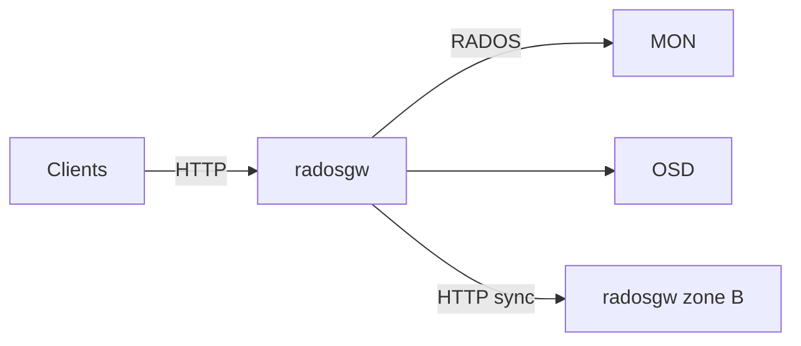

# 运行时拓扑

## `radosgw` process

A typical `radosgw` process:

1. Connects to the **Ceph cluster** (MON + OSD)
2. Loads **realm / period / zone** (multisite)
3. Builds the **SAL driver** (usually `RadosStore`)
4. Registers **REST API** tree per `rgw_enable_apis`
5. Runs one or more **frontends** (default: Beast)

Bootstrap starts in `rgw::AppMain` (`rgw_appmain.cc`).

## 网络

| Traffic | Port / protocol | Notes |
|---------|-----------------|-------|
| Client → RGW | HTTP/HTTPS (80/443 or 7480) | S3/Swift |
| RGW → MON/OSD | RADOS | Object and metadata I/O |
| Zone → Zone | HTTP | Multisite sync (`RGWRESTConn`) |

## Local data

RGW is usually **stateless at the edge**; state lives in RADOS:

- Object data in placement pools
- Bucket index and metadata in system pools
- Metadata log for multisite

Local temp files (cache or special frontends) depend on config and are not source of truth.

## Multiple RGW instances

Several `radosgw` daemons behind a load balancer:

- Each connects to the same realm/period
- Requests are processed independently
- **Data coordination** via RADOS and multisite, not shared memory

## Side processes

| Process | Role |
|---------|------|
| `rgw-object-expirer` | Object expiry |
| Sync coroutines | Zone replication |
| Driver background work | GC, resharding, LC |

## 相关

- [Worker architecture](worker-architecture.md)
- [Deployment architecture](deployment-architecture.md)
- [Critical gaps and HA limitations](critical-gaps-and-ha-limitations.md)
