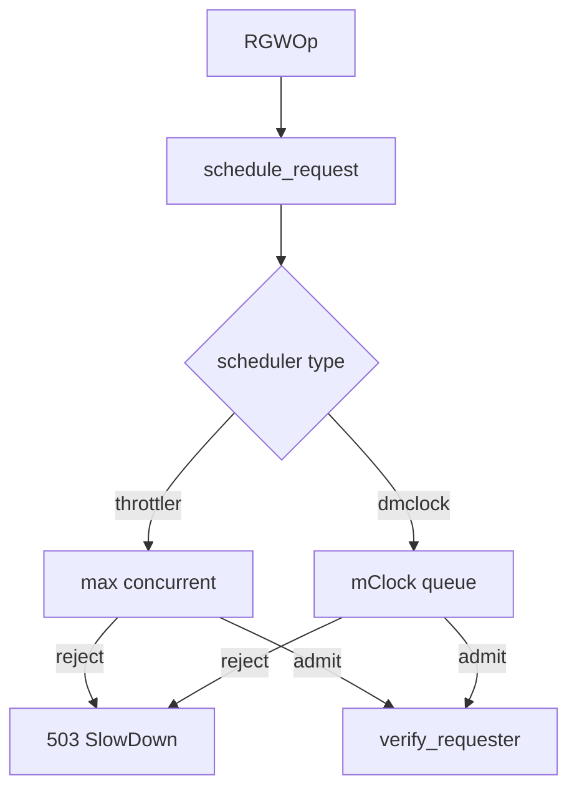

# معماری زمان‌بندی و QoS

RGW **سه لایه** محدودسازی همزمان دارد — هر کدام در نقطه متفاوتی از pipeline:

| لایه | محل | doc |
|------|-----|-----|
| Beast scheduler (throttler / dmclock) | قبل از auth | [dmclock معماری](dmclock-architecture.md) |
| `req_throttle` | thread pool worker | [Worker architecture](worker-architecture.md) |
| rate limit tenant | بعد از auth | [Rate Limit](rate-limit-architecture.md) |

## dmclock / throttler (خلاصه)

- `schedule_request()` در `rgw_process.cc` قبل از `verify_requester`
- پیش‌فرض: **`SimpleThrottler`** (`rgw_max_concurrent_requests`)
- experimental: **`AsyncScheduler`** + mClock per op-class
- شکست → `-EAGAIN` → `-ERR_RATE_LIMITED` (503 SlowDown)

برای تفسیر کامل کلاس‌ها، config، سناریوها و مشکلات → [معماری dmclock](dmclock-architecture.md).

## rate limit tenant (خلاصه)

پس از auth و `pre_exec` — [معماری Rate Limit](rate-limit-architecture.md).

---

## مستندات مرتبط

- [dmclock — مستند کامل](dmclock-architecture.md)
- [Rate Limit — مستند کامل](rate-limit-architecture.md)
- [خط لوله درخواست](request-pipeline.md)
- [Worker architecture](worker-architecture.md)
