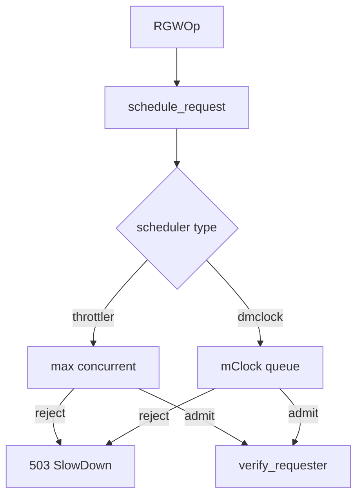

# 调度与 QoS 架构

RGW has **three concurrency limit layers** at different pipeline points:

| Layer | Location | Doc |
|-------|----------|-----|
| Beast scheduler (throttler / dmclock) | Before auth | [dmclock architecture](dmclock-architecture.md) |
| `req_throttle` | Thread pool worker | [Worker architecture](worker-architecture.md) |
| Tenant rate limit | After auth | [Rate limit architecture](rate-limit-architecture.md) |

## dmclock / throttler (summary)

- `schedule_request()` in `rgw_process.cc` before `verify_requester`
- Default: **`SimpleThrottler`** (`rgw_max_concurrent_requests`)
- Experimental: **`AsyncScheduler`** + mClock per op-class
- Failure → `-EAGAIN` → `-ERR_RATE_LIMITED` (503 SlowDown)

See [dmclock architecture](dmclock-architecture.md) for full detail.

## Tenant rate limit (summary)

After auth and `pre_exec` — [Rate limit architecture](rate-limit-architecture.md).

## 相关

- [Request pipeline](request-pipeline.md)
- [Worker architecture](worker-architecture.md)
