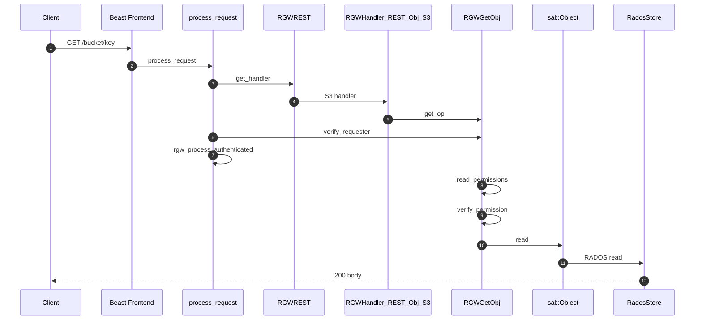
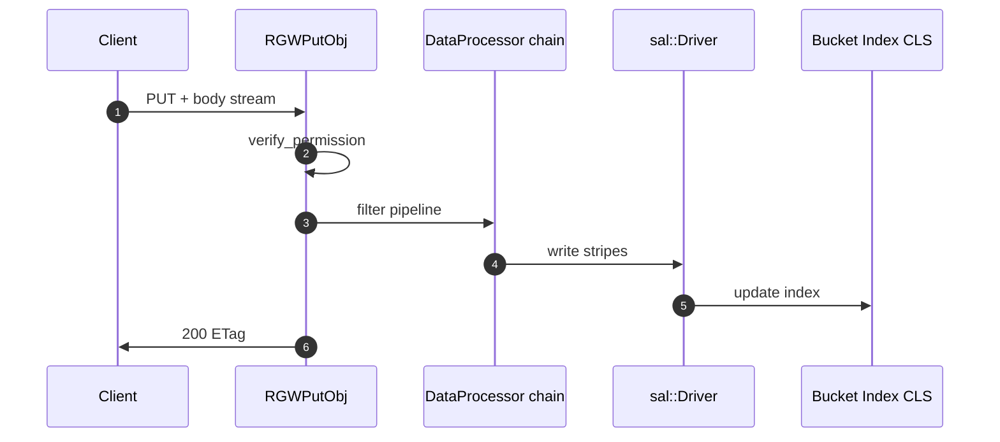
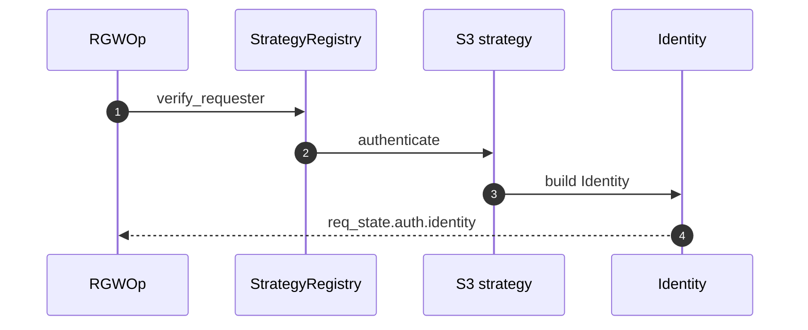
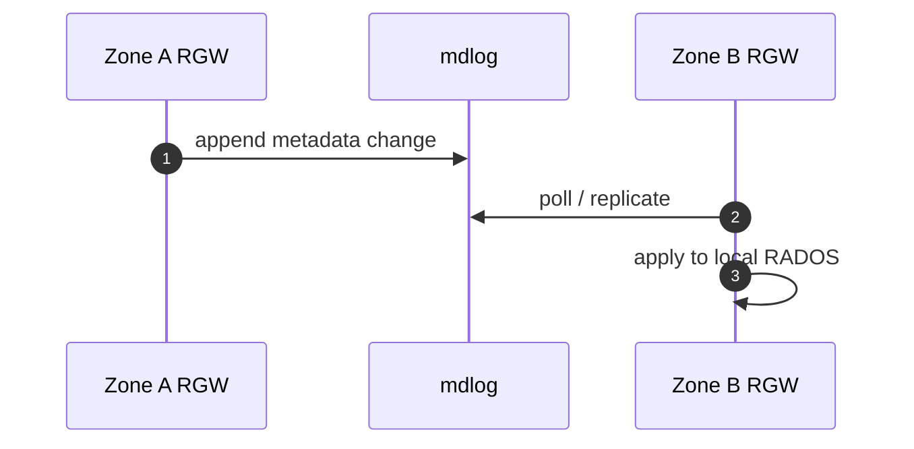
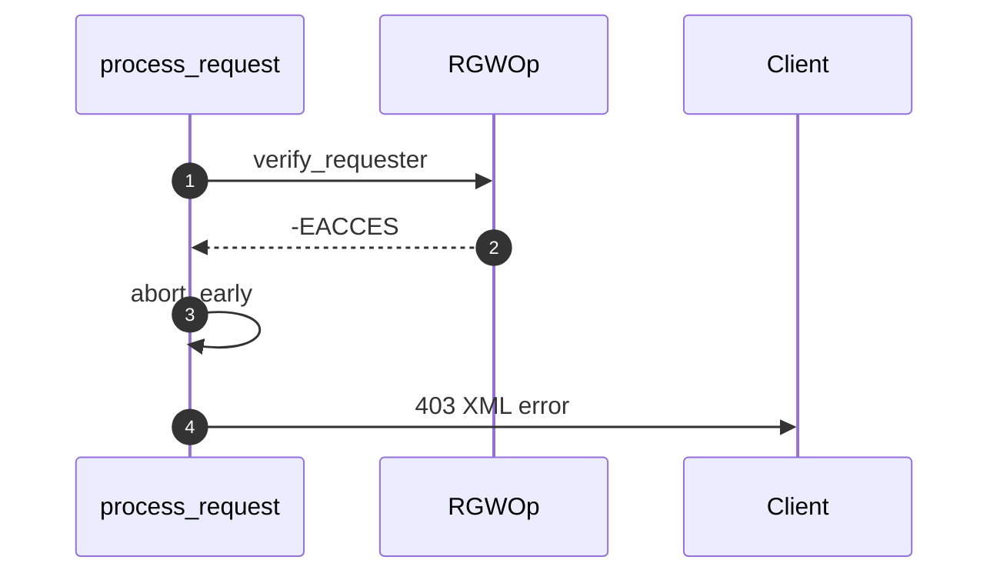

# نمودارهای توالی

همه نمودارها با `autonumber` برای ارجاع در متن.

## ۱. S3 GET Object

**توضیح:** مراحل ۷–۱۰ مجوز و ACL/IAM را بارگذاری می‌کنند؛ ۱۱–۱۳ داده از RADOS خوانده می‌شود.

## ۲. S3 PUT Object

## ۳. احراز هویت S3 SigV4 (خلاصه)

## ۴. Multisite metadata sync (مفهومی)

## ۵. شکست زودهنگام (abort)

## classDiagram — لایه REST (بدون کاما در امضاها)

 RGWRESTMgr&#10;  RGWRESTMgr --> RGWHandler_REST&#10;  RGWHandler_REST --> RGWOp&#10;  RGWRESTOp ..|&gt; RGWOp">

!!! note "رندر classDiagram"
    منبع نمودار کلاس در `data-mermaid-source` قرار دارد تا `&lt;&lt;` در HTML تفسیر نشود.

## مستندات مرتبط

- [خط لوله درخواست](request-pipeline.md)
- [ماژول API پروتکل](../modules/protocol-apis.md)
