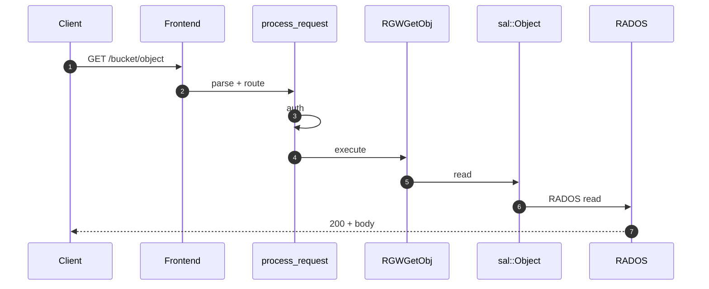
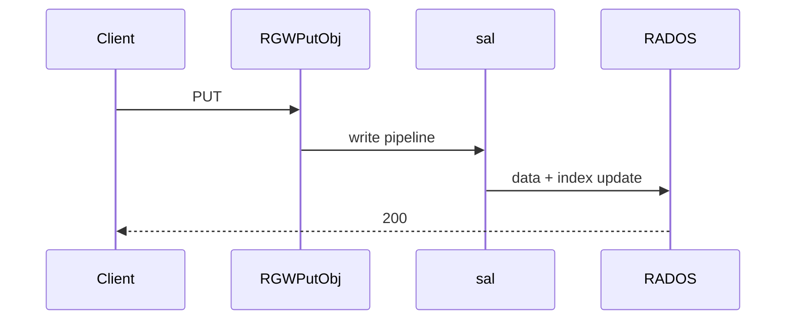

# Sequence diagrams

High-level HTTP flows (see also [Request pipeline](request-pipeline.md)).

## GET object

## PUT object (summary)

## Auth check

See [Authentication module](../modules/auth.md).

## Full diagrams

Additional sequence diagrams and HTTP method variants are in upstream `docs-extended/pages/architecture/sequence-diagrams.md` (Persian, **فارسی** locale on this site).
