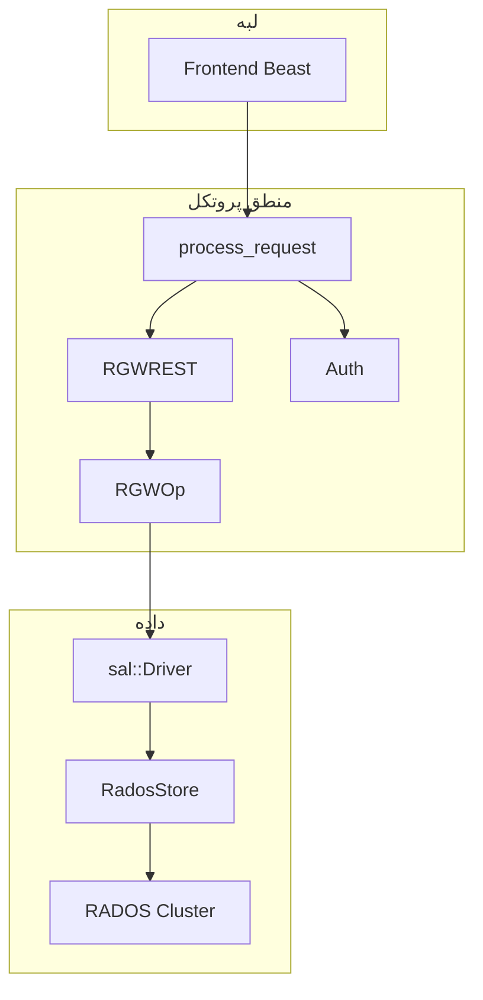

# نمای کلی سیستم

## RGW چیست؟

**RADOS Gateway (RGW)** سرویس دروازه شیء Ceph است که APIهای سازگار با **Amazon S3**، **OpenStack Swift** و افزونه‌های مرتبط (STS، IAM، Admin) را روی خوشه Ceph ارائه می‌دهد. کلاینت‌ها درخواست HTTP می‌فرستند؛ RGW احراز هویت، مجوز و نگاشت به عملیات ذخیره‌سازی را انجام می‌دهد.

## لایه‌های اصلی

| لایه | مسئولیت | محل تقریبی در کد |
|------|---------|------------------|
| Frontend | پذیرش HTTP، پارس درخواست | `rgw_asio_frontend.cc` |
| پردازش درخواست | چرخه عمر `req_state` | `rgw_process.cc` |
| REST / پروتکل | مسیریابی URI → `RGWOp` | `rgw_rest*.cc` |
| عملیات | منطق S3/Swift/Admin | `rgw_op.cc` |
| احراز هویت | `StrategyRegistry` | `rgw_auth*.cc` |
| SAL | انتزاع `User` / `Bucket` / `Object` | `rgw_sal.h` |
| Driver | RADOS و سایر پشتیبان‌ها | `driver/` |
| Services | سرویس‌های داخلی RADOS | `services/` |

## موجودیت‌های داده

- **User** — مالک داده، کلیدها، سهمیه
- **Bucket** — فضای نام تخت برای اشیاء
- **Object** — بایت‌ها + متادیتا + attrs

تعریف SAL در سند منبع:

> **Source:** [`rgw_sal.h`](https://github.com/ceph/ceph/blob/main/src/rgw/rgw_sal.h#L98-L126)

## واحدهای قابل استقرار

| باینری | نقش |
|--------|-----|
| `radosgw` | دیمون اصلی HTTP |
| `radosgw-admin` | ابزار مدیریت خط فرمان |
| `librgw` | API تعبیه‌شده C |

## وابستگی‌های خارجی

- **librados** — ذخیره‌سازی تولید
- **Boost.Beast / ASIO** — سرور HTTP پیش‌فرض
- **OpenSSL** — امضا و رمزنگاری
- **Lua** — قلاب‌های درخواست (اختیاری)

## مستندات مرتبط

- [توپولوژی زمان اجرا](runtime-topology.md)
- [خط لوله درخواست](request-pipeline.md)
- [ماژول مسیر درخواست](../modules/core-request-path.md)
