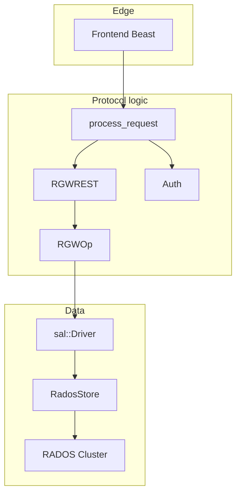

# System overview

## What is RGW?

**RADOS Gateway (RGW)** is Ceph’s object gateway. It exposes **Amazon S3**, **OpenStack Swift**, and related APIs (STS, IAM, Admin) on a Ceph cluster. Clients send HTTP requests; RGW handles auth, authorization, and mapping to storage operations.

## Main layers

| Layer | Responsibility | Approximate code |
|-------|----------------|------------------|
| Frontend | HTTP accept, parse | `rgw_asio_frontend.cc` |
| Request processing | `req_state` lifecycle | `rgw_process.cc` |
| REST / protocol | URI → `RGWOp` | `rgw_rest*.cc` |
| Operations | S3/Swift/Admin logic | `rgw_op.cc` |
| Auth | `StrategyRegistry` | `rgw_auth*.cc` |
| SAL | `User` / `Bucket` / `Object` | `rgw_sal.h` |
| Driver | RADOS and other backends | `driver/` |
| Services | Internal RADOS services | `services/` |

## Data entities

- **User** — data owner, keys, quota
- **Bucket** — flat namespace for objects
- **Object** — bytes + metadata + attrs

> **Source:** [`rgw_sal.h`](https://github.com/ceph/ceph/blob/main/src/rgw/rgw_sal.h#L98-L126)

## Deployable units

| Binary | Role |
|--------|------|
| `radosgw` | Main HTTP daemon |
| `radosgw-admin` | CLI admin tool |
| `librgw` | Embedded C API |

## External dependencies

- **librados** — production storage
- **Boost.Beast / ASIO** — default HTTP server
- **OpenSSL** — signing and encryption
- **Lua** — request hooks (optional)

## Related

- [Runtime topology](runtime-topology.md)
- [Request pipeline](request-pipeline.md)
- [Core request path module](../modules/core-request-path.md)
