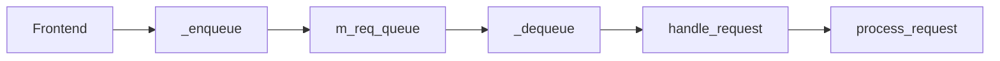

# معماری Worker و صف درخواست

## الگوی کلی

RGW از الگوی **Frontend → Processor → Handler → Operation** پیروی می‌کند (مشابه Worker → Controller → Service در سامانه‌های صف‌محور، اما بدون broker پیام جدا):

| نقش | معادل RGW | توضیح |
|-----|-----------|-------|
| Worker | Thread/ASIO connection | هر اتصال HTTP |
| Controller | `process_request()` | ترتیب auth و اجرا |
| Service | `RGWOp::execute()` | منطق کسب‌وکار |

## صف `RGWProcess`

برای برخی frontendها (legacy thread pool) صف `RGWWQ` درخواست‌ها را نگه می‌دارد:

توابع صف در `rgw_process.cc`: `_enqueue`, `_dequeue`, `_process`.

## Frontend پیش‌فرض (Beast)

- **ASIO** — accept غیرمسدودکننده
- هر connection → پارس HTTP → فراخوانی مستقیم `process_request()`
- فیلترهای I/O: chunking، buffering (`rgw_client_io.h`)

## محیط پردازش مشترک

`RGWProcessEnv` برای هر درخواست شامل:

- `sal::Driver*`
- `RGWREST*`
- `StrategyRegistry`
- rate limiter، Lua manager، ops log

## زمان‌بندی (dmclock)

قبل از اجرا، `schedule_request()` می‌تواند درخواست را در **dmclock** صف‌بندی کند (`rgw_dmclock_*`). در صورت `-EAGAIN` پاسخ rate-limit برمی‌گردد.

## مستندات مرتبط

- [خط لوله درخواست](request-pipeline.md)
- [معماری زمان‌بندی](scheduling-architecture.md)
