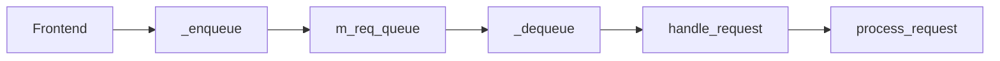

# Worker 与请求队列架构

## Pattern

RGW follows **Frontend → Processor → Handler → Operation** (similar to worker/controller/service queues without a separate message broker):

| Role | RGW equivalent | Notes |
|------|----------------|-------|
| Worker | Thread/ASIO connection | Per HTTP connection |
| Controller | `process_request()` | Auth and execution order |
| Service | `RGWOp::execute()` | Business logic |

## `RGWProcess` queue

Some frontends (legacy thread pool) use `RGWWQ`:

Queue helpers in `rgw_process.cc`: `_enqueue`, `_dequeue`, `_process`.

## Default frontend (Beast)

- **ASIO** — non-blocking accept
- Each connection → parse HTTP → call `process_request()`
- I/O filters: chunking, buffering (`rgw_client_io.h`)

## Shared `RGWProcessEnv`

Per request:

- `sal::Driver*`
- `RGWREST*`
- `StrategyRegistry`
- rate limiter, Lua manager, ops log

## dmclock scheduling

Before execution, `schedule_request()` may queue in **dmclock** (`rgw_dmclock_*`). On `-EAGAIN`, rate-limit response is returned.

## 相关

- [Scheduling architecture](scheduling-architecture.md)
- [Request pipeline](request-pipeline.md)
