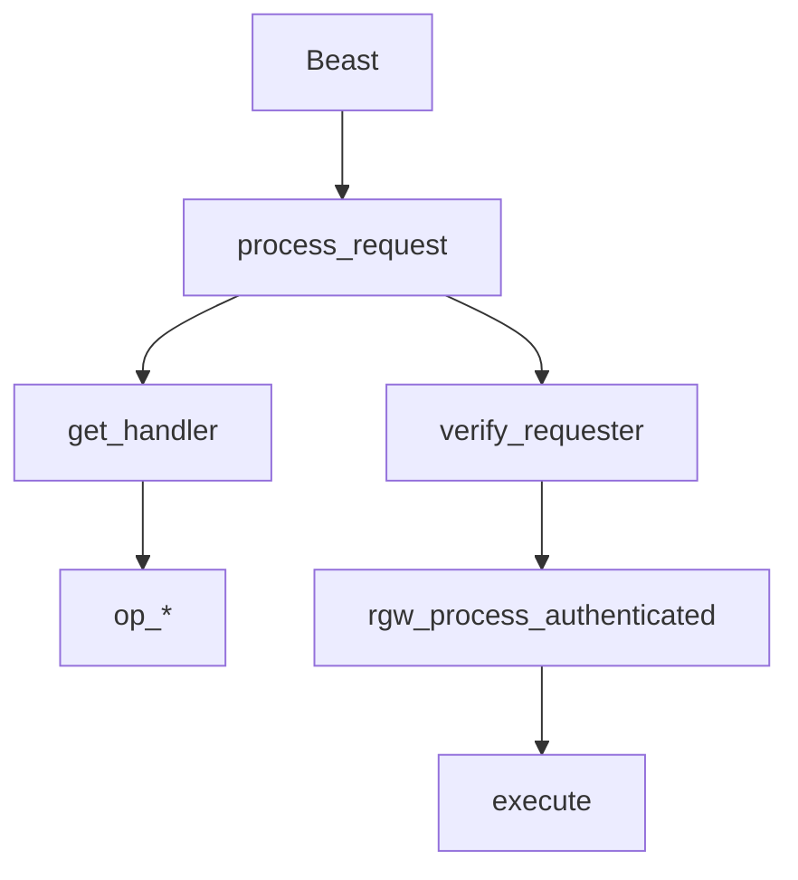

# گام ۱ — فاز ۰: مسیر درخواست‌ها (همه عملیات HTTP)

**مدت پیشنهادی:** ۱–۲ هفته (بسته به عمق)  
**پیش‌نیاز:** [پیش‌نیازها](00-prerequisites.md)

!!! tip "شرح کامل هر عملیات"
    برای هر verb جداگانه سند عمیق با **کد LTR**، **Mermaid** (کلیک = بزرگ‌نمایی)، **الگوریتم، امنیت، FIXME** آماده است:

    **[فهرست فاز ۰](phase-0/index.md)** · **[شرح روایی توابع و کلاس‌ها](phase-0/narrative-reference.md)** · **[لایه‌های مشترک ۰–۶](phase-0/shared-layers-reference.md)** · **[RADOS/OSD/MON](phase-0/rados-osd-mon-stack.md)**

| عملیات | سند |
|--------|------|
| GET | [full-request-path.md](phase-0/full-request-path.md) |
| PUT | [full-request-path-put.md](phase-0/full-request-path-put.md) |
| DELETE | [full-request-path-delete.md](phase-0/full-request-path-delete.md) |
| HEAD | [full-request-path-head.md](phase-0/full-request-path-head.md) |
| LIST | [full-request-path-list.md](phase-0/full-request-path-list.md) |
| POST | [full-request-path-post.md](phase-0/full-request-path-post.md) |
| COPY | [full-request-path-copy.md](phase-0/full-request-path-copy.md) |
| RADOS/OSD/MON | [rados-osd-mon-stack.md](phase-0/rados-osd-mon-stack.md) |

---

## مسیر مشترک (همه عملیات)

| لایه | یک جمله |
|------|---------|
| ۰ بوت | `main` → driver + REST APIs + frontend |
| ۱ HTTP | Beast → فیلتر I/O → `RGWRestfulIO` |
| ۲ process | `process_request` + `req_state` |
| ۳ REST | `get_handler` + `preprocess` |
| ۴ Op | `op_get` / `op_put` / … → کلاس `RGWOp` |
| ۵ Auth | `verify_requester` + `postauth_init` |
| ۶ اجرا | `rgw_process_authenticated` → `execute` |
| ۷–۸ داده | ReadOp / Writer / DeleteOp / list — بسته به verb |
| ۹ cluster | librados → MON (map) → OSD (ذخیره) |

---

## ترتیب مطالعه پیشنهادی

| # | موضوع | سند |
|---|--------|------|
| 1 | GET (پایه) | [GET](phase-0/full-request-path.md) |
| 2 | HEAD | [HEAD](phase-0/full-request-path-head.md) |
| 3 | PUT | [PUT](phase-0/full-request-path-put.md) |
| 4 | LIST | [LIST](phase-0/full-request-path-list.md) |
| 5 | DELETE | [DELETE](phase-0/full-request-path-delete.md) |
| 6 | POST multipart | [POST](phase-0/full-request-path-post.md) |
| 7 | COPY | [COPY](phase-0/full-request-path-copy.md) |
| 8 | RADOS/OSD/MON | [rados-osd-mon-stack.md](phase-0/rados-osd-mon-stack.md) |

### فایل‌های کد (مشترک)

| # | فایل |
|---|------|
| 1–2 | `rgw_main.cc`, `rgw_appmain.cc` |
| 3 | `rgw_asio_frontend.cc` |
| 4–5 | `rgw_process.cc`, `rgw_common.h` |
| 6–7 | `rgw_rest.cc`, `rgw_rest_s3.cc` |
| 8–9 | `rgw_op.cc`, `rgw_sal.h` |
| 10 | `driver/rados/rgw_sal_rados.cc`, `rgw_putobj_processor.cc` |
| 11 | `driver/rados/rgw_rados.cc`, `rgw_tools.cc` |
| 12 | `cls/rgw/` (bucket index — اختیاری) |

---

## سوالات خودارزیابی

1. برای LIST چرا handler سطح bucket است نه object؟
2. تفاوت `RGW_OP_STAT_OBJ` و `RGW_OP_GET_OBJ`؟
3. COPY چه دو مجوز IAM می‌خواهد؟
4. multipart چرا Init با POST و part با PUT است؟

---

## تمرین

- [ ] [فهرست phase-0](phase-0/index.md) را دیدم
- [ ] حداقل GET و PUT را با جدول ردیابی در لاگ تطبیق دادم
- [ ] یک DELETE روی bucket versioned و پاسخ delete marker را دیدم
- [ ] [progress-tracker](progress-tracker.md) را به‌روز کردم

## گام بعدی

→ [02-phase-1-rgwop-lifecycle.md](02-phase-1-rgwop-lifecycle.md)
