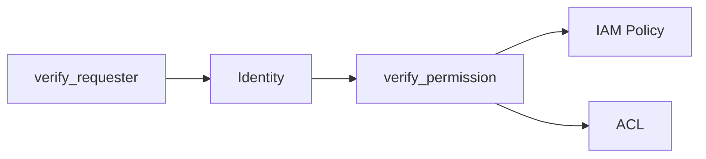

# گام ۴ — فاز ۳: احراز هویت و مجوز

**مدت پیشنهادی:** ۴–۶ روز  
**پیش‌نیاز:** [فاز ۲](03-phase-2-rest-s3.md)

## اهداف

- [ ] تفاوت authentication و authorization را در کد نشان می‌دهی
- [ ] مسیر SigV4 را در `rgw_auth_s3` پیدا کرده‌ای
- [ ] یک درخواست IAM-deny vs ACL-allow را تحلیل کرده‌ای

## دو مرحله

## فایل‌ها

| موضوع | فایل |
|--------|------|
| Registry | `rgw_auth_registry.h` |
| S3 Sig | `rgw_auth_s3.h`, `rgw_auth_s3.cc` |
| IAM | `rgw_iam_policy.cc` |
| ACL | `rgw_acl_s3.cc`, `rgw_acl.cc` |
| Bucket policy | `rgw_policy_s3.cc` |

## قطعه — verify_requester

> **Source:** [`rgw_op.h`](https://github.com/ceph/ceph/blob/main/src/rgw/rgw_op.h#L286-L299)

## تمرین ۱

درخواست با امضای اشتباه: از کجا `-ERR_SIGNATURE_*` برمی‌گردد؟

## تمرین ۲

درخواست anonymous به bucket public-read: کدام تابع اجازه می‌دهد؟

## سوالات

1. `StrategyRegistry` چند strategy دارد؟
2. `rgw_use_opa_authz` کجا چک می‌شود؟ (`rgw_process.cc`)
3. `is_admin()` چه زمانی permission را override می‌کند؟

## مستندات مکمل

- [modules/auth](../modules/auth.md)

## چک‌لیست

- [ ] Identity روی `req_state` را در debugger/log دیدم
- [ ] یک trace امضای نامعتبر انجام دادم

## گام بعدی

→ [05-phase-4-sal.md](05-phase-4-sal.md)
