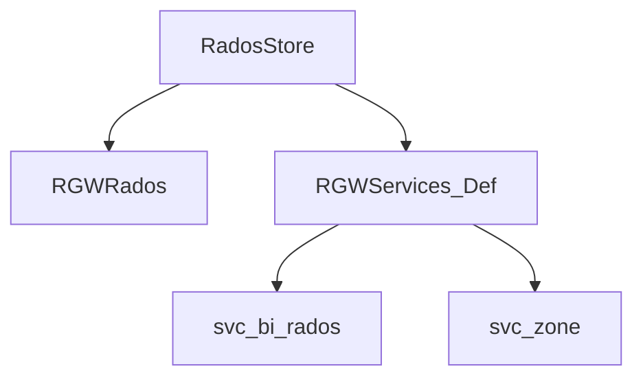

# گام ۶ — فاز ۵: درایور RADOS و Services

**مدت پیشنهادی:** ۷–۱۰ روز  
**پیش‌نیاز:** [فاز ۴](05-phase-4-sal.md)

## اهداف

- [ ] `RadosStore` vs `RGWRados` را تفکیک می‌کنی
- [ ] bucket index و نقش CLS را می‌شناسی
- [ ] `RGWServices_Def` چه سرویس‌هایی جمع می‌کند

## نقشه لایه

## فایل‌ها (ترتیب)

| # | فایل |
|---|------|
| 1 | `driver/rados/rgw_sal_rados.h` |
| 2 | `driver/rados/rgw_service.h` |
| 3 | `driver/rados/rgw_rados.h` (نمای کلی) |
| 4 | `driver/rados/rgw_bucket.cc` |
| 5 | `services/svc_bi_rados.h` |
| 6 | `services/svc_zone.h` |
| 7 | `cls/rgw/` (در tree Ceph) |

## تمرین ۱ — ListObjects

از API تا `cls_rgw` listing (حداقل ۵ hop در call stack).

## تمرین ۲ — CompleteMultipart

نام توابع commit ایندکس را پیدا کن.

## مستندات مکمل

- [rados-driver](../modules/rados-driver.md)
- [services-layer](../modules/services-layer.md)

## چک‌لیست

- [ ] `RGWSI_BucketIndex_RADOS` را باز کردم
- [ ] یک عمل CLS در bucket index شناسایی کردم

## گام بعدی

→ [07-phase-6-put-pipeline.md](07-phase-6-put-pipeline.md)
