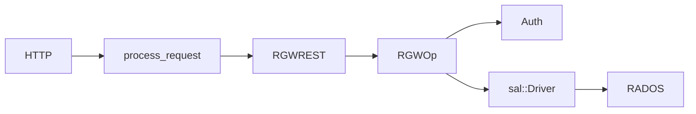

# برنامه یادگیری گام‌به‌گام کد RGW

این پوشه یک **برنامه آموزشی ساخت‌یافته** برای درک عمیق `src/rgw/` و آماده‌سازی برای توسعه است. هر گام شامل فایل‌های مشخص، سوالات، تمرین و چک‌لیست پیشرفت است.

## مدل ذهنی (همیشه در ذهن داشته باش)

> هر درخواست = یک `req_state` + یک `RGWOp`.

## نقشه گام‌ها

| گام | سند | مدت پیشنهادی | هدف |
|-----|------|--------------|------|
| ۰ | [پیش‌نیازها](00-prerequisites.md) | ۲–۳ روز | دانش پایه و ابزار |
| ۱ | [فاز ۰ — مسیر یک درخواست](01-phase-0-request-path.md) | ۳–۵ روز | GET end-to-end |
| ۱+ | [**شرح کامل لایه‌ها (فاز ۰)**](phase-0/full-request-path.md) | همراه گام ۱ | تمام لایه‌ها + کد |
| ۲ | [فاز ۱ — چرخه RGWOp](02-phase-1-rgwop-lifecycle.md) | ۴–۶ روز | هسته عملیات |
| ۳ | [فاز ۲ — REST و S3](03-phase-2-rest-s3.md) | ۵–۷ روز | مسیریابی پروتکل |
| ۴ | [فاز ۳ — Auth و مجوز](04-phase-3-auth.md) | ۴–۶ روز | Identity و IAM |
| ۵ | [فاز ۴ — SAL](05-phase-4-sal.md) | ۵–۷ روز | مرز توسعه |
| ۶ | [فاز ۵ — RADOS و Services](06-phase-5-rados-services.md) | ۷–۱۰ روز | ذخیره‌سازی واقعی |
| ۷ | [فاز ۶ — خط لوله PUT](07-phase-6-put-pipeline.md) | ۴–۶ روز | نوشتن شیء |
| ۸ | [فاز ۷ — Multisite](08-phase-7-multisite.md) | ۵–۷ روز | همگام‌سازی زون |
| ۹ | [فاز ۸ — زیرسیستم‌ها](09-phase-8-subsystems.md) | اختیاری | LC، GC، Lua، … |
| ۱۰ | [چک‌لیست توسعه](10-development-checklist.md) | مرجع | افزودن feature |

## ابزارهای کمکی

- [روش مطالعه هر فایل](study-method.md)
- [ردیاب پیشرفت (چک‌لیست جلسات)](progress-tracker.md)

## مستندات مکمل (همین سایت)

| موضوع | سند |
|--------|------|
| معماری کلی | [system-overview](../architecture/system-overview.md) |
| خط لوله | [request-pipeline](../architecture/request-pipeline.md) |
| نمودار توالی | [sequence-diagrams](../architecture/sequence-diagrams.md) |
| ماژول مسیر درخواست | [core-request-path](../modules/core-request-path.md) |

## قوانین برنامه

1. **گام‌ها را به ترتیب برو** — فاز ۸ قبل از فاز ۴ توصیه نمی‌شود.
2. **هر گام را تمام کن** — چک‌لیست انتهای هر سند را تیک بزن.
3. **یک happy path + یک failure** — در هر فاز کافی است.
4. **`rgw_rest_s3.cc` را از خط ۱ نخوان** — همیشه از symbol search وارد شو.

## شروع

برو به [پیش‌نیازها](00-prerequisites.md) یا اگر آماده‌ای مستقیم [فاز ۰](01-phase-0-request-path.md).
