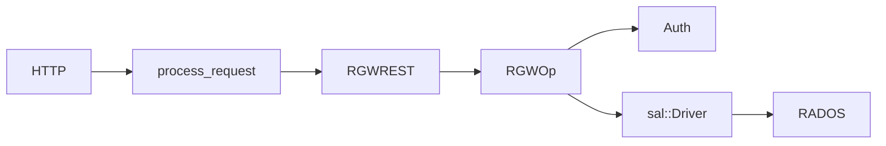

# برنامه یادگیری کد RGW

مسیر ساخت‌یافته برای درک `src/rgw/` و آماده‌سازی برای توسعه. اسناد کامل گام‌به‌گام در upstream `src/rgw/docs-extended/pages/learning-program/` قرار دارد.

## مدل ذهنی

> هر درخواست = یک `req_state` + یک `RGWOp`.

## فازهای پیشنهادی (upstream)

| فاز | موضوع | هدف |
|-----|-------|------|
| ۰ | مسیر درخواست | GET end-to-end |
| ۱ | چرخه RGWOp | هسته عملیات |
| ۲ | REST و S3 | مسیریابی پروتکل |
| ۳ | Auth | Identity و IAM |
| ۴ | SAL | مرز توسعه |
| ۵ | RADOS و services | ذخیره‌سازی واقعی |
| ۶ | خط لوله PUT | نوشتن شیء |
| ۷ | Multisite | همگام‌سازی زون |
| ۸ | زیرسیستم‌ها | LC، GC، Lua (اختیاری) |

## مستندات همین سایت

| موضوع | سند |
|--------|------|
| معماری کلی | [system-overview](../architecture/system-overview.md) |
| خط لوله | [request-pipeline](../architecture/request-pipeline.md) |
| مسیر درخواست | [core-request-path](../modules/core-request-path.md) |
| SAL | [sal-layer](../modules/sal-layer.md) |
| RADOS driver | [rados-driver](../modules/rados-driver.md) |
| Auth | [auth](../modules/auth.md) |
| Multisite | [multisite](../modules/multisite.md) |

## منبع upstream

مخزن [ceph/ceph](https://github.com/ceph/ceph) را clone کنید و `src/rgw/docs-extended/` را برای برنامه کامل فارسی با تمرین‌ها باز کنید.
