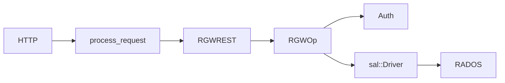

# RGW code learning program

Structured path to understand `src/rgw/` and prepare for development. Full step documents live in upstream `src/rgw/docs-extended/pages/learning-program/`.

## Mental model

> Every request = one `req_state` + one `RGWOp`.

## Suggested phases (upstream)

| Phase | Topic | Goal |
|-------|-------|------|
| 0 | Request path | GET end-to-end |
| 1 | RGWOp lifecycle | Operation core |
| 2 | REST & S3 | Protocol routing |
| 3 | Auth | Identity & IAM |
| 4 | SAL | Development boundary |
| 5 | RADOS & services | Real storage |
| 6 | PUT pipeline | Object write |
| 7 | Multisite | Zone sync |
| 8 | Subsystems | LC, GC, Lua (optional) |

## Docs on this site

| Topic | Document |
|-------|----------|
| System overview | [system-overview](../architecture/system-overview.md) |
| Request pipeline | [request-pipeline](../architecture/request-pipeline.md) |
| Core request path | [core-request-path](../modules/core-request-path.md) |
| SAL | [sal-layer](../modules/sal-layer.md) |
| RADOS driver | [rados-driver](../modules/rados-driver.md) |
| Auth | [auth](../modules/auth.md) |
| Multisite | [multisite](../modules/multisite.md) |

## Upstream source

Clone [ceph/ceph](https://github.com/ceph/ceph) and open `src/rgw/docs-extended/` for the full Persian learning program with exercises.
