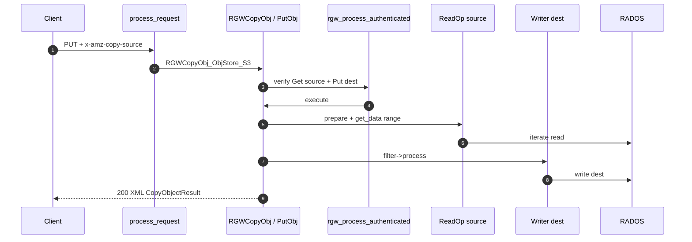
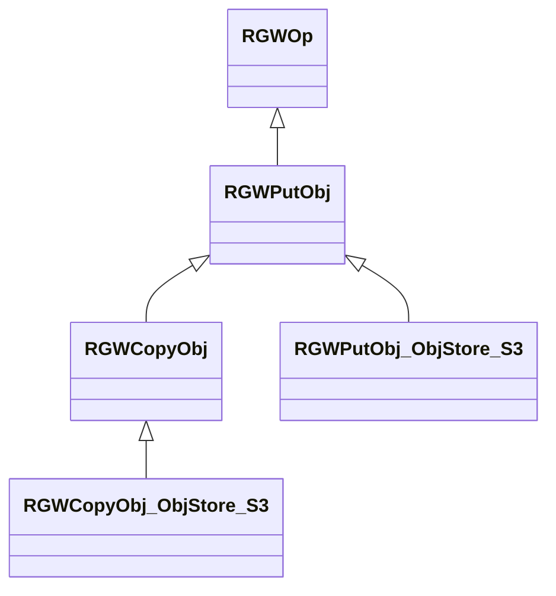
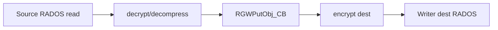

# فاز ۰ — مسیر کامل COPY (PutObject-Copy) (شرح عمیق)

**سناریو:** `PUT /dest-bucket/dest-key` با هدر `x-amz-copy-source: /source-bucket/source-key` (و اختیاری `x-amz-copy-source-range`)

!!! info "نحوه خواندن"
    - **متن فارسی** RTL؛ **کد** LTR.
    - **[شرح روایی](narrative-reference.md)** · لایه‌های ۰–۶: **[shared-layers-reference.md](shared-layers-reference.md)**.
    - پایه PUT/GET: **[PUT](full-request-path-put.md)** · **[GET](full-request-path.md)**.
    - I/O cluster: **[rados-osd-mon-stack.md](rados-osd-mon-stack.md)**.

---

## نمای کلی: COPY = `RGWPutObj` با منبع

COPY در RGW **op جدا در `execute` ندارد**؛ همان `RGWPutObj::execute` است با:

- `s->init_state.src_bucket` / `src_object` از preprocess
- `copy_source` غیرخالی در `RGWCopyObj`
- body کلاینت **خالی** — داده از `ReadOp` منبع خوانده می‌شود

| موضوع | مقدار |
|--------|--------|
| HTTP | `PUT` (نه متد COPY) |
| factory | `op_put` → `RGWCopyObj_ObjStore_S3` اگر `src_bucket` پر باشد |
| `get_type()` | عملیات Put/COPY در لاگ |
| مجوز | **Get** منبع + **Put** مقصد |
| I/O | server-side: RADOS read → filter → RADOS write |

> **Source:** [`rgw_rest_s3.cc`](https://github.com/ceph/ceph/blob/main/src/rgw/rgw_rest_s3.cc#L5529-L5534)

---

## لایه ۴ — کلاس‌ها

### اعضای `RGWCopyObj` (افزوده بر PutObj)

> **Source:** [`rgw_op.h`](https://github.com/ceph/ceph/blob/main/src/rgw/rgw_op.h#L1602-L1654)

| عضو | نقش |
|-----|------|
| `copy_source` | `string_view` — هدر copy-source (الزامی برای COPY) |
| `attrs_mod` | `COPY` vs `REPLACE` metadata |
| `if_match` / `if_nomatch` / `if_mod` / `if_unmod` | preconditions روی **منبع** |
| `src_bucket` | handle SAL bucket منبع |
| `need_to_check_storage_class` | copy به خود بدون تغییر metadata |
| `progress_tracker` | copy بین zone — streaming پاسخ جزئی |

---

## preprocess — پر شدن منبع

در `RGWHandler_REST_S3::postauth_init` / init state:

- پارس `x-amz-copy-source` → `s->init_state.src_bucket`, `src_object`, optional versionId
- `s->object` = **مقصد**؛ منبع جداگانه در `copy_source_*` fields

**Canonical URI برای SigV4:** امضا روی **URI مقصد** (PUT dest) است، نه منبع — منبع فقط در هدر copy-source.

---

## `get_params` — هدرهای COPY

> **Source:** [`rgw_rest_s3.cc`](https://github.com/ceph/ceph/blob/main/src/rgw/rgw_rest_s3.cc#L3815-L3888)

| هدر | نقش |
|-----|------|
| `x-amz-copy-source` | مسیر منبع |
| `x-amz-copy-source-if-match` | precondition منبع |
| `x-amz-metadata-directive` | `COPY` یا `REPLACE` attrs |
| `x-amz-copy-source-range` | بازه byte (در `RGWPutObj`) |
| Object Lock headers | retention/legal hold روی **مقصد** |

**copy به خود (same bucket/key):** اگر placement و metadata عوض نشود → `check_storage_class` → `-ERR_INVALID_REQUEST`.

---

## مجوز — دو مرحله‌ای (Get سپس Put)

> **Source:** [`rgw_op.cc`](https://github.com/ceph/ceph/blob/main/src/rgw/rgw_op.cc#L4195-L4263)

**الگوریتم:**

| # | گام | IAM action |
|---|------|------------|
| 1 | `read_obj_policy` روی bucket/شیء **منبع** | بارگذاری ACL + IAM منبع |
| 2 | `rgw_iam_add_objtags` برای condition روی منبع | — |
| 3 | `verify_object_permission` | `s3:GetObject` یا `s3GetObjectVersion` |
| 4 | `rgw_iam_remove_objtags` | پاکسازی env |
| 5 | پر کردن env مقصد (ACL، SSE، تگ درخواست) | — |
| 6 | `verify_bucket_permission` | `s3:PutObject` روی مقصد |

**امنیت:** بدون Get روی source → `-EACCES` **قبل از** هر read از RADOS — جلوگیری از copy افقی به bucket دیگر.

**Replication:** `s->system_request` و `source_zone` مسیرهای اضافی برای multisite copy دارند.

---

## `execute` — فازها

### فاز ۱–۲: مشترک با PUT

همان `RGWPutObj::execute`: quota، versioning، انتخاب `get_atomic_writer`، `processor->prepare`.

### فاز ۳: آماده‌سازی منبع (بدون body کلاینت)

> **Source:** [`rgw_op.cc`](https://github.com/ceph/ceph/blob/main/src/rgw/rgw_op.cc#L4576-L4614)

| بررسی | نتیجه |
|--------|--------|
| `load_obj_state` منبع | metadata |
| manifest `is_tier_type_s3()` | `-ERR_INVALID_OBJECT_STATE` (Glacier cloud tier) |
| `!exists()` | `-ENOENT` |
| بدون range | `lst = accounted_size - 1` |

### فاز ۴: زنجیره فیلتر نوشتن مقصد

همان PUT: encrypt → compress → lua → checksum روی **مقصد** (ممکن است الگوریتم با منبع متفاوت باشد).

### فاز ۵: حلقه transfer

> **Source:** [`rgw_op.cc`](https://github.com/ceph/ceph/blob/main/src/rgw/rgw_op.cc#L4683-L4715)

**الگوریتم `get_data(fst, lst)` برای COPY:**

> **Source:** [`rgw_op.cc`](https://github.com/ceph/ceph/blob/main/src/rgw/rgw_op.cc#L4293-L4337)

| گام | توضیح |
|-----|--------|
| 1 | `get_read_op()` روی object منبع |
| 2 | `prepare` — manifest، encryption منبع |
| 3 | `get_decrypt_filter` / `decompress` | همان مسیر GET |
| 4 | `read_op->iterate` یا معادل در بازه | chunk ≤ `rgw_max_chunk_size` |
| 5 | `RGWPutObj_CB::handle_data` → `filter->process` مقصد | server-side pipeline |

**bandwidth:** egress از RGW به کلاینت **صفر** برای body شیء — فقط XML پاسخ.

### فاز ۶: `complete`

`processor->complete` — `AtomicObjectProcessor::complete` → `write_meta` + index link ([rados doc](rados-osd-mon-stack.md)).

---

## پاسخ HTTP — XML نه body شیء

> **Source:** [`rgw_rest_s3.cc`](https://github.com/ceph/ceph/blob/main/src/rgw/rgw_rest_s3.cc#L3930-L3943)

- `CopyObjectResult`: `ETag`, `LastModified`
- `send_partial_response` — chunked برای copy بین zone (Progress)

---

## COPY vs GET + PUT دستی

| | Server-side COPY | کلاینت GET سپس PUT |
|--|------------------|---------------------|
| egress WAN | فقط XML | ۲× اندازه object |
| مجوز | Get+Put یک درخواست | جدا |
| decrypt/encrypt | هر دو سمت سرور | بسته به کلاینت |
| range | `x-amz-copy-source-range` | دستی |
| metadata | `metadata-directive` | دستی |

---

## مرجع توابع

| تابع | فایل | نقش |
|------|------|------|
| `RGWHandler_REST_Obj_S3::op_put` | `rgw_rest_s3.cc` | انتخاب Copy vs Put |
| `RGWCopyObj_ObjStore_S3::get_params` | `rgw_rest_s3.cc` | هدرهای COPY |
| `RGWPutObj::verify_permission` | `rgw_op.cc` | Get source + Put dest |
| `RGWPutObj::execute` | `rgw_op.cc` | orchestration |
| `RGWPutObj::get_data(fst,lst)` | `rgw_op.cc` | read منبع |
| `RGWRados::Object::Read::iterate` | `rgw_rados.cc` | stripes منبع |
| `AtomicObjectProcessor::complete` | `rgw_putobj_processor.cc` | finalize مقصد |
| `RGWCopyObj_ObjStore_S3::send_response` | `rgw_rest_s3.cc` | XML |

---

## جدول خطاها

| `ret` | مرحله | S3 / HTTP |
|-------|--------|-----------|
| `-ENOENT` | منبع وجود ندارد | 404 |
| `-EACCES` | Get یا Put ممنوع | 403 |
| `-ERR_INVALID_OBJECT_STATE` | cloud tier | 403 |
| `-ERR_INVALID_REQUEST` | copy به خود بدون تغییر | 400 |
| `-ERR_PRECONDITION_FAILED` | if-match منبع | 412 |
| `-EINVAL` | metadata-directive نامعتبر | 400 |
| `-EIO` | decode compression/manifest | 500 |

---

## امنیت

| تهدید | کنترل |
|--------|--------|
| افشای object دیگر bucket | IAM Get روی ARN منبع |
| کپی به bucket قابل نوشتن عمومی | Put روی مقصد |
| bypass encryption مقصد | `get_encrypt_filter` روی writer |
| copy از object قفل‌شده | retention روی منبع/مقصد |
| SSRF via copy-source | پارس محدود به bucket/key معتبر cluster |

---

## اشکالات شناخته‌شده

| محل | موضوع |
|-----|--------|
| `rgw_rest_s3.cc:3377` | browser POST (مرتبط کمتر) |
| copy بین zone | `progress_tracker` — پاسخ غیر استاندارد S3 |

---

## جدول ردیابی

| # | فایل:خط | نماد |
|---|---------|------|
| 1 | `rgw_rest_s3.cc:5533` | `RGWCopyObj` factory |
| 2 | `rgw_rest_s3.cc:3858` | parse copy-source |
| 3 | `rgw_op.cc:4231` | verify Get source |
| 4 | `rgw_op.cc:4257` | verify Put dest |
| 5 | `rgw_op.cc:4591` | cloud tier check |
| 6 | `rgw_op.cc:4691` | `get_data` حلقه |
| 7 | `rgw_op.cc:4314` | `read_op->prepare` |
| 8 | `driver/rados/rgw_rados.cc:8398` | `iterate_obj` منبع |
| 9 | `driver/rados/rgw_putobj_processor.cc:427` | `write_meta` مقصد |

---

## پرسش‌های تمرینی

1. چرا COPY در `op_put` است؟
2. آیا SigV4 روی URI منبع یا مقصد محاسبه می‌شود؟
3. اگر فقط Put روی dest باشد و Get روی source نباشد، در کدام خط رد می‌شود؟
4. `metadata-directive=REPLACE` چه تأثیری روی attrs دارد؟
5. چرا object cloud-tiered قابل copy نیست؟

---

## مستندات مرتبط

| سند | موضوع |
|-----|--------|
| [PUT](full-request-path-put.md) | Writer، فیلترها |
| [GET](full-request-path.md) | ReadOp، iterate |
| [index.md](index.md) | فهرست |
| [shared-layers-reference.md](shared-layers-reference.md) | auth |

→ [POST](full-request-path-post.md) · [فهرست](index.md)
