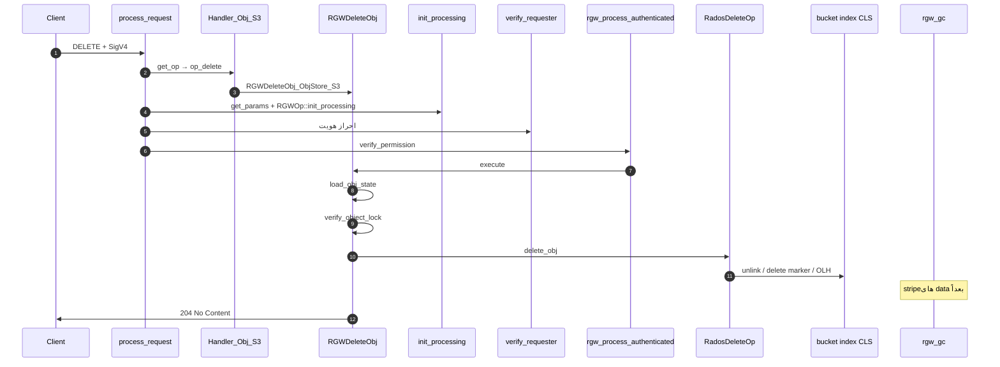
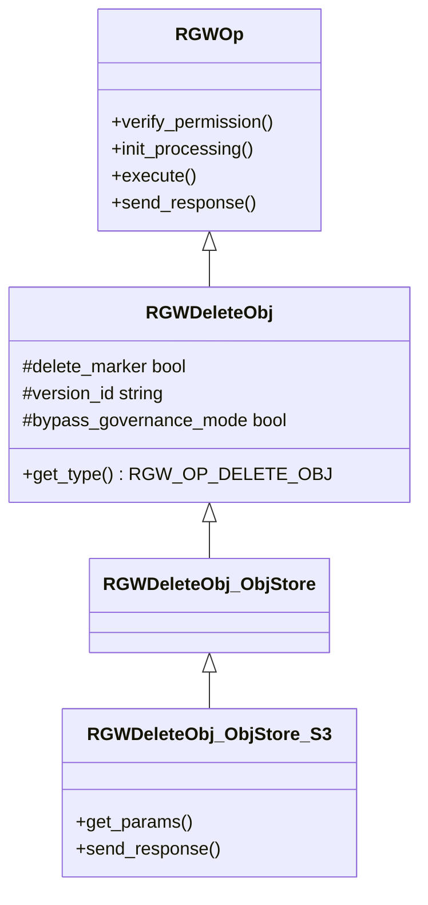
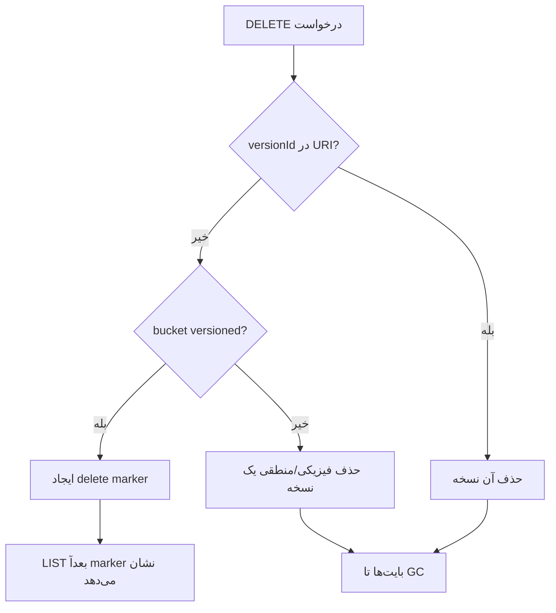

# فاز ۰ — مسیر کامل DELETE Object (شرح عمیق)

**سناریو:** `DELETE /mybucket/myobject` — حذف شیء در bucket نسخه‌دار یا ساده، با یا بدون `versionId`

!!! info "مرجع لایه‌های مشترک"
    **[شرح روایی](narrative-reference.md)** · **[لایه‌های مشترک ۰–۶](shared-layers-reference.md)** · **[RADOS برای DELETE](rados-osd-mon-stack.md)**

!!! info "پیش‌نیاز"
    [فهرست فاز ۰](index.md) · [GET](full-request-path.md) · [HEAD](full-request-path-head.md) · [LIST](full-request-path-list.md)

---

## نمای کلی

DELETE یک درخواست **بدون entity-body** است (پس از SigV4 completion). هزینهٔ اصلی در **metadata**، **bucket index (CLS)** و **Object Lock / versioning** است — نه انتقال بایت از data pool.

| محور | مقدار برای DELETE |
|------|-------------------|
| Handler | `RGWHandler_REST_Obj_S3` |
| Op پایه | `RGWDeleteObj` → `RGWDeleteObj_ObjStore_S3` |
| `RGWOpType` | `RGW_OP_DELETE_OBJ` |
| IAM | `s3:DeleteObject` یا `s3:DeleteObjectVersion` |
| SAL | `Object::get_delete_op()` → `DeleteOp::delete_obj` |
| پاسخ موفق | `204 No Content` + اختیاری `x-amz-delete-marker` / `x-amz-version-id` |
| dmclock | `dmc::client_id::data` |

**تفاوت با GET:** هیچ `iterate` روی stripeها نیست؛ ممکن است delete marker در index بنویسد بدون حذف فوری بایت‌های قدیمی (GC بعداً).

---

## نمودار توالی end-to-end

---

## سلسله‌مراتب کلاس‌ها

| لایه | کلاس | فایل |
|------|------|------|
| منطق عمومی | `RGWDeleteObj` | `rgw_op.h` / `rgw_op.cc` |
| REST مشترک | `RGWDeleteObj_ObjStore` | `rgw_rest.h` |
| S3 XML/هدر | `RGWDeleteObj_ObjStore_S3` | `rgw_rest_s3.h` / `rgw_rest_s3.cc` |
| Abort multipart | `RGWAbortMultipart_ObjStore_S3` | اگر `uploadId` در query |

---

## اعضای protected در `RGWDeleteObj`

> **Source:** [`rgw_op.h`](https://github.com/ceph/ceph/blob/main/src/rgw/rgw_op.h#L1562-L1600)

| عضو | نوع | نقش در DELETE |
|-----|-----|----------------|
| `delete_marker` | `bool` | آیا پاسخ باید `x-amz-delete-marker: true` بفرستد |
| `multipart_delete` | `bool` | حذف SLO manifest (مسیر جدا) |
| `version_id` | `string` | `x-amz-version-id` خروجی |
| `unmod_since` | `ceph::real_time` | precondition `x-amz-delete-if-unmodified-since` |
| `last_mod_time_match` | `ceph::real_time` | precondition زمان |
| `size_match` | `optional<uint64_t>` | precondition اندازه |
| `if_match` | `const char*` | `If-Match` / ETag |
| `no_precondition_error` | `bool` | درخواست سیستمی: خطای precondition → موفق |
| `deleter` | `unique_ptr<RGWBulkDelete::Deleter>` | حذف دسته‌ای اجزای SLO |
| `bypass_perm` | `bool` | مجوز bypass governance (پس از IAM) |
| `bypass_governance_mode` | `bool` | هدر `x-amz-bypass-governance-retention` |

---

## جدول مرجع توابع (۱۸ تابع)

| # | تابع | فایل | نقش |
|---|------|------|-----|
| 1 | `process_request` | `rgw_process.cc` | چرخهٔ کامل HTTP |
| 2 | `RGWHandler_REST_Obj_S3::op_delete` | `rgw_rest_s3.cc` | factory op |
| 3 | `RGWDeleteObj::init_processing` | `rgw_op.cc` | `get_params` سپس `RGWOp::init_processing` |
| 4 | `RGWDeleteObj_ObjStore_S3::get_params` | `rgw_rest_s3.cc` | preconditionها + SigV4 body |
| 5 | `RGWDeleteObj::verify_permission` | `rgw_op.cc` | IAM + MFA + governance |
| 6 | `RGWDeleteObj::pre_exec` | `rgw_op.cc` | `rgw_bucket_object_pre_exec` |
| 7 | `RGWDeleteObj::execute` | `rgw_op.cc` | منطق حذف |
| 8 | `RGWDeleteObj::handle_slo_manifest` | `rgw_op.cc` | حذف اجزای SLO |
| 9 | `verify_object_lock` | `rgw_op.cc` | retention / legal hold |
| 10 | `Object::load_obj_state` | SAL | attrs، اندازه، lock |
| 11 | `Object::get_delete_op` | SAL | ساخت `DeleteOp` |
| 12 | `RadosDeleteOp::delete_obj` | `driver/rados/rgw_sal_rados.cc` | پل به RADOS |
| 13 | `RGWRados::Object::Delete::delete_obj` | `driver/rados/rgw_rados.cc` | index + head |
| 14 | `RGWRados::set_olh` | `driver/rados/rgw_rados.cc` | delete marker نسخه‌دار |
| 15 | `RGWDeleteObj_ObjStore_S3::send_response` | `rgw_rest_s3.cc` | 204 + هدرهای نسخه |
| 16 | `rgw_build_object_policies` | `rgw_process.cc` | بار `s->object` |
| 17 | `verify_bucket_permission` | `rgw_auth*.cc` | ارزیابی IAM |
| 18 | `do_aws4_auth_completion` | `rgw_rest_s3.cc` | تکمیل امضای DELETE |

---

## چرخهٔ عمر `RGWOp` (مشترک)

> **Source:** [`rgw_op.h`](https://github.com/ceph/ceph/blob/main/src/rgw/rgw_op.h#L286-L306)

برای DELETE ترتیب مهم است: `init_processing` **قبل از** `verify_permission` در `rgw_process_authenticated`، چون `get_params` هدرهای precondition را می‌خواند.

---

## لایه ۱–۲: `process_request` و انتخاب handler

> **Source:** [`rgw_process.cc`](https://github.com/ceph/ceph/blob/main/src/rgw/rgw_process.cc#L278-L341)

> **Source:** [`rgw_rest_s3.cc`](https://github.com/ceph/ceph/blob/main/src/rgw/rgw_rest_s3.cc#L5536-L5546)

| شرط query / subresource | کلاس ساخته‌شده |
|-------------------------|----------------|
| `tagging` | `RGWDeleteObjTags_ObjStore_S3` |
| `uploadId` غیرخالی | `RGWAbortMultipart_ObjStore_S3` |
| غیره | `RGWDeleteObj_ObjStore_S3` |

---

## `init_processing` و `get_params`

> **Source:** [`rgw_op.cc`](https://github.com/ceph/ceph/blob/main/src/rgw/rgw_op.cc#L5529-L5536)

> **Source:** [`rgw_rest_s3.cc`](https://github.com/ceph/ceph/blob/main/src/rgw/rgw_rest_s3.cc#L3740-L3790)

**نکات `get_params`:**

1. preconditionهای S3 از env خوانده می‌شوند (`If-Match`, `x-amz-if-match-size`, …).
2. `bypass_governance_mode` از `x-amz-bypass-governance-retention=true`.
3. `do_aws4_auth_completion()` — body خالی؛ hash ثابت SHA256 خالی.

---

## `verify_permission` — مجوز و MFA

> **Source:** [`rgw_op.cc`](https://github.com/ceph/ceph/blob/main/src/rgw/rgw_op.cc#L5538-L5566)

| گام | شرط | خروجی |
|-----|------|--------|
| 1 | IAM condition tags | `rgw_iam_add_objtags` |
| 2 | `versionId` در object | `s3DeleteObject` vs `s3DeleteObjectVersion` |
| 3 | lock + bypass header | نیاز `s3BypassGovernanceRetention` |
| 4 | bucket MFA + versioned delete | `-ERR_MFA_REQUIRED` بدون `x-amz-mfa` |

---

## `execute` — جدول خط‌به‌خط (بخش ۱: اعتبارسنجی)

> **Source:** [`rgw_op.cc`](https://github.com/ceph/ceph/blob/main/src/rgw/rgw_op.cc#L5573-L5621)

| خطوط تقریبی | کد / شرط | معنی |
|-------------|----------|------|
| 5575–5578 | `!bucket_exists` | `-ERR_NO_SUCH_BUCKET` |
| 5580+ | `!Object::empty` | مسیر حذف واقعی |
| 5586–5587 | `have_instance` + lock | بررسی retention روی نسخهٔ مشخص |
| 5589 | `load_obj_state` | بار attrs؛ `-ENOENT` رفتار ویژه |
| 5591–5602 | `-ENOENT` + expiration | ممکن است بدون خطا برگردد |
| 5611–5620 | `verify_object_lock` | `-EACCES` + پیام lock |
| 5623–5639 | `multipart_delete` | مسیر SLO — `handle_slo_manifest` |

---

## `execute` — جدول خط‌به‌خط (بخش ۲: حذف SAL)

> **Source:** [`rgw_op.cc`](https://github.com/ceph/ceph/blob/main/src/rgw/rgw_op.cc#L5643-L5694)

| خطوط تقریبی | کد | معنی |
|-------------|-----|------|
| 5644–5652 | `publish_reserve` | رزرو notification قبل از حذف |
| 5657 | `set_atomic(true)` | سازگاری خواندن/نوشتن concurrent |
| 5660–5664 | `swift_versioning_restore` | مسیر Swift versioning |
| 5672–5675 | `get_system_versioning_params` | epoch OLH، version_id هدف |
| 5677–5688 | پر کردن `DeleteOp::params` | versioning، preconditionها |
| 5690 | `delete_obj(FLAG_LOG_OP)` | فراخوانی SAL/RADOS |
| 5691–5693 | `result` | `delete_marker`، `version_id` برای XML |

**پس از حذف:** bucket logging، نرمال‌سازی `-ECANCELED` / precondition، perf counters، `publish_commit` notification.

---

## لایه SAL → RADOS

> **Source:** [`driver/rados/rgw_sal_rados.cc`](https://github.com/ceph/ceph/blob/main/src/rgw/driver/rados/rgw_sal_rados.cc#L3767-L3799)

> **Source:** [`driver/rados/rgw_rados.cc`](https://github.com/ceph/ceph/blob/main/src/rgw/driver/rados/rgw_rados.cc#L6515-L6566)

| حالت bucket | DELETE بدون `versionId` | DELETE با `versionId` |
|-------------|-------------------------|------------------------|
| غیرنسخه‌دار | حذف رکورد index + head | N/A (معمولاً) |
| versioned | **delete marker** (`set_olh`) | حذف آن نسخه از index |
| suspended | رفتار خاص OLH | همان با محدودیت marker |

جزئیات CLS و shard: **[rados-osd-mon-stack.md](rados-osd-mon-stack.md)**.

---

## `send_response`

> **Source:** [`rgw_rest_s3.cc`](https://github.com/ceph/ceph/blob/main/src/rgw/rgw_rest_s3.cc#L3792-L3807)

| رفتار | توضیح |
|--------|--------|
| `-ENOENT` → `r=0` | S3: حذف idempotent — موفق |
| موفق | `STATUS_NO_CONTENT` (204) |
| `x-amz-version-id` | نسخهٔ marker یا حذف‌شده |
| `x-amz-delete-marker: true` | وقتی `delete_marker` set شده |

---

## Versioning — الگوریتم سطح کاربر

---

## امنیت

| تهدید | کنترل RGW | IAM / هدر |
|--------|-----------|-----------|
| حذف توسط غیرمالک | `verify_bucket_permission` | `s3:DeleteObject` |
| دور زدن retention | `verify_object_lock` | `s3BypassGovernanceRetention` + هدر bypass |
| حذف نسخه حساس | MFA bucket | `x-amz-mfa` |
| حذف با ETag اشتباه | `if_match` در `DeleteOp` | `If-Match` |
| حذف bucket (اشتباه کاربر) | op جدا | `DeleteBucket` — نه این مسیر |
| SLO حذف ناقص | `handle_slo_manifest` | bulk delete اجزا |

**نکته عملیاتی:** DELETE موفق برای کاربر **برگشت‌ناپذیر** است مگر versioning + بازیابی نسخهٔ قبلی.

---

## جدول خطاها

| کد داخلی | HTTP / S3 | علت رایج |
|----------|-----------|----------|
| `-EACCES` | 403 | IAM یا object lock |
| `-ERR_MFA_REQUIRED` | 403 | MFA برای حذف نسخه |
| `-ENOENT` | 204 (پس از map) | شیء نیست — idempotent |
| `-ERR_NO_SUCH_BUCKET` | 404 | bucket |
| `-ERR_NOT_SLO_MANIFEST` | 400 | `multipart_delete` روی غیر-SLO |
| `-ERR_PRECONDITION_FAILED` | 412 | If-Match / زمان / اندازه |
| `-EINVAL` | 400 | پارامتر precondition بد |

---

## FIXME و محدودیت‌های شناخته‌شده

| محل | موضوع |
|-----|--------|
| `rgw_process.cc` | `FIXME` حذف `transform_old_authinfo` پس از migration auth |
| `rgw_op.cc` | SLO + `multipart_delete` — پیچیدگی و race |
| multisite | replicate delete marker — فاز ۷ |
| GC | حذف index ≠ حذف فوری همه stripeها |

---

## تمرین‌ها (۵ سؤال)

1. چرا `init_processing` برای DELETE `get_params` را **قبل** از `RGWOp::init_processing` صدا می‌زند؟
2. تفاوت `s3DeleteObject` و `s3DeleteObjectVersion` دقیقاً به کدام فیلد `s->object` وابسته است؟
3. در bucket versioned، چرا DELETE بدون `versionId` ممکن است بایت‌های data pool را فوراً آزاد نکند؟
4. مسیر `uploadId` در `op_delete` چه op دیگری می‌سازد و چرا؟
5. چرا `send_response` خطای `-ENOENT` را به پاسخ موفق map می‌کند؟

---

## چک‌لیست ردیابی (gdb / log)

| # | فایل:خط | نماد / نکته |
|---|---------|-------------|
| 1 | `rgw_process.cc:337` | `handler->get_op()` |
| 2 | `rgw_rest_s3.cc:5544` | `RGWDeleteObj_ObjStore_S3` |
| 3 | `rgw_op.cc:5531` | `init_processing` |
| 4 | `rgw_rest_s3.cc:3789` | `do_aws4_auth_completion` |
| 5 | `rgw_op.cc:5549` | `verify_bucket_permission` |
| 6 | `rgw_op.cc:5589` | `load_obj_state` |
| 7 | `rgw_op.cc:5613` | `verify_object_lock` |
| 8 | `rgw_op.cc:5690` | `del_op->delete_obj` |
| 9 | `driver/rados/rgw_sal_rados.cc:3791` | `parent_op.delete_obj` |
| 10 | `driver/rados/rgw_rados.cc:6564` | `set_olh` (marker) |
| 11 | `rgw_rest_s3.cc:3802` | `x-amz-version-id` |
| 12 | `rgw_op.cc:5719` | `l_rgw_op_del_obj` perf |

---

## `rgw_process_authenticated` — ترتیب پس از auth

پس از `verify_requester` و `postauth_init`، مسیر authenticated برای DELETE همان الگوی سایر verbهاست:

| مرحله | متد | نکته DELETE |
|--------|------|-------------|
| init_processing | `op->init_processing` | پارس precondition **قبل** از بار policy شیء |
| init_permissions | `rgw_build_bucket_policies` | `s->bucket` |
| read_permissions | IAM/ACL load | `s->iam_policy` |
| verify_permission | `RGWDeleteObj::verify_permission` | MFA اینجا |
| verify_op_mask | نوع DELETE | |
| pre_exec | `rgw_bucket_object_pre_exec` | |
| execute | `RGWDeleteObj::execute` | |
| complete | `send_response` | 204 |

> **Source:** [`rgw_process.cc`](https://github.com/ceph/ceph/blob/main/src/rgw/rgw_process.cc#L417-L421)

---

## هدرهای درخواست DELETE (مرجع سریع)

| هدر HTTP | فیلد op | اثر |
|----------|---------|-----|
| `If-Match` | `if_match` | `-ERR_PRECONDITION_FAILED` |
| `x-amz-delete-if-unmodified-since` | `unmod_since` | حذف فقط اگر قدیمی‌تر نباشد |
| `x-amz-if-match-last-modified-time` | `last_mod_time_match` | تطابق mtime |
| `x-amz-if-match-size` | `size_match` | تطابق اندازه |
| `x-amz-bypass-governance-retention` | `bypass_governance_mode` | + IAM bypass |
| `x-amz-mfa` | `s->mfa_verified` | حذف نسخه در bucket MFA |
| `versionId` (query) | `s->object->instance` | نسخهٔ هدف |

---

## Notification و logging

| رویداد | زمان | شکست |
|--------|------|------|
| `ObjectRemovedDelete` | قبل از `delete_obj` — `publish_reserve` | abort حذف |
| `publish_commit` | پس از موفقیت | فقط log — حذف commit شده |
| bucket logging | پس از `op_ret==0` | **نادیده** — DELETE همچنان موفق |

---

## مقایسه DELETE با PUT/GET

| | GET | PUT | DELETE |
|--|-----|-----|--------|
| body درخواست | خیر | بله | خیر |
| تغییر index | خیر | بله | بله |
| `dmclock_client` | data | data | data |
| idempotent (S3) | بله (read) | خیر | بله (`ENOENT`→204) |
| versioning | read نسخه | نسخه جدید | marker / حذف نسخه |

---

## پیوندها

→ [HEAD](full-request-path-head.md) · [LIST](full-request-path-list.md) · [GET](full-request-path.md) · [فهرست فاز ۰](index.md)
