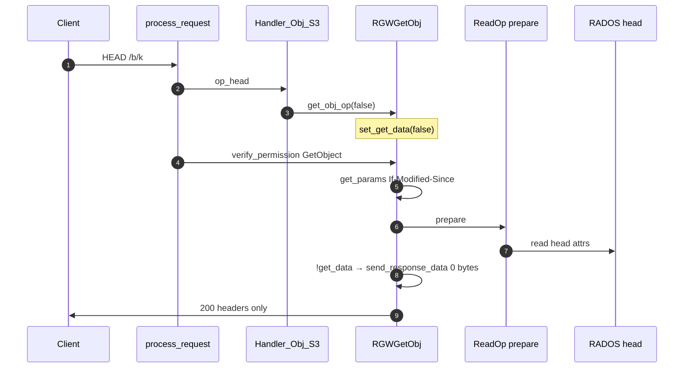
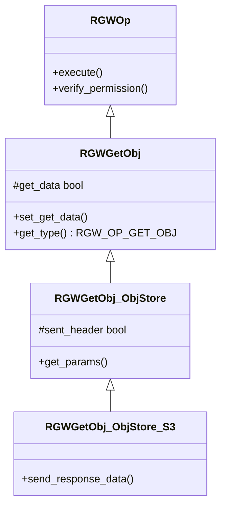
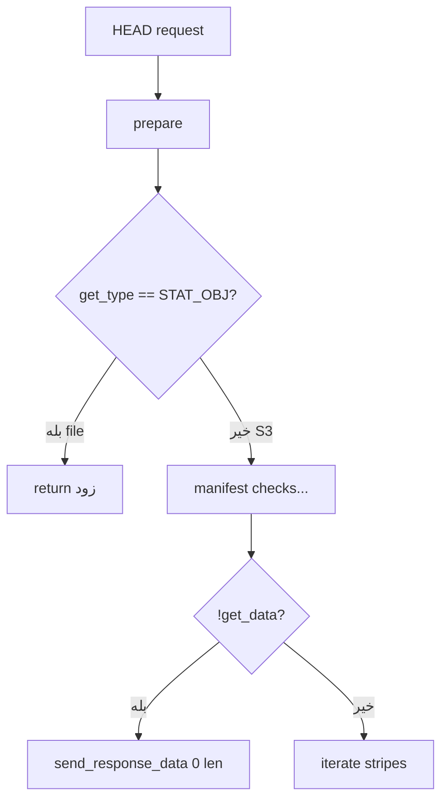
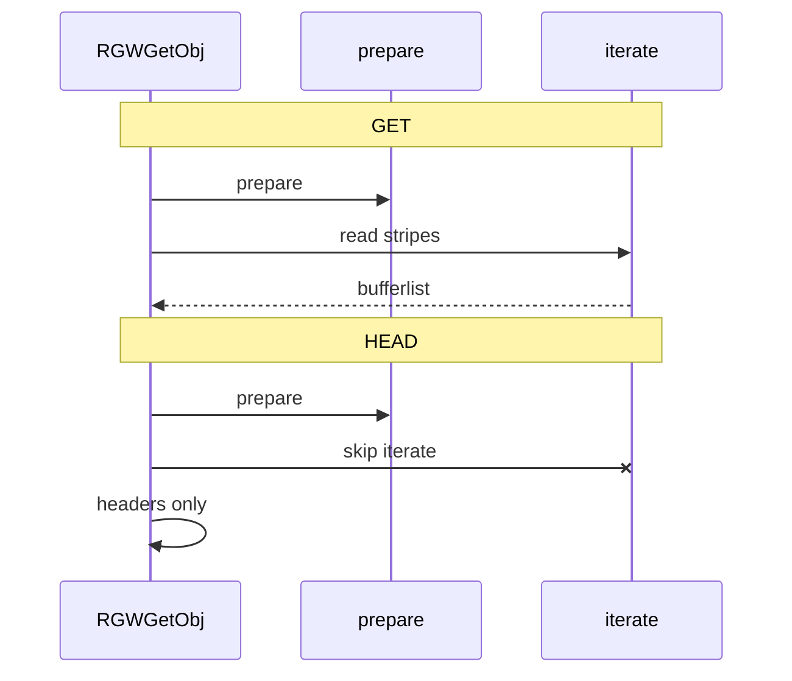

# فاز ۰ — مسیر کامل HEAD (شرح عمیق)

**سناریو:** `HEAD /mybucket/myobject` — metadata و هدرهای HTTP **بدون entity-body**

!!! info "مرجع لایه‌های مشترک"
    **[شرح روایی](narrative-reference.md)** · **[لایه‌های مشترک ۰–۶](shared-layers-reference.md)** · **[RADOS](rados-osd-mon-stack.md)**

!!! info "پیش‌نیاز"
    [GET](full-request-path.md) — HEAD در S3 همان `RGWGetObj` با `get_data=false` است.

---

## نمای کلی — سه سطح HEAD

| درخواست HTTP | Handler | Op | `get_data` | `RGWOpType` |
|--------------|---------|-----|------------|-------------|
| `HEAD /bucket/key` | `RGWHandler_REST_Obj_S3` | `RGWGetObj_ObjStore_S3` | `false` | `RGW_OP_GET_OBJ` |
| `HEAD /bucket` | `RGWHandler_REST_Bucket_S3` | `RGWStatBucket_ObjStore_S3` | — | `RGW_OP_STAT_BUCKET` |
| `HEAD /` | `RGWHandler_REST_Service_S3` | `RGWListBuckets_ObjStore_S3` | — | `RGW_OP_LIST_BUCKETS` |

**تفاوت مهم با NFS (`rgw_file`):** در REST S3، `get_type()` همچنان `RGW_OP_GET_OBJ` است؛ شاخهٔ `RGW_OP_STAT_OBJ` در `execute` عمدتاً برای لایهٔ file است.

| سطح | رفتار HEAD |
|------|------------|
| HTTP | بدون body در پاسخ (RFC 7231) |
| `execute` | `ReadOp::prepare` + `send_response_data(bl,0,0)` — **بدون `iterate`** وقتی `!get_data` |
| bandwidth | فقط head/metadata — نه stripeهای data |
| IAM object | همان `s3:GetObject` / `GetObjectVersion` |

---

## نمودار توالی — Object HEAD

---

## سلسله‌مراتب کلاس — Object HEAD

---

## اعضای protected در `RGWGetObj` (مرتبط با HEAD)

> **Source:** [`rgw_op.h`](https://github.com/ceph/ceph/blob/main/src/rgw/rgw_op.h#L410-L450)

| عضو | نقش در HEAD |
|-----|-------------|
| `get_data` | `false` برای HEAD — پرهیز از `iterate` |
| `if_mod` / `if_unmod` | `If-Modified-Since` / `If-Unmodified-Since` |
| `if_match` / `if_nomatch` | precondition ETag |
| `attrs` | کپی attrs پس از `prepare` — برای هدرها |
| `lastmod` | `Last-Modified` |
| `version_id` | `x-amz-version-id` |
| `partial_content` | معمولاً false در HEAD |
| `range_str` | Range در HEAD نادر — metadata همچنان از prepare |

> **Source:** [`rgw_op.h`](https://github.com/ceph/ceph/blob/main/src/rgw/rgw_op.h#L494-L527)

---

## جدول مرجع توابع (۱۸ تابع)

| # | تابع | فایل | نقش HEAD |
|---|------|------|----------|
| 1 | `RGWHandler_REST_Obj_S3::op_head` | `rgw_rest_s3.cc` | factory |
| 2 | `get_obj_op(false)` | `rgw_rest_s3.cc` | `set_get_data(false)` |
| 3 | `RGWGetObj_ObjStore::get_params` | `rgw_rest.cc` | precondition هدرها |
| 4 | `RGWGetObj_ObjStore_S3::get_params` | `rgw_rest_s3.cc` | partNumber، multisite |
| 5 | `RGWGetObj::verify_permission` | `rgw_op.cc` | `s3:GetObject` |
| 6 | `RGWGetObj::init_common` | `rgw_op.cc` | parse زمان/Range |
| 7 | `RGWGetObj::execute` | `rgw_op.cc` | prepare + شاخه بدون داده |
| 8 | `ReadOp::prepare` | SAL | بار size، etag، attrs |
| 9 | `RGWGetObj_ObjStore_S3::send_response_data` | `rgw_rest_s3.cc` | dump هدرها |
| 10 | `dump_content_length` | `rgw_rest_s3.cc` | `Content-Length` |
| 11 | `dump_etag` | `rgw_rest_s3.cc` | `ETag` |
| 12 | `RGWStatBucket::verify_permission` | `rgw_op.cc` | `s3:ListBucket` |
| 13 | `RGWStatBucket::execute` | `rgw_op.cc` | stats اختیاری |
| 14 | `RGWStatBucket_ObjStore_S3::send_response` | `rgw_rest_s3.cc` | quota headers |
| 15 | `load_bucket_stats` | `rgw_op.cc` | اندازه/تعداد object |
| 16 | `process_request` | `rgw_process.cc` | چرخه کامل |
| 17 | `rgw_process_authenticated` | `rgw_process.cc` | execute پس از auth |
| 18 | `Object::load_obj_state` | SAL | head object در prepare |

---

## انتخاب Operation — Object

> **Source:** [`rgw_rest_s3.cc`](https://github.com/ceph/ceph/blob/main/src/rgw/rgw_rest_s3.cc#L5481-L5515)

| شرط | op |
|------|-----|
| `uploadId` | `RGWListMultipart` (HEAD multipart) |
| ACL subresource | `RGWGetACLs` |
| پیش‌فرض | `RGWGetObj` + `get_data=false` |

---

## `get_params` — preconditionهای HTTP

> **Source:** [`rgw_rest.cc`](https://github.com/ceph/ceph/blob/main/src/rgw/rgw_rest.cc#L842-L858)

> **Source:** [`rgw_rest_s3.cc`](https://github.com/ceph/ceph/blob/main/src/rgw/rgw_rest_s3.cc#L298-L334)

| هدر / args | فیلد op | اثر در prepare |
|------------|---------|----------------|
| `HTTP_IF_MODIFIED_SINCE` | `if_mod` | 304 Not Modified |
| `HTTP_IF_UNMODIFIED_SINCE` | `if_unmod` | 412 |
| `HTTP_IF_MATCH` | `if_match` | 412 |
| `HTTP_IF_NONE_MATCH` | `if_nomatch` | 304 |
| `HTTP_RANGE` | `range_str` | parse range (HEAD کمتر رایج) |
| `partNumber` | `multipart_part_num` | metadata بخش MPU |

**درخواست سیستمی:** `rgwx-stat` می‌تواند `get_data` را override کند (`rgwx_stat`).

---

## `execute` — دو شاخهٔ بدون body

### شاخه A: `RGW_OP_STAT_OBJ` (عمدتاً file/NFS)

> **Source:** [`rgw_op.cc`](https://github.com/ceph/ceph/blob/main/src/rgw/rgw_op.cc#L2499-L2510)

### شاخه B: S3 REST — `!get_data` (مسیر اصلی HEAD)

> **Source:** [`rgw_op.cc`](https://github.com/ceph/ceph/blob/main/src/rgw/rgw_op.cc#L2673-L2676)

**الگوریتم S3 HEAD (خلاصه):**

1. `get_params` → preconditionها.
2. `init_common` → parse زمان‌ها.
3. `read_op->prepare` — **یک (یا چند) read RADOS برای head**؛ size، ETag، encryption flags.
4. اگر manifest/SLO/user-manifest — ممکن است مسیرهای جانبی اجرا شوند (همانند GET) تا به `!get_data` برسد.
5. `send_response_data(bl, 0, 0)` — فقط هدرها، `end_header` بدون body.

---

## `send_response_data` — ساخت هدرها

> **Source:** [`rgw_rest_s3.cc`](https://github.com/ceph/ceph/blob/main/src/rgw/rgw_rest_s3.cc#L393-L420)

> **Source:** [`rgw_rest_s3.cc`](https://github.com/ceph/ceph/blob/main/src/rgw/rgw_rest_s3.cc#L497-L548)

| هدر خروجی | منبع |
|-----------|------|
| `Content-Length` | `total_len` / `s->obj_size` |
| `Last-Modified` | `lastmod` |
| `ETag` | `RGW_ATTR_ETAG` یا `lo_etag` (SLO) |
| `x-amz-version-id` | `version_id` |
| `x-amz-meta-*` | user attrs |
| `x-amz-server-side-encryption-*` | attrs رمزنگاری |
| `Content-Type` | attr یا sniff |

**نکته:** `sent_header` — اولین فراخوانی `send_response_data` هدرها را می‌نویسد؛ فراخوانی‌های بعدی فقط body (در HEAD طول ۰).

---

## Bucket HEAD — `RGWStatBucket`

> **Source:** [`rgw_op.cc`](https://github.com/ceph/ceph/blob/main/src/rgw/rgw_op.cc#L3220-L3231)

> **Source:** [`rgw_op.cc`](https://github.com/ceph/ceph/blob/main/src/rgw/rgw_op.cc#L3255-L3270)

> **Source:** [`rgw_rest_s3.cc`](https://github.com/ceph/ceph/blob/main/src/rgw/rgw_rest_s3.cc#L2531-L2559)

| موضوع | مقدار |
|--------|--------|
| مجوز | `s3:ListBucket` (نه GetObject) — سطح bucket |
| `read-stats` query | بارگذاری `RGWStorageStats` |
| پاسخ | هدرهای quota (`X-RGW-Quota-*`) برای owner |
| body | خالی — `end_header` + `dump_start` |

---

## مقایسه GET vs HEAD

| موضوع | GET | HEAD |
|--------|-----|------|
| Factory | `get_obj_op(true)` | `get_obj_op(false)` |
| `get_data` | `true` | `false` |
| `verify_permission` | `s3:GetObject` | همان |
| SigV4 | همان canonical request | همان (method=HEAD) |
| `prepare` | بله | بله |
| `iterate` | بله (stripeها) | **خیر** (شاخه `!get_data`) |
| bandwidth | بالا | پایین |
| افشای metadata | کامل | همان سطح (بدون body) |
| 304 | با `If-Modified-Since` | بله |

---

## امنیت

| موضوع | توضیح |
|--------|--------|
| سطح افشا | همان GET از نظر metadata: size، ETag، user meta |
| بدون body | محتوای decrypt‌شده در پاسخ نیست — مگر attrs حساس در head |
| IAM | `s3:GetObject` — نه action جدا برای HEAD |
| Conditional | 304 / 412 در `prepare` |
| ListBucket برای bucket HEAD | افشای quota — فقط owner در `send_response` |
| Side channel | timing prepare هنوز وجود دارد |

---

## جدول خطاها

| کد | HTTP | معنی (object HEAD) |
|----|------|---------------------|
| `-EACCES` | 403 | بدون GetObject |
| `-ENOENT` | 404 | key نیست |
| `-ERR_NOT_MODIFIED` | 304 | If-None-Match / If-Modified-Since |
| `-ERR_PRECONDITION_FAILED` | 412 | If-Match / If-Unmodified-Since |
| `-ERANGE` | 416 | Range نامعتبر (نادر در HEAD) |

---

## FIXME

| محل | موضوع |
|-----|--------|
| `rgw_op.cc:2507` | دو مسیر STAT vs `!get_data` — مستندسازی برای file vs S3 |
| SLO HEAD | ممکن است منطق manifest قبل از `!get_data` اجرا شود |
| `rgw_process.cc` | auth legacy `transform_old_authinfo` |

---

## تمرین‌ها (۵ سؤال)

1. چرا S3 HEAD `RGW_OP_GET_OBJ` برمی‌گرداند ولی `iterate` نمی‌زند؟
2. تفاوت مجوز `HEAD /bucket` و `HEAD /bucket/key` چیست؟
3. کدام خط `execute` برای REST S3 عملاً body را قطع می‌کند؟
4. آیا `Content-Length` در HEAD همیشه اندازهٔ کامل object است؟
5. `rgwx-stat` در درخواست سیستمی چه تفاوتی با HEAD عمومی دارد؟

---

## چک‌لیست ردیابی

| # | فایل:خط | نماد |
|---|---------|------|
| 1 | `rgw_rest_s3.cc:5515` | `op_head` |
| 2 | `rgw_rest_s3.cc:5484` | `set_get_data(false)` |
| 3 | `rgw_rest.cc:844` | `HTTP_IF_MODIFIED_SINCE` |
| 4 | `rgw_op.cc:1136` | `verify_permission` |
| 5 | `rgw_op.cc:2499` | `prepare` |
| 6 | `rgw_op.cc:2508` | `RGW_OP_STAT_OBJ` (file) |
| 7 | `rgw_op.cc:2673` | `!get_data` |
| 8 | `rgw_rest_s3.cc:497` | `Content-Length` |
| 9 | `rgw_op.cc:3227` | StatBucket ListBucket perm |
| 10 | `rgw_rest_s3.cc:2557` | bucket HEAD `end_header` |

---

## `verify_permission` — Object HEAD

> **Source:** [`rgw_op.cc`](https://github.com/ceph/ceph/blob/main/src/rgw/rgw_op.cc#L1199-L1215)

HEAD از نظر IAM **همان GET** است — action `s3:GetObject` یا `s3GetObjectVersion` بسته به `versionId`.

---

## پاسخ 304 Not Modified

در `ReadOp::prepare`، اگر `If-Modified-Since` برقرار باشد و شیء تغییر نکرده:

- `op_ret` می‌تواند `-ERR_NOT_MODIFIED` شود.
- `send_response_data` با `op_ret` غیرصفر — بدون body.
- کلاینت **304** می‌بیند (نه 200 با body خالی).

---

## Service HEAD — `ListBuckets` بدون لیست کامل

> **Source:** [`rgw_rest_s3.cc`](https://github.com/ceph/ceph/blob/main/src/rgw/rgw_rest_s3.cc#L5268-L5271)

`HEAD /` همان op لیست bucketها را می‌سازد؛ پیاده‌سازی ممکن است تعداد محدودی metadata برگرداند — برای جزئیات به `RGWListBuckets_ObjStore_S3` مراجعه کنید.

---

## هزینه I/O — prepare در برابر iterate

| مرحله | RADOS تقریبی | HEAD | GET بزرگ |
|--------|--------------|------|----------|
| head object | 1× read meta | بله | بله |
| stripe data | N× read | **خیر** | بله |
| decompress/decrypt filter | setup | minimal | full |
| bandwidth egress | | کم | زیاد |

→ prepare روی **head** در data pool: **[rados-osd-mon-stack.md](rados-osd-mon-stack.md)**.

---

## `RGW_OP_STAT_OBJ` — مسیر file (مرجع)

> **Source:** [`rgw_file_int.h`](https://github.com/ceph/ceph/blob/main/src/rgw/rgw_file_int.h#L2191-L2192)

در NFS/RGW file gateway، `get_type()` صریحاً `RGW_OP_STAT_OBJ` برمی‌گرداند و شاخهٔ زودهنگام `execute` خط ۲۵۰۸ فعال می‌شود — متفاوت از REST S3 که `get_data=false` است.

---

## `rgw_process_authenticated`

> **Source:** [`rgw_process.cc`](https://github.com/ceph/ceph/blob/main/src/rgw/rgw_process.cc#L417-L421)

---

## پیوندها

→ [LIST](full-request-path-list.md) · [DELETE](full-request-path-delete.md) · [GET](full-request-path.md) · [فهرست](index.md)
