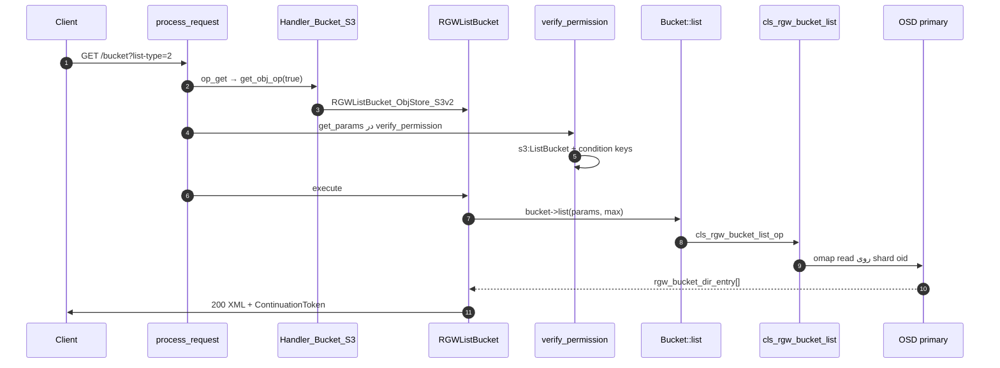
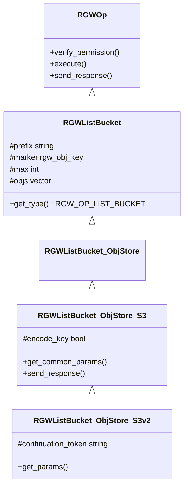
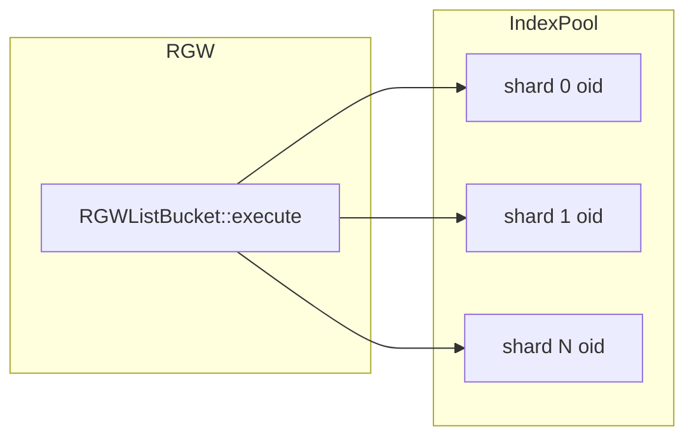

# فاز ۰ — مسیر کامل LIST (ListObjects) (شرح عمیق)

**سناریو:** `GET /mybucket?list-type=2&prefix=foo/&max-keys=100` — صفحه‌بندی کلیدها در bucket

!!! info "مرجع لایه‌های مشترک"
    **[شرح روایی](narrative-reference.md)** · **[لایه‌های مشترک ۰–۶](shared-layers-reference.md)** · **[RADOS برای LIST](rados-osd-mon-stack.md)**

!!! info "پیش‌نیاز"
    [فهرست فاز ۰](index.md) · [GET](full-request-path.md) · [HEAD bucket](full-request-path-head.md)

---

## نمای کلی

LIST یک **GET روی bucket** است (نه روی object key). handler، op و مجوز با `RGWGetObj` متفاوت است.

| محور | مقدار |
|------|--------|
| Handler | `RGWHandler_REST_Bucket_S3` |
| Op | `RGWListBucket` → `RGWListBucket_ObjStore_S3` / `S3v2` |
| `RGWOpType` | `RGW_OP_LIST_BUCKET` |
| IAM | `s3:ListBucket` یا `s3:ListBucketVersions` |
| I/O اصلی | **bucket index** در index pool — نه خواندن body اشیاء |
| پاسخ | XML/JSON `ListBucketResult` (chunked) |
| perf | `l_rgw_op_list_obj`, `l_rgw_op_list_obj_lat` |

**ListBuckets** (`GET /`) op جدا با `RGWListBuckets` است — در انتهای سند.

---

## نمودار توالی end-to-end

---

## سلسله‌مراتب کلاس‌ها

---

## اعضای protected در `RGWListBucket`

> **Source:** [`rgw_op.h`](https://github.com/ceph/ceph/blob/main/src/rgw/rgw_op.h#L1006-L1044)

| عضو | نوع | نقش |
|-----|-----|------|
| `prefix` | `string` | فیلتر پیشوند کلید |
| `marker` / `next_marker` | `rgw_obj_key` | صفحه‌بندی (v1 marker یا v2 token) |
| `end_marker` | `rgw_obj_key` | محدودهٔ بالای لیست |
| `max_keys` | `string` | مقدار خام query قبل از parse |
| `delimiter` | `string` | گروه‌بندی `CommonPrefixes` |
| `encoding_type` | `string` | `url` برای encode کلیدها |
| `list_versions` | `bool` | `versions` در query |
| `max` | `int` | پس از `parse_max_keys` — تعداد entry |
| `objs` | `vector<rgw_bucket_dir_entry>` | نتیجهٔ صفحه |
| `common_prefixes` | `map<string,bool>` | پیشوند‌های مشترک |
| `is_truncated` | `bool` | ادامه دارد؟ |
| `allow_unordered` | `bool` | لیست بدون ترتیب lex (سریع‌تر) |
| `shard_id` | `int` | درخواست سیستمی — shard مشخص |
| `default_max` | `int` | سقف پیش‌فرض (1000 در S3) |

---

## جدول مرجع توابع (۱۷ تابع)

| # | تابع | فایل | نقش |
|---|------|------|-----|
| 1 | `RGWHandler_REST_Bucket_S3::op_get` | `rgw_rest_s3.cc` | dispatch subresource vs list |
| 2 | `get_obj_op(true)` | `rgw_rest_s3.cc` | `list-type` → v1/v2 |
| 3 | `RGWListBucket::verify_permission` | `rgw_op.cc` | `get_params` + IAM conditions |
| 4 | `RGWListBucket::parse_max_keys` | `rgw_op.cc` | bound به `rgw_max_listing_results` |
| 5 | `RGWListBucket::pre_exec` | `rgw_op.cc` | `rgw_bucket_object_pre_exec` |
| 6 | `RGWListBucket::execute` | `rgw_op.cc` | `bucket->list` |
| 7 | `RGWListBucket_ObjStore_S3::get_common_params` | `rgw_rest_s3.cc` | prefix، delimiter، max-keys |
| 8 | `RGWListBucket_ObjStore_S3::get_params` | `rgw_rest_s3.cc` | marker (v1) |
| 9 | `RGWListBucket_ObjStore_S3v2::get_params` | `rgw_rest_s3.cc` | start-after، continuation-token |
| 10 | `RGWListBucket_ObjStore_S3::send_response` | `rgw_rest_s3.cc` | XML ListBucketResult |
| 11 | `rgw::sal::Bucket::list` | SAL | abstraction listing |
| 12 | `RGWRados::cls_bucket_list` | `driver/rados/rgw_rados.cc` | shard loop |
| 13 | `cls_rgw_bucket_list_op` | CLS | op روی index object |
| 14 | `rgw_rados_operate` | `driver/rados/rgw_rados.cc` | ارسال به OSD |
| 15 | `load_bucket_stats` | `rgw_op.cc` | آمار اختیاری container |
| 16 | `verify_bucket_permission` | auth | `s3:ListBucket` |
| 17 | `RGWHandler_REST_Service_S3::op_get` | `rgw_rest_s3.cc` | `ListBuckets` سطح حساب |

---

## انتخاب Operation — Handler

> **Source:** [`rgw_rest_s3.cc`](https://github.com/ceph/ceph/blob/main/src/rgw/rgw_rest_s3.cc#L5273-L5290)

> **Source:** [`rgw_rest_s3.cc`](https://github.com/ceph/ceph/blob/main/src/rgw/rgw_rest_s3.cc#L5350-L5351)

| `list-type` | کلاس | تفاوت API |
|-------------|------|-----------|
| `1` (پیش‌فرض) | `RGWListBucket_ObjStore_S3` | `Marker` / `NextMarker` |
| `2` | `RGWListBucket_ObjStore_S3v2` | `StartAfter`, `ContinuationToken`, `KeyCount` |
| دیگر | fallback به v1 + log | سازگاری |

**توجه:** `op_get` ابتدا ده‌ها subresource (`versioning`, `acl`, `uploads`, …) را بررسی می‌کند؛ فقط در absence آن‌ها به `get_obj_op(true)` می‌رسد.

---

## `get_params` — query و IAM condition keys

> **Source:** [`rgw_rest_s3.cc`](https://github.com/ceph/ceph/blob/main/src/rgw/rgw_rest_s3.cc#L1858-L1901)

> **Source:** [`rgw_rest_s3.cc`](https://github.com/ceph/ceph/blob/main/src/rgw/rgw_rest_s3.cc#L1904-L1918)

| پارامتر query | فیلد op | IAM condition (`s->env`) |
|---------------|---------|---------------------------|
| `prefix` | `prefix` | `s3:prefix` |
| `delimiter` | `delimiter` | `s3:delimiter` |
| `max-keys` | `max` (پس از parse) | `s3:max-keys` |
| `versions` | `list_versions` | action جدا: `ListBucketVersions` |
| `marker` / `continuation-token` | `marker` | — |
| `allow-unordered` | `allow_unordered` | — (غیراستاندارد) |

---

## `verify_permission`

> **Source:** [`rgw_op.cc`](https://github.com/ceph/ceph/blob/main/src/rgw/rgw_op.cc#L3272-L3298)

**الگوریتم:**

1. `get_params` — اگر parse شکست خورد، همان خطا برگردد.
2. قرار دادن `s3:prefix`, `s3:delimiter`, `s3:max-keys` در `s->env` برای **IAM condition**.
3. `rgw_iam_add_buckettags` اگر policy به tag bucket نیاز دارد.
4. `verify_bucket_permission` با `s3ListBucket` یا `s3ListBucketVersions`.

**امنیت:** حتی اگر objectها public باشند، **نام کلیدها** بدون `ListBucket` افشا نمی‌شود (مگر policy صریح).

---

## `parse_max_keys` — ضد DoS

> **Source:** [`rgw_op.cc`](https://github.com/ceph/ceph/blob/main/src/rgw/rgw_op.cc#L3301-L3309)

| ورودی | رفتار |
|--------|--------|
| `max-keys` بسیار بزرگ | سقف `rgw_max_listing_results` |
| `max-keys=0` | مجاز — probe خالی بودن bucket |
| پیش‌فرض | `default_max` (1000 در S3) |

---

## `execute` — جدول خط‌به‌خط

> **Source:** [`rgw_op.cc`](https://github.com/ceph/ceph/blob/main/src/rgw/rgw_op.cc#L3317-L3367)

| خطوط | شرط / فراخوانی | نتیجه |
|------|----------------|--------|
| 3319–3322 | `!bucket_exists` | `-ERR_NO_SUCH_BUCKET` |
| 3324–3329 | `Indexless` layout | `-ERR_METHOD_NOT_ALLOWED` |
| 3331–3336 | `allow_unordered` + `delimiter` | `-EINVAL` — ترکیب نامعتبر |
| 3338–3343 | `need_container_stats` | `load_bucket_stats` اختیاری |
| 3345–3352 | ساخت `ListParams` | prefix، marker، shard، … |
| 3356 | `bucket->list(..., max, results)` | خواندن صفحه از index |
| 3357–3361 | موفق | `objs`, `common_prefixes`, `is_truncated` |
| 3364–3366 | perf counters | latency listing |

---

## لایه RADOS — `cls_rgw_bucket_list_op`

> **Source:** [`driver/rados/rgw_rados.cc`](https://github.com/ceph/ceph/blob/main/src/rgw/driver/rados/rgw_rados.cc#L11081-L11091)

**الگوریتم سطح بالا (هر shard):**

1. `bucket_shard_index` — hash نام کلید → shard id.
2. oid shard در **index pool** (نه data pool).
3. `cls_rgw_bucket_list_op` روی OSD primary — omap entries.
4. حداکثر `max` entry برگردانده می‌شود — **بدون** خواندن محتوای object.

→ shard، bilog، multisite: **[rados-osd-mon-stack.md](rados-osd-mon-stack.md)**.

---

## `send_response` — XML و chunked

> **Source:** [`rgw_rest_s3.cc`](https://github.com/ceph/ceph/blob/main/src/rgw/rgw_rest_s3.cc#L2045-L2070)

| بخش XML | منبع داده |
|---------|-----------|
| `Name`, `Prefix`, `MaxKeys` | `s->bucket_name`, `prefix`, `max` |
| `Contents` / `Version` | `objs[]` — Key، ETag، Size، StorageClass |
| `CommonPrefixes` | `common_prefixes` + `delimiter` |
| `IsTruncated`, `NextMarker` | `is_truncated`, `next_marker` |
| v2 | `KeyCount`, `ContinuationToken` در کلاس v2 |

**Perf:** `CHUNKED_TRANSFER_ENCODING` — شروع پاسخ قبل از ساخت کامل XML در حافظه.

---

## ListObjects v1 در برابر v2

| موضوع | v1 (`list-type=1`) | v2 (`list-type=2`) |
|--------|-------------------|-------------------|
| ادامهٔ لیست | `marker` | `continuation-token` |
| شروع | — | `start-after` |
| مالک | همیشه در XML قدیمی | `fetch-owner` |
| نام XML root | `ListBucketResult` | همان + فیلدهای v2 |
| کلاس | `RGWListBucket_ObjStore_S3` | `RGWListBucket_ObjStore_S3v2` |

---

## ListBuckets — `GET /` (سطح سرویس)

| موضوع | مقدار |
|--------|--------|
| Handler | `RGWHandler_REST_Service_S3` |
| Op | `RGWListBuckets_ObjStore_S3` |
| `op_head` سرویس | همان op (بدون body کامل) |
| IAM | `s3:ListAllMyBuckets` |
| داده | metadata bucketهای کاربر از RADOS — نه index اشیاء |

> **Source:** [`rgw_rest_s3.cc`](https://github.com/ceph/ceph/blob/main/src/rgw/rgw_rest_s3.cc#L5260-L5265)

---

## امنیت

| تهدید | کنترل |
|--------|--------|
| enumeration نام کلیدها | `s3:ListBucket` اجباری |
| DoS با `max-keys` عظیم | `rgw_max_listing_results` |
| افشای `versionId` | `list-versions=true` → `ListBucketVersions` |
| لیست bucket بدون index | Indexless → 405 |
| افشای محتوا | LIST فقط metadata خلاصه — نه body |

---

## جدول خطاها

| کد | HTTP | معنی |
|----|------|------|
| `-EACCES` | 403 | بدون ListBucket / Versions |
| `-ERR_NO_SUCH_BUCKET` | 404 | bucket |
| `-ERR_METHOD_NOT_ALLOWED` | 405 | indexless bucket |
| `-EINVAL` | 400 | delimiter + unordered |
| parse `max-keys` | 400 | مقدار غیرعددی |

---

## FIXME

| محل | موضوع |
|-----|--------|
| `rgw_rest_s3.cc:5295` | `XXX` — indexing به‌جای GET برای برخی subresourceها |
| `unordered` listing | بدون delimiter — محدودیت API |
| multisite | همگام‌سازی index — فاز ۷ |

---

## تمرین‌ها (۵ سؤال)

1. چرا `verify_permission` خودش `get_params` را صدا می‌زند؟
2. تفاوت `marker` در v1 و `continuation-token` در v2 چیست؟
3. چرا `allow-unordered=true` با `delimiter` غیرخالی `-EINVAL` می‌دهد؟
4. LIST از کدام pool می‌خواند و چرا data pool در این مسیر نیست؟
5. `max-keys=0` چه use case عملیاتی دارد؟

---

## چک‌لیست ردیابی

| # | فایل:خط | نماد |
|---|---------|------|
| 1 | `rgw_rest_s3.cc:5351` | `op_get` → list |
| 2 | `rgw_rest_s3.cc:5283` | `S3v2` |
| 3 | `rgw_rest_s3.cc:1867` | `parse_max_keys` via `get_common_params` |
| 4 | `rgw_op.cc:3274` | `get_params` در verify |
| 5 | `rgw_op.cc:3290` | `verify_bucket_permission` |
| 6 | `rgw_op.cc:3324` | indexless check |
| 7 | `rgw_op.cc:3356` | `bucket->list` |
| 8 | `driver/rados/rgw_rados.cc:11083` | `cls_rgw_bucket_list_op` |
| 9 | `rgw_rest_s3.cc:2054` | chunked XML |
| 10 | `rgw_op.cc:3365` | `l_rgw_op_list_obj` |

---

## `delimiter` و `CommonPrefixes` — الگوریتم

وقتی `delimiter=/` و `prefix=photos/`:

1. index shardها با `prefix` فیلتر می‌شوند.
2. کلید `photos/cat.jpg` در `Contents` می‌آید.
3. کلید `photos/2024/a.jpg` — اگر delimiter بعد از prefix برخورد کند، entry در `CommonPrefixes` به‌صورت `photos/2024/` تجمیع می‌شود (بدون list عمیق‌تر در همان صفحه).

| `delimiter` خالی | `delimiter` تنظیم‌شده |
|-------------------|----------------------|
| لیست تخت همه کلیدها | پوشه‌های مجازی S3 |
| `common_prefixes` معمولاً خالی | تجمیع پیشوندها |

---

## `list-versions=true`

| فیلد XML | منبع `rgw_bucket_dir_entry` |
|----------|----------------------------|
| `VersionId` | `key.instance` یا `"null"` |
| `IsLatest` | `is_current()` |
| `DeleteMarker` | `is_delete_marker()` |
| `VersionIdMarker` | marker نسخه در صفحه‌بندی |

مجوز: `s3:ListBucketVersions` — جدا از `ListBucket`.

---

## shard و درخواست سیستمی

| env / arg | اثر |
|-----------|-----|
| `HTTP_RGWX_SHARD_ID` | لیست فقط یک shard index |
| `objs-container` | XML با wrapper `Entries` |
| `allow-unordered` | لیست سریع‌تر — بدون ترتیب کامل lex |

---

## هزینه و tuning

| تنظیم | اثر |
|--------|-----|
| `rgw_max_listing_results` | سقف `max-keys` |
| تعداد shard bucket | حلقهٔ بیشتر در `cls_bucket_list` |
| `allow-unordered` | کمتر merge بین shardها — latency کمتر |

perf counterها در `execute`: `l_rgw_op_list_obj`, `l_rgw_op_list_obj_lat`.

---

## `rgw_process_authenticated`

LIST مانند سایر opها: `verify_permission` خودش `get_params` را صدا می‌زند — بنابراین **قبل از** `execute`، `prefix` و `max` آماده‌اند.

> **Source:** [`rgw_process.cc`](https://github.com/ceph/ceph/blob/main/src/rgw/rgw_process.cc#L417-L421)

---

## پیوندها

→ [DELETE](full-request-path-delete.md) · [HEAD](full-request-path-head.md) · [POST](full-request-path-post.md) · [فهرست](index.md)
