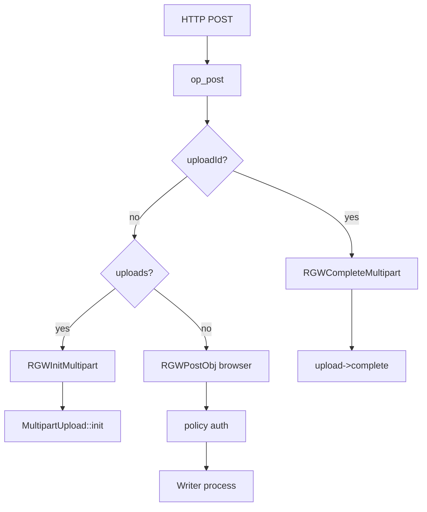
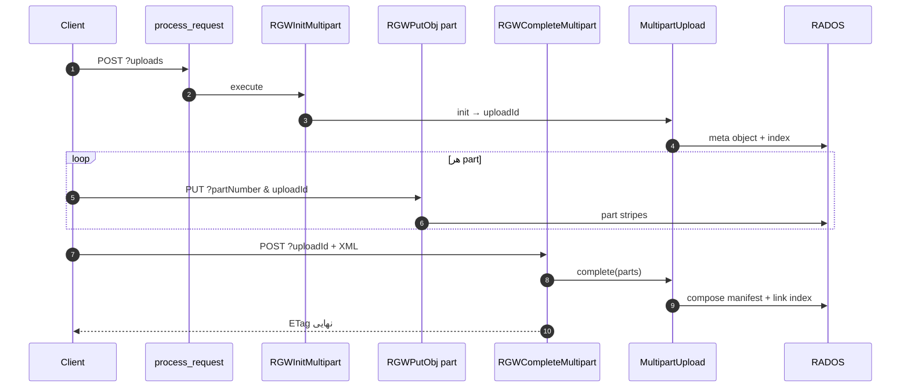
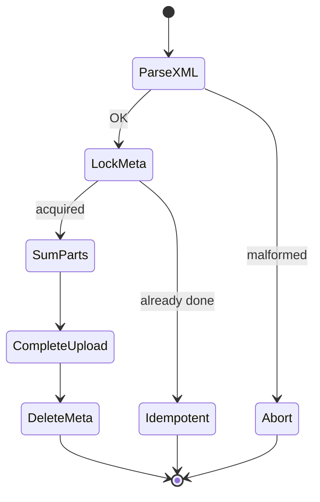

# فاز ۰ — مسیر کامل POST (multipart و browser) (شرح عمیق)

**سناریوها:**

1. `POST /bucket/key?uploads` — **CreateMultipartUpload** (`RGWInitMultipart`)
2. `POST /bucket/key?uploadId=…` — **CompleteMultipartUpload** (`RGWCompleteMultipart`)
3. `POST /bucket` یا `POST /bucket/key` — **Browser-based POST** (`RGWPostObj`)

!!! info "نحوه خواندن"
    - **متن فارسی** راست‌به‌چپ؛ **کد** چپ‌به‌چپ (LTR).
    - **[شرح روایی](narrative-reference.md)** · لایه‌های ۰–۶: **[shared-layers-reference.md](shared-layers-reference.md)** · **[فهرست](index.md)**.
    - آپلود part: **[PUT](full-request-path-put.md)** (`partNumber` + `uploadId`).
    - RADOS زیر Complete/Post: **[rados-osd-mon-stack.md](rados-osd-mon-stack.md)**.

---

## نمای کلی: یک متد HTTP، چند `RGWOp`

POST روی object در RGW **factory چندشاخه‌ای** است؛ ترتیب بررسی query در `op_post` مهم است (اول `uploadId`، بعد `uploads`).

> **Source:** [`rgw_rest_s3.cc`](https://github.com/ceph/ceph/blob/main/src/rgw/rgw_rest_s3.cc#L5549-L5564)

| شرط query / حالت | کلاس S3 | `get_type()` | body کلاینت |
|------------------|---------|--------------|-------------|
| `uploadId` | `RGWCompleteMultipart_ObjStore_S3` | `RGW_OP_COMPLETE_MULTIPART` | XML لیست part |
| `uploads` | `RGWInitMultipart_ObjStore_S3` | `RGW_OP_INIT_MULTIPART` | معمولاً خالی |
| `restore` | `RGWRestoreObj_ObjStore_S3` | restore tier | — |
| `select` | s3select | SQL | — |
| پیش‌فرض | `RGWPostObj_ObjStore_S3` | `RGW_OP_POST_OBJ` | `multipart/form-data` |

---

## نمودار توالی — multipart سه‌مرحله‌ای

**نکته:** partها **PUT** هستند، نه POST — POST فقط Init و Complete (و browser upload).

---

## لایه ۴ — کلاس‌ها و متغیرهای عضو

### `RGWInitMultipart`

> **Source:** [`rgw_op.h`](https://github.com/ceph/ceph/blob/main/src/rgw/rgw_op.h#L2058-L2086)

| عضو | نوع | نقش |
|-----|-----|------|
| `upload_id` | `string` | خروجی پس از `init` |
| `policy` | `RGWAccessControlPolicy` | ACL آپلود |
| `attrs` | `sal::Attrs` | encryption، tags، trace |
| `obj_retention` / `obj_legal_hold` | optional | Object Lock روی شیء نهایی |
| `cksum_algo` / `cksum_flags` | enum / uint16 | checksum multipart (CRC و غیره) |
| `multipart_trace` | `jspan_ptr` | tracing |

### `RGWCompleteMultipart`

> **Source:** [`rgw_op.h`](https://github.com/ceph/ceph/blob/main/src/rgw/rgw_op.h#L2088-L2122)

| عضو | نقش |
|-----|------|
| `data` | body XML پارس‌شده |
| `serializer` | قفل CLS روی meta object — جلوگیری از complete هم‌زمان |
| `meta_obj` | شیء metadata session در RADOS |
| `cksum` / `armored_cksum` | اعتبارسنجی checksum کل شیء |

### `RGWPostObj`

> **Source:** [`rgw_op.h`](https://github.com/ceph/ceph/blob/main/src/rgw/rgw_op.h#L1404-L1454)

| عضو | نقش |
|-----|------|
| `min_len` / `max_len` | از policy فرم |
| `supplied_md5_b64` | مقایسه با MD5 محاسبه‌شده |
| `policy` | ACL آپلود browser |
| `attrs` | ETag، content-type، compression |

---

## مسیر ۱ — InitiateMultipart (`POST ?uploads`)

### مجوز

> **Source:** [`rgw_op.cc`](https://github.com/ceph/ceph/blob/main/src/rgw/rgw_op.cc#L6974-L6989)

- IAM: `s3:PutObject` روی ARN شیء (همان PUT ساده).
- هدرهای SSE به `s->info.crypt_attribute_map` اضافه می‌شوند.

### `execute`

> **Source:** [`rgw_op.cc`](https://github.com/ceph/ceph/blob/main/src/rgw/rgw_op.cc#L6996-L7052)

**الگوریتم:**

| # | گام | RADOS / SAL |
|---|------|-------------|
| 1 | `get_params` — encryption، tags، canned ACL | — |
| 2 | encode `RGW_ATTR_ACL`, metadata، `prepare_encryption` | attrs |
| 3 | `bucket->get_multipart_upload(name, upload_id)` | factory |
| 4 | `upload->init(owner, placement, attrs)` | **meta object** + session در index |
| 5 | `upload_id = upload->get_upload_id()` | پاسخ XML به کلاینت |

**خروجی HTTP:** XML با `UploadId` — **هنوز هیچ part و هیچ byte دادهٔ نهایی** نوشته نشده.

**امنیت:** بدون `s3:PutObject` → `-EACCES` قبل از ایجاد session؛ uploadId تصادفی — حدس زدن برای complete دشوار اما نه غیرممکن اگر ACL ضعیف باشد.

---

## مسیر ۲ — Upload Part (`PUT` — مرجع)

| موضوع | جزئیات |
|--------|--------|
| Op | `RGWPutObj` با `multipart_upload_id` و `partNumber` |
| Writer | `RadosMultipartWriter` / `MultipartUpload::get_writer` |
| مجوز | `s3:PutObject` + مالکیت upload session |
| RADOS | part به‌عنوان object جدا در data pool |

→ [full-request-path-put.md](full-request-path-put.md) · compose در RADOS: `RadosMultipartUpload::complete` در `rgw_sal_rados.cc`.

---

## مسیر ۳ — CompleteMultipart (`POST ?uploadId`)

### مجوز

همان `s3:PutObject` — complete عملاً **ایجاد نسخهٔ نهایی** object است.

### `execute` — الگوریتم

> **Source:** [`rgw_op.cc`](https://github.com/ceph/ceph/blob/main/src/rgw/rgw_op.cc#L7196-L7293)

> **Source:** [`rgw_op.cc`](https://github.com/ceph/ceph/blob/main/src/rgw/rgw_op.cc#L7399-L7453)

| فاز | توضیح | خطای رایج |
|-----|--------|-----------|
| پارس XML | `CompleteMultipartUpload` / سازگاری `CompletedMultipartUpload` | `-ERR_MALFORMED_XML` |
| سقف part | `rgw_multipart_part_upload_limit` | `-ERANGE` |
| قفل meta | `serializer->try_lock` — race دو complete | `-ERR_INTERNAL_ERROR` / idempotent OK |
| checksum | `try_sum_part_cksums` + مقایسه با header کلاینت | `-ERR_BAD_DIGEST` |
| `upload->complete` | compose partها، ETag نهایی MD5 partها | `-ERR_INVALID_PART` |
| حذف meta | حلقه با `cls_version` — part دیررس | `-ECANCELED` → retry + `cleanup_orphaned_parts` |

**امنیت complete:**

- فقط دارندهٔ مجوز Put روی key می‌تواند complete کند.
- XML باید ETag/partNumberهای واقعی را داشته باشد — part جعلی رد می‌شود.
- قفل `rgw_mp_lock_max_time` از دو complete هم‌زمان جلوگیری می‌کند.

---

## مسیر ۴ — Browser POST (`RGWPostObj`)

### تفاوت با PUT + SigV4

| | PUT | Browser POST |
|--|-----|----------------|
| Auth | هدر `Authorization` SigV4 | فیلدهای form: policy + signature |
| Body | raw object | `multipart/form-data` |
| `verify_requester` | موتور S3 اصلی | policy در `get_params` / `get_policy` |

### اعتبارسنجی policy

> **Source:** [`rgw_rest_s3.cc`](https://github.com/ceph/ceph/blob/main/src/rgw/rgw_rest_s3.cc#L3310-L3394)

| گام | توضیح |
|-----|--------|
| استخراج `policy` base64 | فیلد form |
| تشخیص AWS4 | `x-amz-algorithm` = `AWS4-HMAC-SHA256` |
| `Strategy::apply(..., get_s3_post())` | تأیید امضا |
| decode policy JSON | شرط bucket، key prefix، `content-length-range`، expiry |

!!! warning "FIXME در کد"
    `rgw_rest_s3.cc:3377` — browser upload auth «makeshift» نامیده شده؛ در production بازبینی امنیتی policy (prefix باز، expiry طولانی) ضروری است.

### `init_processing` و مجوز

> **Source:** [`rgw_op.cc`](https://github.com/ceph/ceph/blob/main/src/rgw/rgw_op.cc#L4935-L4964)

- `get_params` قبل از `RGWOp::init_processing` — policy و فیلدهای form.
- `verify_permission`: `s3:PutObject`.

### `execute` — pipeline نوشتن

> **Source:** [`rgw_op.cc`](https://github.com/ceph/ceph/blob/main/src/rgw/rgw_op.cc#L4971-L5030)

> **Source:** [`rgw_op.cc`](https://github.com/ceph/ceph/blob/main/src/rgw/rgw_op.cc#L5074-L5193)

**الگوریتم (هر فایل در form — Swift چندفایلی):**

1. `get_atomic_writer` + `prepare`.
2. زنجیره فیلتر: encrypt → compress → checksum (مشابه PUT).
3. `get_data(data, again)` از form به‌جای socket PUT.
4. `filter->process` — MD5 hash موازی.
5. محدودیت `min_len` / `max_len` از policy.
6. `processor->complete` — head + index (همان مسیر PUT در RADOS).

**تهدیدهای browser POST:**

| تهدید | کنترل |
|--------|--------|
| policy با `"key": ""` یا prefix وسیع | محدود کردن در policy تولیدی |
| expiry دور | `expiration` در policy |
| bypass SigV4 header | فقط POST policy معتبر |
| MD5 mismatch | `-ERR_BAD_DIGEST` |

---

## Abort multipart

`DELETE /key?uploadId` → `RGWAbortMultipart` — [DELETE](full-request-path-delete.md).

---

## مرجع توابع — POST

| تابع | فایل | نقش |
|------|------|------|
| `RGWHandler_REST_Obj_S3::op_post` | `rgw_rest_s3.cc` | factory |
| `RGWInitMultipart::execute` | `rgw_op.cc` | شروع session |
| `RGWCompleteMultipart::execute` | `rgw_op.cc` | compose + finalize |
| `RGWCompleteMultipart::check_previously_completed` | `rgw_op.cc` | idempotent complete |
| `RGWPostObj::execute` | `rgw_op.cc` | browser upload |
| `RGWPostObj_ObjStore_S3::get_policy` | `rgw_rest_s3.cc` | امضای form |
| `RadosMultipartUpload::init` | `rgw_sal_rados.cc` | RADOS meta |
| `RadosMultipartUpload::complete` | `rgw_sal_rados.cc` | لیست part + compose |

---

## جدول خطاها

| `ret` / S3 | مرحله | علت |
|------------|--------|------|
| `-ERR_MALFORMED_XML` | complete | body XML بد |
| `-ERANGE` | complete | تعداد part از سقف config |
| `-ERR_NO_SUCH_UPLOAD` | complete | uploadId نامعتبر |
| `-ERR_INVALID_PART` | complete | partNumber/ETag |
| `-ERR_ENTITY_TOO_SMALL` | part PUT | زیر `rgw_multipart_min_part_size` |
| `-ERR_BAD_DIGEST` | post / complete checksum | MD5 یا CRC |
| `-ERR_TOO_LARGE` / `-ERR_TOO_SMALL` | post policy | نقض content-length-range |
| `-EACCES` | policy auth | امضا یا شرط policy |
| `-EINVAL` | get_policy | فیلد aws4 کم |

---

## امنیت — چک‌لیست

- [ ] policy فقط prefix موردنظر را مجاز می‌کند؟
- [ ] expiry کوتاه برای آپلود ناشناس؟
- [ ] complete فقط برای uploadId متعلق به همان bucket/key؟
- [ ] آیا anonymous POST روی bucket عمومی خطرناک است؟
- [ ] Lua روی POST همان سطح PUT اعمال می‌شود؟

---

## جدول ردیابی

| # | فایل:خط | نماد |
|---|---------|------|
| 1 | `rgw_rest_s3.cc:5555` | `RGWInitMultipart` factory |
| 2 | `rgw_op.cc:6996` | Init `execute` |
| 3 | `rgw_rest_s3.cc:5552` | Complete factory |
| 4 | `rgw_op.cc:7196` | Complete `execute` |
| 5 | `rgw_op.cc:7400` | `upload->complete` |
| 6 | `rgw_rest_s3.cc:3380` | POST policy `Strategy::apply` |
| 7 | `rgw_op.cc:4971` | `RGWPostObj::execute` |
| 8 | `driver/rados/rgw_sal_rados.cc:4315` | `RadosMultipartUpload::complete` |
| 9 | `rgw_process.cc:381` | `verify_requester` (مشترک) |

---

## پرسش‌های تمرینی

1. چرا `uploadId` قبل از `uploads` در `op_post` چک می‌شود؟
2. اگر دو کلاینت هم‌زمان complete کنند چه پیامی می‌بینند؟
3. تفاوت مجوز Init و Complete چیست؟
4. browser POST چرا از `get_s3_post()` strategy استفاده می‌کند نه `get_s3_main()`؟
5. delete marker پس از complete کجا ظاهر می‌شود — در POST یا در versioning DELETE؟

---

## مستندات مرتبط

| سند | موضوع |
|-----|--------|
| [PUT](full-request-path-put.md) | part upload، Writer |
| [COPY](full-request-path-copy.md) | — |
| [rados-osd-mon-stack.md](rados-osd-mon-stack.md) | PUT write، index |
| [index.md](index.md) | فهرست verbها |
| [shared-layers-reference.md](shared-layers-reference.md) | لایه‌های ۰–۶ |

→ [فهرست فاز ۰](index.md)
