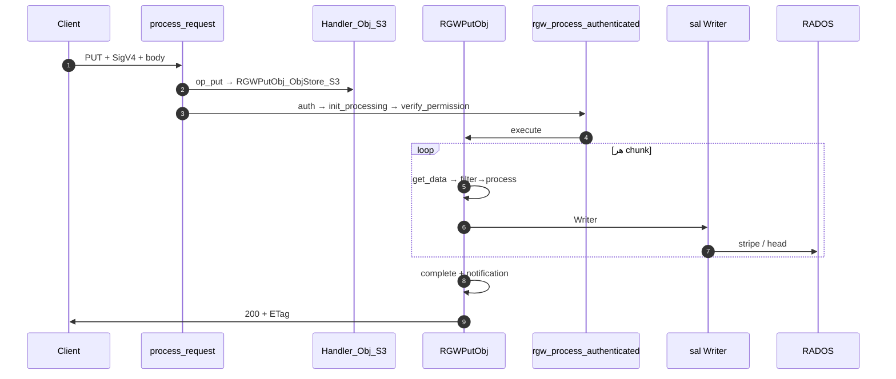
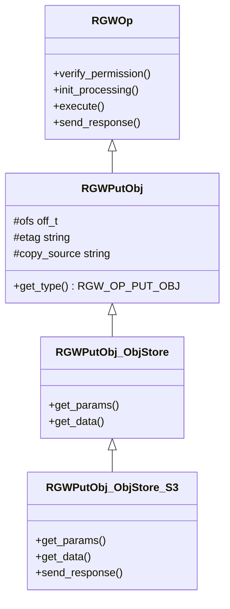
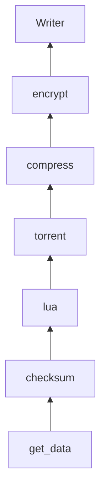

# فاز ۰ — مسیر کامل PUT Object (شرح عمیق)

**سناریو:** `PUT /mybucket/myobject` با body و SigV4 — آپلود ساده (غیر multipart)؛ با `x-amz-copy-source` مسیر **Copy** جدا است.

!!! info "مرجع لایه‌های مشترک"
    **[شرح روایی توابع و کلاس‌ها](narrative-reference.md)** · **[لایه‌های مشترک ۰–۶](shared-layers-reference.md)** · **[RADOS برای PUT](rados-osd-mon-stack.md)**

!!! info "پیش‌نیاز"
    [فهرست فاز ۰](index.md) · [GET](full-request-path.md) · [HEAD](full-request-path-head.md) · [LIST](full-request-path-list.md) · [DELETE](full-request-path-delete.md)

---

## نمای کلی

PUT درخواست **نوشتنی با entity-body** است. هزینهٔ اصلی: خواندن stream، زنجیرهٔ فیلتر (checksum → lua → torrent → compress → encrypt)، نوشتن stripeها به **data pool** و ثبت در **bucket index (CLS)**.

| محور | مقدار برای PUT |
|------|----------------|
| Handler | `RGWHandler_REST_Obj_S3` |
| Op | `RGWPutObj` → `RGWPutObj_ObjStore_S3` |
| `RGWOpType` | `RGW_OP_PUT_OBJ` |
| IAM | `s3:PutObject` (+ `s3:GetObject` اگر copy) |
| SAL | `get_atomic_writer` / `MultipartUpload::get_writer` |
| پاسخ موفق | `200` یا `201` (`rgw_s3_success_create_obj_status`) |
| dmclock | `dmc::client_id::data` |

**تفاوت با GET:** body ورودی؛ فیلترها معکوس decrypt/decompress. **تفاوت با DELETE:** index نوشته می‌شود؛ idempotent نیست.

---

## نمودار توالی end-to-end

---

## سلسله‌مراتب کلاس‌ها

| لایه | کلاس | فایل |
|------|------|------|
| منطق | `RGWPutObj` | `rgw_op.h` / `rgw_op.cc` |
| REST | `RGWPutObj_ObjStore` | `rgw_rest.cc` |
| S3 | `RGWPutObj_ObjStore_S3` | `rgw_rest_s3.cc` |
| Copy | `RGWCopyObj_ObjStore_S3` | `init_state.src_bucket` پر |

---

## اعضای protected در `RGWPutObj`

> **Source:** [`rgw_op.h`](https://github.com/ceph/ceph/blob/main/src/rgw/rgw_op.h#L1282-L1399)

| عضو | نقش در PUT |
|-----|-------------|
| `ofs` | offset نوشتن |
| `supplied_md5_b64` / `supplied_etag` | `Content-MD5` / ETag کلاینت |
| `if_match` / `if_nomatch` | precondition در `complete` |
| `copy_source*` | server-side copy |
| `chunked_upload` | بدون `Content-Length` |
| `policy`, `obj_tags`, `attrs` | ACL، تگ، metadata |
| `multipart_*` | part upload |
| `append` / `position` | Swift append |
| `obj_retention` / `obj_legal_hold` | Object Lock |

---

## جدول مرجع توابع (۲۰ تابع)

| # | تابع | فایل | نقش |
|---|------|------|-----|
| 1 | `process_request` | `rgw_process.cc` | چرخه HTTP |
| 2 | `op_put` | `rgw_rest_s3.cc` | factory |
| 3 | `RGWPutObj::init_processing` | `rgw_op.cc` | copy source + `get_params` |
| 4 | `RGWPutObj_ObjStore_S3::get_params` | `rgw_rest_s3.cc` | chunked، lock، part |
| 5 | `RGWPutObj_ObjStore::get_params` | `rgw_rest.cc` | `Content-MD5` |
| 6 | `RGWPutObj_ObjStore::get_data` | `rgw_rest.cc` | `recv_body` |
| 7 | `RGWPutObj_ObjStore_S3::get_data` | `rgw_rest_s3.cc` | + SigV4 completion |
| 8 | `verify_permission` | `rgw_op.cc` | Put + Get(copy) |
| 9 | `pre_exec` | `rgw_op.cc` | `rgw_bucket_object_pre_exec` |
| 10 | `execute` | `rgw_op.cc` | transfer + complete |
| 11 | `get_encrypt_filter` / compress / lua | `rgw_op.cc` | `DataProcessor` |
| 12 | `get_atomic_writer` | `rgw_sal_rados.cc` | writer ساده |
| 13 | `RadosAtomicWriter::prepare` | `rgw_sal_rados.cc` | رزرو head |
| 14 | `Writer::complete` | SAL | commit index |
| 15 | `send_response` | `rgw_rest_s3.cc` | ETag، version-id |
| 16 | `init_permissions` | handler | bucket policies |
| 17 | `read_permissions` | handler | IAM load |
| 18 | `verify_bucket_permission` | `rgw_auth*.cc` | `s3:PutObject` |
| 19 | `read_obj_policy` | `rgw_op.cc` | copy source |
| 20 | `do_aws4_auth_completion` | `rgw_op.cc` | امضای payload |

---

## چرخهٔ `RGWOp` و factory

> **Source:** [`rgw_op.h`](https://github.com/ceph/ceph/blob/main/src/rgw/rgw_op.h#L286-L306)

> **Source:** [`rgw_process.cc`](https://github.com/ceph/ceph/blob/main/src/rgw/rgw_process.cc#L336-L341)

> **Source:** [`rgw_rest_s3.cc`](https://github.com/ceph/ceph/blob/main/src/rgw/rgw_rest_s3.cc#L5518-L5534)

| شرط `op_put` | کلاس |
|--------------|------|
| ACL / tagging / retention | opهای subresource |
| `src_bucket` خالی | `RGWPutObj_ObjStore_S3` |
| copy (preprocess) | `RGWCopyObj_ObjStore_S3` |

---

## `init_processing` — copy source

> **Source:** [`rgw_op.cc`](https://github.com/ceph/ceph/blob/main/src/rgw/rgw_op.cc#L4081-L4125)

پس از این بلوک: بار bucket منبع، parse range، رد public canned ACL، `get_params(y)`، `RGWOp::init_processing(y)`. body هنوز خوانده **نمی‌شود**.

---

## `get_params` و `get_data`

> **Source:** [`rgw_rest_s3.cc`](https://github.com/ceph/ceph/blob/main/src/rgw/rgw_rest_s3.cc#L2813-L2920)

> **Source:** [`rgw_rest_s3.cc`](https://github.com/ceph/ceph/blob/main/src/rgw/rgw_rest_s3.cc#L2922-L2930)

- بدون length و بدون chunked → `-ERR_LENGTH_REQUIRED`.
- `create_s3_policy`، Object Lock، `uploadId`/`partNumber`، `append`.
- `get_data` پایه در `rgw_rest.cc:1072` — `recv_body` تا `rgw_max_chunk_size`؛ S3 پس از هر chunk موفق `do_aws4_auth_completion()` را صدا می‌زند.

---

## `verify_permission`

> **Source:** [`rgw_op.cc`](https://github.com/ceph/ceph/blob/main/src/rgw/rgw_op.cc#L4195-L4263)

| گام | IAM |
|-----|-----|
| copy | `s3:GetObject` روی منبع |
| env | ACL، تگ درخواست، SSE |
| مقصد | `s3:PutObject` |

---

## `execute` — فاز ۱: اعتبارسنجی

> **Source:** [`rgw_op.cc`](https://github.com/ceph/ceph/blob/main/src/rgw/rgw_op.cc#L4417-L4510)

| شرط | خطا |
|------|------|
| object خالی | `-EINVAL` |
| `!bucket_exists` | `-ERR_NO_SUCH_BUCKET` |
| MD5 نامعتبر | `-ERR_INVALID_DIGEST` |
| quota (غیر chunked) | quota exceeded |
| notification reserve | شکست → abort |

---

## `execute` — فاز ۲: Writer

> **Source:** [`rgw_op.cc`](https://github.com/ceph/ceph/blob/main/src/rgw/rgw_op.cc#L4519-L4568)

| حالت | Writer |
|------|--------|
| multipart part | `MultipartUpload::get_writer` |
| append | `get_append_writer` (نه روی versioned) |
| versioning | `gen_rand_obj_instance_name` |
| پیش‌فرض | `get_atomic_writer` → `RadosAtomicWriter` |

`processor->prepare()` — head/manifest خالی.

---

## `execute` — فاز ۳: فیلترها

> **Source:** [`rgw_op.cc`](https://github.com/ceph/ceph/blob/main/src/rgw/rgw_op.cc#L4630-L4682)

آخرین فیلتر اضافه‌شده **اول** اجرا می‌شود. جزئیات RADOS: **[rados-osd-mon-stack.md](rados-osd-mon-stack.md)**.

---

## `execute` — فاز ۴: transfer

> **Source:** [`rgw_op.cc`](https://github.com/ceph/ceph/blob/main/src/rgw/rgw_op.cc#L4683-L4720)

1. `get_data` از socket یا copy range.
2. `hash.Update`؛ `filter->process`.
3. flush؛ `ofs != content_length` → `-ERR_REQUEST_TIMEOUT`.
4. quota دوم؛ MD5 → `-ERR_BAD_DIGEST`.

---

## `execute` — فاز ۵: complete

> **Source:** [`rgw_op.cc`](https://github.com/ceph/ceph/blob/main/src/rgw/rgw_op.cc#L4898-L4932)

`processor->complete` — attrs، etag، OLH. `publish_commit` خطا rollback نمی‌کند.

---

## `send_response`

> **Source:** [`rgw_rest_s3.cc`](https://github.com/ceph/ceph/blob/main/src/rgw/rgw_rest_s3.cc#L2946-L2960)

| موفق | `dump_etag`، `x-amz-version-id`، expiration؛ copy → XML (ادامه تابع) |
| خطا | `dump_errno` |

---

## `rgw_process_authenticated` — ترتیب PUT

| # | مرحله | نکته PUT |
|---|--------|----------|
| 1 | `init_permissions` | bucket |
| 2 | `retarget` | website |
| 3 | `read_permissions` | IAM |
| 4 | `init_processing` | پارس هدر — **بدون body** |
| 5 | `verify_op_mask` | write |
| 6 | `verify_permission` | copy → Get |
| 7 | `pre_exec` | |
| 8 | `rate_limit` | |
| 9 | `execute` | **get_data در حلقه** |
| 10 | `complete` → `send_response` | ETag |

> **Source:** [`rgw_process.cc`](https://github.com/ceph/ceph/blob/main/src/rgw/rgw_process.cc#L417-L421)

> **Source:** [`rgw_process.cc`](https://github.com/ceph/ceph/blob/main/src/rgw/rgw_process.cc#L211-L218)

`init_processing` در خط ۲۱۲؛ `verify_permission` در ۲۳۵؛ `execute` در ۲۶۸.

---

## هدرهای PUT

| هدر | اثر |
|-----|------|
| `Content-Length` / chunked | length یا `chunked_upload` |
| `Content-MD5` | digest verify |
| `If-Match` / `If-None-Match` | precondition |
| `x-amz-copy-source` (+ range) | copy |
| `x-amz-acl` / tagging / SSE | policy + IAM |
| `x-amz-object-lock-*` | retention |
| `uploadId` + `partNumber` | multipart part |

---

## امنیت

| تهدید | کنترل |
|--------|--------|
| آپلود بدون مجوز | SigV4 + `s3:PutObject` |
| copy بدون خواندن | `s3:GetObject` روی source |
| آپلود بزرگ | quota، `rgw_max_put_size` |
| digest tampering | MD5 / checksum |
| public ACL | `init_processing` block |

---

## خطاها

| کد | HTTP | علت |
|----|------|-----|
| `-ERR_LENGTH_REQUIRED` | 411 | بدون length/chunked |
| `-ERR_BAD_DIGEST` | 400 | MD5/checksum |
| `-ERR_REQUEST_TIMEOUT` | 408 | اندازه ناقص |
| `-ERR_TOO_LARGE` | 413 | `rgw_max_put_size` |
| `-EACCES` | 403 | IAM / ACL |
| `-ERR_NO_SUCH_BUCKET` | 404 | bucket |
| `-ERR_INVALID_BUCKET_STATE` | 409 | append + versioned |

---

## FIXME

| محل | موضوع |
|-----|--------|
| `rgw_process.cc:388` | `transform_old_authinfo` |
| `rgw_op.cc:1605` | `do_aws4_auth_completion` دوبار |
| `rgw_rest_s3.cc:3377` | browser upload |
| compress+encrypt | zone feature |

---

## تمرین‌ها

1. چرا `get_params` در `init_processing` است ولی body در `execute` خوانده می‌شود؟
2. تفاوت `atomic_writer` و multipart `get_writer` در commit index؟
3. چرا ترتیب ساخت فیلتر encrypt/compress با GET معکوس است؟
4. copy چرا `s3:GetObject` می‌خواهد؟
5. چرا شکست `publish_commit` PUT را rollback نمی‌کند؟

---

## چک‌لیست ردیابی (۱۵ نقطه)

| # | فایل:خط | نماد |
|---|---------|------|
| 1 | `rgw_process.cc:337` | `get_op` |
| 2 | `rgw_rest_s3.cc:5531` | `RGWPutObj_ObjStore_S3` |
| 3 | `rgw_process.cc:381` | `verify_requester` |
| 4 | `rgw_process.cc:417` | `rgw_process_authenticated` |
| 5 | `rgw_process.cc:212` | `init_processing` |
| 6 | `rgw_op.cc:4081` | copy source parse |
| 7 | `rgw_rest_s3.cc:2813` | `get_params` |
| 8 | `rgw_op.cc:4257` | `s3:PutObject` |
| 9 | `rgw_op.cc:4417` | `execute` |
| 10 | `rgw_op.cc:4570` | `prepare` |
| 11 | `rgw_op.cc:4689` | `get_data` loop |
| 12 | `rgw_op.cc:4737` | aws4 completion |
| 13 | `rgw_op.cc:4902` | `complete` |
| 14 | `rgw_rest_s3.cc:2965` | `dump_etag` |
| 15 | `rgw_sal_rados.cc:2772` | `RadosAtomicWriter` |

---

## مقایسه و notification

| | GET | PUT | DELETE |
|--|-----|-----|--------|
| body | خیر | بله | خیر |
| index | — | write | delete/marker |

`ObjectCreatedPut`: reserve قبل از writer (شکست abort)؛ commit پس از complete (شکست فقط log).

---

## پیوندها

→ [DELETE](full-request-path-delete.md) · [GET](full-request-path.md) · [لایه‌های مشترک](shared-layers-reference.md) · [RADOS](rados-osd-mon-stack.md) · [فهرست](index.md)
