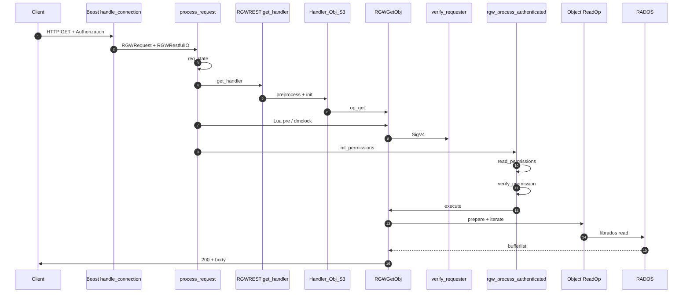
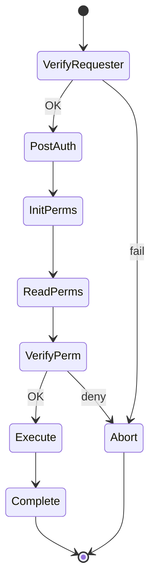
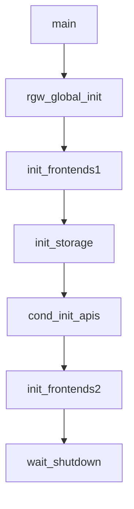
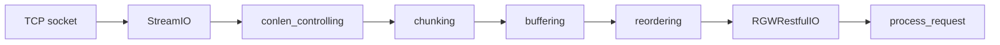
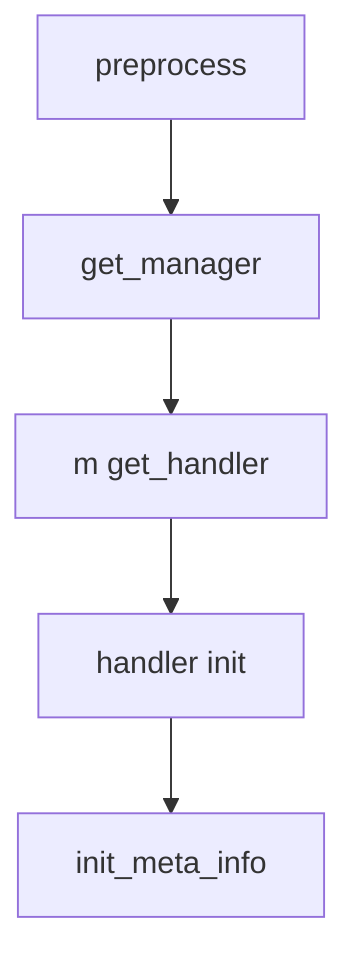
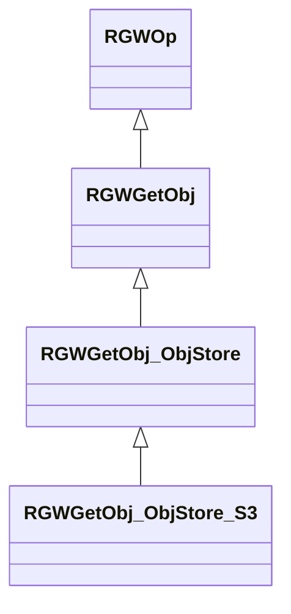
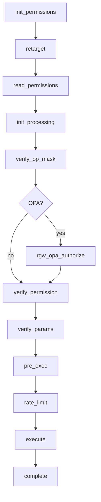
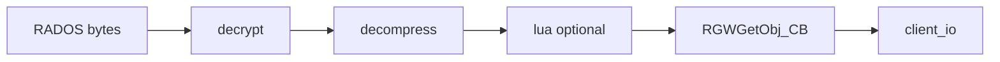
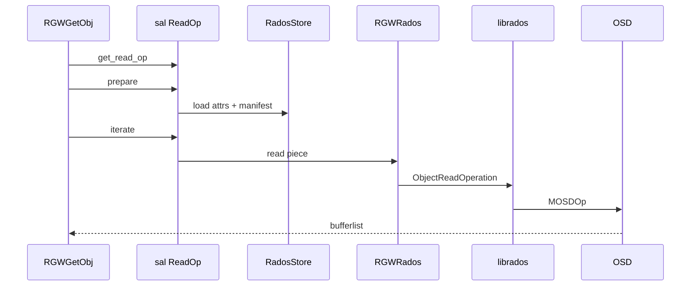

# فاز ۰ — مسیر کامل GET (شرح عمیق کد و ساختارها)

**سناریو:** `GET /mybucket/myobject` با امضای S3 SigV4

!!! info "نحوه خواندن این صفحه"
    - **متن فارسی** راست‌به‌چپ است.
    - **بلوک‌های کد** چپ‌به‌چپ (LTR) هستند.
    - **روی هر نمودار Mermaid کلیک کن** → بزرگ‌نمایی تمام‌صفحه، درگ برای جابجایی، چرخ موس برای zoom (SVG وکتوری — بدون افت کیفیت).
    - لایه‌های **۰–۶ مشترک** همه verbها: **[shared-layers-reference.md](shared-layers-reference.md)**
    - **شرح روایی** هر کلاس/تابع: **[narrative-reference.md](narrative-reference.md)**

---

## نمای کلی: سه محور جدا

یک درخواست GET در RGW روی **سه محور مستقل** پیش می‌رود؛ اگر آن‌ها را قاطی کنیم، دیباگ سخت می‌شود:

| محور | سوال | لایه‌های اصلی |
|------|------|----------------|
| **حمل (I/O)** | بایت‌ها از کجا می‌آیند و چگونه به سوکت برمی‌گردند؟ | Beast → `RGWRestfulIO` → `RGWGetObj_CB` |
| **کنترل (HTTP/S3)** | URI، هدر، کد خطا، پاسخ XML/JSON چگونه ساخته می‌شود؟ | `preprocess` → `get_handler` → `send_response` |
| **سیاست (امنیت)** | چه کسی است؟ اجازه دارد؟ | `verify_requester` → `read_permissions` → `verify_permission` |

**Authentication** (احراز هویت) یعنی «این درخواست متعلق به کدام principal است؟» و خروجی آن `s->auth.identity` است. **Authorization** (مجوز) یعنی «آیا این principal حق `s3:GetObject` روی این bucket/object را دارد؟» و معمولاً پس از بارگذاری IAM/ACL در `verify_permission` انجام می‌شود.

ترتیب عمدی است: ابتدا handler و op انتخاب می‌شوند (تا بدانیم SigV4 S3 است یا نه)، سپس auth، سپس bucket/object از RADOS خوانده می‌شوند، و **در آخر** بایت‌های شیء از OSD خوانده می‌شوند — تا در صورت 403 یا 404 هزینهٔ I/O سنگین نپردازیم.

---

## نمودار توالی end-to-end



**خواندن نمودار:** شمارهٔ گام‌ها تقریباً با ترتیب واقعی در `process_request` هم‌خوان است. نکتهٔ مهم: `verify_requester` **قبل از** `init_permissions` است؛ بنابراین identity برای `postauth_init` (پارس bucket از URI با tenant کاربر) موجود است، اما `s->object` هنوز خالی است تا `read_permissions` اجرا شود.

---

## مرجع ساختارها و متغیرهای کلیدی

### `RGWProcessEnv` — محیط مشترک همه درخواست‌ها


> **Source:** [`rgw_process_env.h`](https://github.com/ceph/ceph/blob/main/src/rgw/rgw_process_env.h#L44-L59)


| عضو | نوع | نقش |
|-----|-----|------|
| `driver` | `rgw::sal::Driver*` | دسترسی به User/Bucket/Object و zone |
| `rest` | `RGWREST*` | ریشه درخت REST |
| `auth_registry` | `StrategyRegistry` | موتورهای auth (S3 v2/v4, …) |
| `ratelimiting` | `ActiveRateLimiter*` | سهمیه درخواست |
| `lua.manager` | `LuaManager` | اسکریپت pre/post |
| `olog` | `OpsLogSink` | لاگ عملیات S3 |
| `site` | `SiteConfig*` | realm/period بارگذاری‌شده |
| `cfgstore` | `ConfigStore*` | پیکربندی پایدار multisite |

---

### `req_state` — state یک درخواست HTTP


> **Source:** [`rgw_common.h`](https://github.com/ceph/ceph/blob/main/src/rgw/rgw_common.h#L1304-L1344)


| فیلد | نوع | کی پر می‌شود؟ | معنی |
|------|-----|---------------|------|
| `cct` | `CephContext*` | سازنده | config، لاگ، perf |
| `penv` | `const RGWProcessEnv&` | سازنده | اشاره به driver/rest/auth |
| `cio` | `BasicClient*` | preprocess | I/O پاسخ HTTP |
| `info` | `req_info` | preprocess | method، URI، query، env |
| `bucket_name` | `string` | preprocess | نام سطل از URI/host |
| `bucket` | `unique_ptr<sal::Bucket>` | `rgw_build_bucket_policies` | handle سطل در SAL |
| `object` | `unique_ptr<sal::Object>` | `rgw_build_object_policies` | handle شیء |
| `user` | `unique_ptr<sal::User>` | auth / postauth | کاربر احراز‌شده |
| `auth.identity` | `unique_ptr<Identity>` | `verify_requester` | principal برای IAM |
| `iam_policy` | `optional<Policy>` | read_permissions | سیاست سطح سطل/شیء |
| `yield` | `optional_yield` | process_request | context coroutine RADOS |
| `trans_id` | `string` | process_request | id یکتا برای لاگ/trace |
| `op_type` | `RGWOpType` | پس از get_op | مثلاً `RGW_OP_GET_OBJ` |


> **Source:** [`rgw_common.cc`](https://github.com/ceph/ceph/blob/main/src/rgw/rgw_common.cc#L294-L303)


**توضیح سازنده:** `info` از `RGWEnv` (هدرهای HTTP) ساخته می‌شود؛ `time` برای latency؛ هنوز bucket/object خالی است.

---

### `RGWRequest` — شناسه درخواست در frontend

| فیلد | معنی |
|------|------|
| `id` | عدد یکتا از `driver->get_new_req_id()` |
| `op` | اشاره به `RGWOp` پس از انتخاب (در `process_request`) |

---

### `RGWOp` — الگوی Command


> **Source:** [`rgw_op.h`](https://github.com/ceph/ceph/blob/main/src/rgw/rgw_op.h#L286-L306)


| متد | مرحله | توضیح |
|-----|--------|--------|
| `verify_requester` | قبل از مجوز | **Authentication** — ساخت `Identity` |
| `verify_permission` | مجوز | **Authorization** — IAM/ACL |
| `verify_params` | اعتبارسنجی | Range، versionId، … |
| `pre_exec` | پیش‌اجرای | hookهای کوچک |
| `execute` | اصلی | منطق GET/PUT/… |
| `complete` | پایان | معمولاً `send_response()` |



---

## لایه ۰ — بوت `radosgw`

### نمودار



### کد `main`


> **Source:** [`rgw_main.cc`](https://github.com/ceph/ceph/blob/main/src/rgw/rgw_main.cc#L104-L173)


| خط / بلوک | توضیح دقیق |
|-----------|------------|
| `rgw_global_init(..., CEPH_ENTITY_TYPE_CLIENT, ...)` | ساخت `g_ceph_context`؛ RGW به‌عنوان **کلاینت RADOS** به cluster وصل می‌شود |
| `AppMain main` | نگه‌دارنده `RGWProcessEnv env` و frontends |
| `init_frontends1` | پارس `rgw_frontends`؛ اگر خالی → `"beast"` |
| `init_storage` | **`env.driver = DriverManager::get_storage(...)`** — نقطه اتصال به RADOS |
| `cond_init_apis` | ساخت `RGWREST` و ثبت handlerهای S3/Swift طبق `rgw_enable_apis` |
| `init_frontends2` | listen روی پورت؛ accept loop |

### `init_storage`


> **Source:** [`rgw_appmain.cc`](https://github.com/ceph/ceph/blob/main/src/rgw/rgw_appmain.cc#L214-L268)


| متغیر محلی | نقش |
|------------|------|
| `cfgstore` | خواندن realm/zone از config store |
| `site.load` | `SiteConfig` برای multisite |
| `cfg` | نوع driver (rados، filter، …) |
| `env.driver` | نمونه singleton `RadosStore` + threadهای GC/LC/sync |

**منطق بوت:** تا `init_storage` تمام نشود، هیچ `process_request`ی اجرا نمی‌شود. `env` شامل اشارهٔ پایدار به `driver` است — تمام threadهای Beast همان `RadosStore` را share می‌کنند (connection pool RADOS در پشت SAL).

---

## لایه ۱ — Frontend Beast

### نمودار I/O



### کد — پارس header


> **Source:** [`rgw_asio_frontend.cc`](https://github.com/ceph/ceph/blob/main/src/rgw/rgw_asio_frontend.cc#L268-L276)


| متغیر | معنی |
|--------|------|
| `parser` | Boost.Beast HTTP parser |
| `message` | درخواست parse‌شده (method، target، headers) |
| `yield` | coroutine context اگر `rgw_beast_enable_async` |

### کد — فراخوانی پردازش


> **Source:** [`rgw_asio_frontend.cc`](https://github.com/ceph/ceph/blob/main/src/rgw/rgw_asio_frontend.cc#L313-L356)


| خط | توضیح |
|----|--------|
| `RGWRequest req{env.driver->get_new_req_id()}` | id عددی درخواست |
| `StreamIO real_client{...}` | خواندن body از socket |
| زنجیره `add_*` | نرمال‌سازی Content-Length / chunked |
| `RGWRestfulIO client` | لایه‌ای که `process_request` می‌شناسد |
| `process_request(env, &req, uri_prefix, &client, y, scheduler, ...)` | **ورود به لایه ۲** |
| `user` | پس از auth از identity پر می‌شود (برای access log) |
| `http_ret` | کد HTTP نهایی (200، 403، …) |

### امنیت و robustness در Beast

- **Parse failure** → پاسخ 400 و بستن درخواست؛ body مخرب به `process_request` نمی‌رسد.
- **Connection reset** → بدون log سنگین return (جلوگیری از log flooding).
- **زنجیرهٔ `add_conlen_controlling` / `add_chunking`:** محدودیت طول body — در GET معمولاً body خالی است؛ برای PUT در فازهای بعد مهم‌تر است.
- **TLS:** اگر frontend با SSL باشد، cipher/version در env قرار می‌گیرد — برای audit لاگ.

`handle_connection` هیچ تصمیم امنیتی S3 نمی‌گیرد؛ فقط HTTP معتبر تحویل می‌دهد.

---

## لایه ۲ — `process_request`

### امضای تابع و پارامترها


> **Source:** [`rgw_process.cc`](https://github.com/ceph/ceph/blob/main/src/rgw/rgw_process.cc#L278-L325)


| پارامتر | جهت | توضیح |
|---------|------|--------|
| `penv` | in | `driver`, `rest`, `auth_registry`, … |
| `req` | in/out | `id` ورودی؛ `op` پر می‌شود |
| `frontend_prefix` | in | prefix URI برای multisite/admin |
| `client_io` | in/out | env هدرها + نوشتن پاسخ |
| `yield` | in | async RADOS |
| `scheduler` | in | dmclock (می‌تواند null) |
| `user` | out | برای access log |
| `latency` | out | مدت پردازش |
| `http_ret` | out | status code |

### شرح خط‌به‌خط (بخش اول)

| خط | کد | توضیح |
|----|-----|--------|
| 288 | `client_io->init(g_ceph_context)` | آماده‌سازی بافر پاسخ |
| 289 | `driver = penv.driver` | اشاره کوتاه به SAL |
| 290 | `zone_unique_trans_id(req->id)` | شناسه global برای ops log |
| 297–298 | `req_state rstate(...); s = &rstate` | **stack allocation** — state تا پایان تابع |
| 302–303 | `get_user(rgw_user())` | user خالی؛ بعد auth جایگزین می‌شود |
| 311–314 | `req_id`, `host_id`, `yield` | metadata درخواست |
| 322–325 | `rest->get_handler(...)` | **لایه ۳** — handler + `init_error` |

### انتخاب Operation


> **Source:** [`rgw_process.cc`](https://github.com/ceph/ceph/blob/main/src/rgw/rgw_process.cc#L336-L377)


| خط | توضیح |
|----|--------|
| 337 | `handler->get_op()` — برای GET → `RGWGetObj_ObjStore_S3` |
| 338–340 | اگر op نباشد → `405 METHOD_NOT_ALLOWED` |
| 347–363 | Lua `preRequest` (اختیاری) |
| 366 | `schedule_request` — dmclock QoS |
| 368–369 | `-EAGAIN` → rate limit |
| 377 | `s->op_type = op->get_type()` — enum برای perf/log |

### احراز هویت


> **Source:** [`rgw_process.cc`](https://github.com/ceph/ceph/blob/main/src/rgw/rgw_process.cc#L379-L416)


| خط | توضیح |
|----|--------|
| 381 | `verify_requester(auth_registry)` — بررسی SigV4 / anonymous |
| 390–397 | مسیر legacy اگر `identity` خالی بماند |
| 401 | `postauth_init` — normalize bucket/tenant |
| 408–411 | user معلق → `ERR_USER_SUSPENDED` |
| 417 | **`rgw_process_authenticated`** — لایه ۶ |

### منطق `process_request` — تصمیم‌ها و شاخه‌ها

تابع `process_request` در `rgw_process.cc` **ارکستراتور** است: خودش منطق S3 را پیاده نمی‌کند، بلکه `req_state` را می‌سازد، handler/op را انتخاب می‌کند، auth را صدا می‌زند و در پایان ops log و Lua post را اجرا می‌کند.

**الگوریتم سطح بالا:**

1. ساخت `req_state` روی stack (تا پایان درخواست زنده است).
2. `get_handler` — اگر null → خطای 405/404 بسته به مرحله.
3. `get_op` — اگر null → `ERR_METHOD_NOT_ALLOWED`.
4. (اختیاری) Lua `preRequest` — شکست فقط warning است، درخواست ادامه می‌یابد.
5. `schedule_request` (dmclock) — `-EAGAIN` → rate limit قبل از هر کار RADOS سنگین.
6. `verify_requester` — موتور SigV4؛ شکست → `abort_early` بدون `execute`.
7. `postauth_init` — نرمال‌سازی bucket/tenant پس از شناخت کاربر.
8. `rgw_process_authenticated` — مجوزها و `execute`.
9. `done:` — Lua post، trace، آزاد کردن op.

**چرا `verify_requester` قبل از `read_permissions`؟** چون پارس نام bucket در حالت virtual-hosted-style به tenant کاربر وابسته است و برخی handlerها در `postauth_init` نام object را اعتبارسنجی می‌کنند. با این حال، **خواندن metadata شیء از RADOS** تا `read_permissions` به تأخیر می‌افتد تا کلید نامعتبر زودتر با `-ERR_INVALID_ACCESS_KEY` یا `-ERR_SIGNATURE_NO_MATCH` رد شود (بدون افشای وجود bucket به anonymous در برخی پیکربندی‌ها).

**مسیر legacy (FIXME خط 388):** اگر handler قدیمی `s->auth.identity` را پر نکند، `transform_old_authinfo` یک identity مصنوعی می‌سازد. این مسیر برای سازگاری است و در حملهٔ مستقیم نقشی ندارد، اما برای دیباگ «چرا user پر شده ولی SigV4 fail بوده» مهم است.

---

## لایه ۳ — REST `get_handler`


> **Source:** [`rgw_rest.cc`](https://github.com/ceph/ceph/blob/main/src/rgw/rgw_rest.cc#L2297-L2338)




| مرحله | تابع | خروجی روی `req_state` |
|--------|------|------------------------|
| 1 | `preprocess` | `decoded_uri`, `bucket_name` از host |
| 2 | `get_manager` | انتخاب `RGWRESTMgr` از درخت |
| 3 | `get_handler` | `RGWHandler_REST_Obj_S3` |
| 4 | `init` | اتصال `s` و `cio` |
| 5 | `init_meta_info` | پارامترهای S3 |

### `preprocess` (ابتدا)


> **Source:** [`rgw_rest.cc`](https://github.com/ceph/ceph/blob/main/src/rgw/rgw_rest.cc#L2033-L2062)


| متغیر | توضیح |
|--------|--------|
| `info.request_uri_aws4` | URI اصلی برای canonical string امضا |
| `s->cio = cio` | لینک I/O |
| `api_priority_s3` | ترتیب اولویت s3 vs s3website |

---

## لایه ۴ — `op_get` و کلاس‌ها


> **Source:** [`rgw_rest_s3.cc`](https://github.com/ceph/ceph/blob/main/src/rgw/rgw_rest_s3.cc#L5488-L5506)


| شرط | کلاس برگشتی | `get_type()` |
|-----|--------------|--------------|
| `is_acl_op()` | `RGWGetACLs_ObjStore_S3` | ACL |
| `uploadId` | `RGWListMultipart` | multipart list |
| پیش‌فرض | `RGWGetObj_ObjStore_S3` | `RGW_OP_GET_OBJ` |



| کلاس | مسئولیت |
|------|---------|
| `RGWGetObj` | `execute`, SAL `ReadOp`, filters |
| `RGWGetObj_ObjStore` | منطق objstore مشترک |
| `RGWGetObj_ObjStore_S3` | `get_params`, `send_response`, SigV4 hooks |

### `op_get` — منطق شاخه‌ای

`RGWHandler_REST_Obj_S3::op_get` یک **factory** است، نه خود عملیات GET:

- اگر query پارامتر `acl` باشد → `RGWGetACLs` (مجوزهای متفاوت).
- اگر `uploadId` → لیست partهای multipart (نه GET معمولی).
- در غیر این صورت → `RGWGetObj_ObjStore_S3`.

برای سناریوی فاز ۰ فقط شاخهٔ آخر مهم است. نوع عملیات در `s->op_type = RGW_OP_GET_OBJ` ثبت می‌شود و در perf counter و ops log استفاده می‌گردد.

---

## لایه ۶ — `rgw_process_authenticated`


> **Source:** [`rgw_process.cc`](https://github.com/ceph/ceph/blob/main/src/rgw/rgw_process.cc#L175-L275)


| ترتیب | فراخوانی | متغیرهای پر شده |
|-------|----------|-----------------|
| 1 | `init_permissions` | `s->bucket`, `bucket_attrs`, `iam_policy` env |
| 2 | `retarget` | ممکن است op عوض شود (website) |
| 3 | `read_permissions` | `s->object`, ACL شیء |
| 4 | `init_processing` | quota |
| 5 | `verify_op_mask` | نوع read/write |
| 6 | `verify_permission` | allow/deny |
| 7 | `verify_params` | Range معتبر |
| 8 | `pre_exec` | — |
| 9 | `rate_limit` | — |
| 10 | `execute` | خواندن داده |
| 11 | `complete` | ارسال HTTP |

### `init_permissions` / `read_permissions`


> **Source:** [`rgw_op.cc`](https://github.com/ceph/ceph/blob/main/src/rgw/rgw_op.cc#L8911-L8942)


| تابع | در صورت خطا |
|------|-------------|
| `rgw_build_bucket_policies` | `-ENODATA` → `-EACCES` |
| `rgw_build_object_policies` | anonymous + deny → `-EPERM` |

### الگوریتم `rgw_process_authenticated`

این تابع **Template Method** برای همهٔ عملیات‌های احراز‌شده است (GET، PUT، DELETE، …). برای GET ترتیب زیر تضمین می‌کند metadata قبل از خواندن بایت آماده باشد:



| مرحله | هدف | شکست معمول GET |
|--------|------|----------------|
| `init_permissions` | بارگذاری bucket، zone policy، IAM در سطح bucket | `-EACCES` اگر bucket وجود نداشته باشد یا دسترسی نباشد |
| `retarget` | website/static hosting — ممکن است op را عوض کند | خطای پیکربندی website |
| `read_permissions` | ساخت `s->object`، ACL شیء، delete marker | `-ENOENT` → 404؛ anonymous → `-EPERM` |
| `verify_op_mask` | مطابقت op با نوع API | نادر در GET ساده |
| `verify_permission` | `s3:GetObject` / نسخه / replication | `-EACCES` |
| `verify_params` | Range، versionId | `-EINVAL`, `-ERANGE` |
| `rate_limit` | سهمیه per-user/bucket | `-ERR_RATE_LIMITED` |

**نکتهٔ admin bypass (خطوط 238–248):** فقط وقتی `verify_permission` دقیقاً `-EACCES`، `-EPERM` یا `-ERR_AUTHORIZATION` برگرداند **و** `identity->is_admin()` true باشد، اجرا ادامه می‌یابد. خطاهایی مثل `-ENOENT` override نمی‌شوند — admin هم object ناموجود را با 200 نمی‌گیرد.

---

## لایه ۵ — احراز هویت SigV4 (عمیق)

### زنجیرهٔ فراخوانی

```
RGWGetObj_ObjStore_S3::verify_requester
  → RGWOp::verify_requester (rgw_op.h)
    → handler->authorize (RGWHandler_REST_S3)
      → RGW_Auth_S3::authorize
        → Strategy::apply(auth_registry.get_s3_main())
          → LocalEngine::authenticate (کلید RADOS)
```

### الگوریتم امضای AWS Signature Version 4

SigV4 یک **MAC زنجیره‌ای** روی «درخواست canonical» است، نه رمزنگاری کل body. برای GET معمولاً body خالی است و `x-amz-content-sha256` اغلب `UNSIGNED-PAYLOAD` یا hash ثابت empty body است.

**گام‌های سرور (باید با کلاینت bit-identical باشد):**

| # | گام | خروجی |
|---|------|--------|
| 1 | پارس `Authorization` یا query string presigned | access key، scope، لیست headerهای امضاشده |
| 2 | ساخت **canonical headers** | رشتهٔ نرمال‌شده (نام کوچک، trim فاصله) |
| 3 | **canonical request** | `METHOD\nURI\nQS\nHEADERS\nSIGNED_LIST\nPAYLOAD_HASH` |
| 4 | `hash(canonical_request)` | SHA256 hex |
| 5 | **string to sign** | `AWS4-HMAC-SHA256\nDATE\nSCOPE\nHASH` |
| 6 | **signing key** | `HMAC(HMAC(HMAC(HMAC("AWS4"+secret, date), region), service), "aws4_request")` |
| 7 | **signature** | `HMAC(signing_key, string_to_sign)` → hex |
| 8 | مقایسه با signature کلاینت | برابر نیست → `-ERR_SIGNATURE_NO_MATCH` |

**canonical URI:** RGW در `preprocess` مقدار `request_uri_aws4` را **قبل از** rewriteهای subdomain ذخیره می‌کند (`rgw_rest.cc` حدود 2037) تا امضا با آنچه کلاینت امضا کرده یکی بماند — اشتباه در این نقطه شایع‌ترین علت «امضا درست است ولی RGW رد می‌کند» است.

**skew زمانی:** `RGW_AUTH_GRACE` (معمولاً ±۱۵ دقیقه) — خارج از بازه → `-ERR_REQUEST_TIME_SKEWED` (جلوگیری از replay با timestamp قدیمی).

**lookup کلید:** `access_key` → user در RADOS → `secret` برای signing key. کلید نامعتبر → `-ERR_INVALID_ACCESS_KEY` (قبل از مقایسهٔ امضا).


> **Source:** [`rgw_auth_s3.h`](https://github.com/ceph/ceph/blob/main/src/rgw/rgw_auth_s3.h#L30-L33)


### پس از auth موفق

`Strategy::apply` پر می‌کند:

- `s->user` — کاربر RADOS
- `s->auth.identity` — برای IAM condition و admin check
- `s->perm_mask` — ماسک قدیمی ACL (سازگاری)

سپس `postauth_init` bucket را از URI استخراج می‌کند (`rgw_parse_url_bucket`) و `validate_object_name` را اجرا می‌کند.

---

## لایه ۷ — `RGWGetObj::execute`


> **Source:** [`rgw_op.cc`](https://github.com/ceph/ceph/blob/main/src/rgw/rgw_op.cc#L2453-L2505)


| خط | متغیر / call | توضیح |
|----|----------------|--------|
| 2463 | `RGWGetObj_CB cb` | callback نوشتن به HTTP |
| 2476 | `read_op = object->get_read_op()` | factory SAL |
| 2479 | `get_params` | پارس `Range`, `versionId` |
| 2483 | `init_common` | محاسبه ofs/end |
| 2487–2497 | `read_op->params.*` | شرط‌های If-Match, mod time |
| 2499 | `read_op->prepare` | **بارگذاری metadata از RADOS** |
| 2501–2502 | `obj_size`, `attrs` | اندازه و x-amz-meta-* |

### خواندن بایت


> **Source:** [`rgw_op.cc`](https://github.com/ceph/ceph/blob/main/src/rgw/rgw_op.cc#L2673-L2698)


| خط | توضیح |
|----|--------|
| 2640 | `range_to_ofs` — تبدیل `bytes=0-99` |
| 2662 | `get_decrypt_filter` — SSE |
| 2680 | `read_op->iterate(ofs, end, filter)` — حلقه خواندن stripe |
| 2683 | `filter->flush` | آخرین chunk |
| 2691 | `send_response_data` | هدر + body به client |

### زنجیره فیلتر read



### منطق `execute` — فازها

`RGWGetObj::execute` سنگین‌ترین بخش مسیر GET است و ترکیبی از **I/O streaming** و **تبدیل داده** (فشرده‌سازی، رمزگشایی SSE) است.

**فاز ۱ — آماده‌سازی (بدون خواندن OSD):**

- `get_read_op()` — factory در SAL؛ برای RADOS → `RadosReadOp`.
- `get_params()` — پارس `Range`, `versionId`, `partNumber`, `response-*` overrides.
- `init_common()` — تبدیل Range به `(ofs, end)`؛ بررسی If-Match / If-None-Match.

**فاز ۲ — metadata (`prepare`):**

- یک یا چند read به RADOS برای head object، manifest، attrs.
- تعیین `obj_size`، ETag، `x-amz-meta-*`, encryption flags.
- اگر `GET` با `Range` روی object خالی → `-ERANGE` قبل از iterate.

**فاز ۳ — مجوز در op (اگر هنوز انجام نشده):**

`verify_permission` در `rgw_process_authenticated` صدا زده شده؛ در `execute` موارد خاص replication و `x-rgw-auth` بررسی می‌شوند.

**فاز ۴ — iterate (خواندن بایت):**

الگوریتم `Object::Read::iterate` در `rgw_rados.cc` manifest را stripe به stripe طی می‌کند:

- پنجرهٔ async (`rgw_get_obj_window_size`) — چند chunk هم‌زمان از OSD.
- هر chunk از حد `rgw_get_obj_max_req_size` بزرگ‌تر نمی‌شود.
- در خطا: `data.cancel()` — خواندن متوقف، بدون ارسال partial نامعتبر به کلاینت (بسته به نقطهٔ شکست).

**فاز ۵ — پاسخ:**

- `send_response_data` — هدر `Content-Length` / `Content-Range`، سپس body.
- `complete` — نهایی‌سازی log و trace.

**حالت‌های کوتاه‌مدت (بدون body کامل):**

| شرط | رفتار |
|------|--------|
| `HEAD` / `GET` با فقط metadata | پس از `prepare` برگشت |
| `HTTP_X_RGW_AUTH` | مسیر داخلی cluster؛ body ارسال نمی‌شود |
| DLO/SLO manifest | redirect یا assemble متفاوت — خارج از GET ساده |

### `verify_permission` برای GET


> **Source:** [`rgw_op.cc`](https://github.com/ceph/ceph/blob/main/src/rgw/rgw_op.cc#L1136-L1212)


منطق:

1. اگر درخواست **replication system** است → مجموعهٔ مجوزهای گسترده‌تر (retention، legal hold، …).
2. در غیر این صورت → `verify_object_permission` با action `s3:GetObject` یا `s3GetObjectVersion`.
3. IAM policy (اگر `iam_policy` بارگذاری شده) + ACL legacy + **requester pays** + هدر `x-amz-expected-bucket-owner`.

رد نهایی → `-EACCES` که در `abort_early` به XML S3 `AccessDenied` map می‌شود.

---

## لایه ۸ — SAL → RADOS



| لایه | تابع نمونه |
|------|------------|
| SAL | `rgw::sal::Object::get_read_op()` |
| RadosStore | `RadosObject::ReadOp::prepare/iterate` |
| RGWRados | `Object::Read::iterate`, `get_obj_iterate_cb` |
| librados | `rgw_rados_operate` / `async_operate` |
| OSD | read در placement pool |

### لایه ۹ — MON، Objecter، OSD (جزئیات)

برای **poolها**، **CLS bucket index**، **manifest stripe**، **aio window**، و نقش **MON** در map:

→ **[لایه RADOS / OSD / MON — جریان داده](rados-osd-mon-stack.md)** (سند اختصاصی با نمودار و snippet)

خلاصه GET روی cluster:

1. `prepare` — یک read به **head oid** (attrs + manifest).
2. `iterate_obj` — برای هر stripe: `op.read` از **data pool**.
3. Objecter از **OSDMap** (از MON) PG و primary را پیدا می‌کند.
4. پاسخ‌ها از طریق aio به `RGWGetObj_CB` → HTTP.

---

## پایان — موفق یا `abort_early`


> **Source:** [`rgw_rest.cc`](https://github.com/ceph/ceph/blob/main/src/rgw/rgw_rest.cc#L682-L704)


| پارامتر `abort_early` | معنی |
|----------------------|------|
| `s` | req_state برای formatter |
| `op` | ممکن است null |
| `err_no` | کد داخلی (`-ENOENT`, …) |
| `handler` | اگر op null باشد |


> **Source:** [`rgw_process.cc`](https://github.com/ceph/ceph/blob/main/src/rgw/rgw_process.cc#L427-L475)


### الگوریتم `abort_early`

وقتی هر مرحله‌ای `ret < 0` برگرداند، `process_request` به `abort_early` می‌رود (مستقیم یا از طریق `goto done` پس از auth):

1. **`error_handler`** روی op یا handler — نگاشت `-ENOENT` → 404، `-EACCES` → 403، امضا → `SignatureDoesNotMatch`.
2. **`set_req_state_err`** — پر کردن `s->err` و HTTP status اگر خالی باشد.
3. **redirect zone** — برخی 404ها به 301 multisite تبدیل می‌شوند.
4. **`dump_errno`** — بدنهٔ XML/JSON خطای S3.
5. **`perfcounter->inc(l_rgw_failed_req)`** — متریک شکست.

!!! warning "TODO در کد"
    در `rgw_rest.cc` حدود خط 737 هنوز برخی فیلدهای خطای S3 فقط در XML body هستند، نه به‌صورت هدر HTTP — برای کلاینت‌هایی که فقط header می‌خوانند گیج‌کننده است.

---

## مرجع توابع — نقش هر تابع در مسیر GET

| تابع | فایل | ورودی‌های مهم | خروجی / اثر |
|------|------|----------------|-------------|
| `handle_connection` | `rgw_asio_frontend.cc` | socket, `RGWProcessEnv` | حلقه keep-alive؛ parse HTTP |
| `process_request` | `rgw_process.cc` | `penv`, `req`, `client_io` | `http_ret`, `user`, `latency` |
| `RGWREST::preprocess` | `rgw_rest.cc` | `req_state`, env هدرها | `request_uri_aws4`, `bucket_name`, `op` |
| `RGWREST::get_handler` | `rgw_rest.cc` | URI, method | `RGWHandler_REST*` |
| `RGWHandler_REST_Obj_S3::op_get` | `rgw_rest_s3.cc` | query params | `RGWOp*` (GetObj) |
| `RGWOp::verify_requester` | `rgw_op.h` | `auth_registry` | `s->auth.identity` |
| `RGW_Auth_S3::authorize` | `rgw_rest_s3.cc` | `req_state` | strategy apply |
| `LocalEngine::authenticate` | `rgw_rest_s3.cc` | SigV4 params | signature verify |
| `handler->postauth_init` | `rgw_rest_s3.cc` | — | bucket/object names |
| `rgw_process_authenticated` | `rgw_process.cc` | handler, op | `execute` یا خطا |
| `RGWOp::init_permissions` | `rgw_op.cc` | — | `s->bucket`, attrs |
| `RGWOp::read_permissions` | `rgw_rest.cc` | — | `s->object` |
| `RGWGetObj::verify_permission` | `rgw_op.cc` | — | IAM GET allow/deny |
| `RGWGetObj::execute` | `rgw_op.cc` | `yield` | stream body |
| `sal::ReadOp::prepare` | `rgw_sal_rados.cc` | — | size, attrs |
| `sal::ReadOp::iterate` | `rgw_sal_rados.cc` | ofs, end, callback | chunks |
| `RGWRados::Object::Read::iterate` | `rgw_rados.cc` | manifest stripes | bufferlist |
| `abort_early` | `rgw_rest.cc` | `err_no` | HTTP error response |

---

## جدول خطاها — از کد داخلی تا پاسخ HTTP

| `ret` / `err_no` | مرحلهٔ رایج | HTTP / کد S3 (نمونه) | علت معمول |
|------------------|-------------|----------------------|-----------|
| `-ERR_METHOD_NOT_ALLOWED` | `get_op` / REST | 405 | method روی resource اشتباه |
| `-ERR_RATE_LIMITED` | dmclock / `rate_limit` | 503 SlowDown | فشار یا سهمیه |
| `-ERR_INVALID_ACCESS_KEY` | SigV4 lookup | 403 | access key در cluster نیست |
| `-ERR_SIGNATURE_NO_MATCH` | SigV4 verify | 403 SignatureDoesNotMatch | secret، canonical URI، header |
| `-ERR_REQUEST_TIME_SKEWED` | SigV4 time | 403 | ساعت کلاینت |
| `-ERR_AMZ_CONTENT_SHA256_MISMATCH` | SigV4 payload | 400 | hash body با header |
| `-ERR_USER_SUSPENDED` | پس از auth | 403 | کاربر معلق |
| `-ERR_INVALID_SECRET_KEY` | DigestException | 403 | کلید secret خراب |
| `-EACCES` | permissions | 403 AccessDenied | IAM/ACL |
| `-EPERM` | anonymous policy | 403 | دسترسی عمومی بسته |
| `-ENOENT` | `prepare` / policies | 404 NoSuchKey | شیء نیست |
| `-ERANGE` | Range روی object | 416 | Range نامعتبر |
| `-ERR_ZERO_IN_URL` | `preprocess` | 400 | `\0` در URI |
| `-EINVAL` | params | 400 | پارامتر بد |

**اصل طراحی:** بیشتر خطاها قبل از `iterate` برمی‌گردند تا bandwidth OSD و egress gateway هدر نرود.

---

## امنیت — تهدیدها، کنترل‌ها، و نقاط حساس

### مدل تهدید (خلاصه)

| تهدید | کنترل در مسیر GET |
|--------|-------------------|
| جعل هویت | SigV4 + secret در RADOS؛ presigned expiry |
| Replay درخواست | window زمانی ±۱۵ دقیقه؛ (نه nonce یکبارمصرف) |
| دسترسی افقی به bucket دیگر | IAM `s3:GetObject` + `x-amz-expected-bucket-owner` |
| افشای وجود object به anonymous | `-EPERM` vs `-ENOENT` بسته به policy و anonymous |
| MITM | TLS روی Beast (پیکربندی `rgw frontends`) |
| DoS | dmclock، rate limit، محدودیت اندازه chunk read |
| خواندن بدون decrypt | `get_decrypt_filter` — کلید SSE از policy/headers |
| privilege escalation | admin فقط روی `-EACCES`/`-EPERM` خاص؛ نه روی `-ENOENT` |
| injection در URI | رد `\0`؛ decode محدود |

### نکات پیاده‌سازی مهم

1. **جداسازی auth و authorize:** حمله‌ای که فقط bucket name را حدس می‌زند هنوز باید امضا یا policy عمومی داشته باشد.
2. **Canonical URI:** هر rewrite (virtual host، proxy) باید با آنچه کلاینت امضا کرده sync باشد — مربوط به `request_uri_aws4`.
3. **System / replication:** `s->system_request` مسیر مجوز جدا در `verify_permission` دارد — خطای پیکربندی replication می‌تواند دسترسی گسترده‌تر بدهد.
4. **`HTTP_X_RGW_AUTH`:** مسیر داخلی؛ نباید از اینترنت قابل دسترسی باشد (فایروال / frontend جدا).
5. **Lua `preRequest`:** اسکریپت ادمین می‌تواند روی هر درخواست اجرا شود — سطح دسترسی config مهم است.
6. **OPA (`rgw_use_opa_authz`):** اگر فعال باشد، تصمیم مجوز به سرویس خارجی واگذار می‌شود — availability OPA = availability GET.

### چک‌لیست بازبینی امنیتی برای توسعه‌دهنده

- [ ] آیا تغییر URI parsing `request_uri_aws4` را می‌شکند؟
- [ ] آیا handler جدید `verify_requester` را پیاده می‌کند یا به FIXME legacy می‌افتد؟
- [ ] آیا op جدید `verify_permission` دارد قبل از `iterate`؟
- [ ] آیا anonymous به metadata حساس دسترسی پیدا می‌کند؟
- [ ] آیا خطای داخلی جزئیات secret را در `s->err.message` لو می‌دهد؟

---

## اشکالات شناخته‌شده، FIXME و TODO (مسیر GET)

موارد زیر در کد فعلی Ceph RGW دیده می‌شوند؛ برای دیباگ و توسعهٔ آینده مفیدند — **لزوماً باگ امنیتی فعال نیستند**.

| محل | موضوع | اثر روی GET |
|-----|--------|-------------|
| `rgw_process.cc:388` | FIXME: حذف `transform_old_authinfo` | handlerهای قدیمی ممکن است identity متفاوت بسازند |
| `rgw_rest_s3.cc:6301` | FIXME: anon user در `get_auth_data` | رفتار anonymous ناقص در برخی مسیرها |
| `rgw_rest_s3.cc:6094` | FIXME: website retarget و `s->object` | نشت/اشتباه handle در website mode |
| `rgw_rest_s3.cc:3377` | FIXME: browser upload auth موقت | مربوط به POST policy بیشتر از GET |
| `rgw_op.cc:2423` | TODO: range prefetch | کارایی Range، نه correctness |
| `rgw_auth_s3.cc:1487` | TODO: original content length chunked | عمدتاً PUT/chunked upload |
| `rgw_rest.cc:737` | TODO: error headers | تجربهٔ کلاینت |
| `rgw_rest.cc:226,241` | TODO: hostname sanity | DNS/host header attacks |

!!! tip "چگونه در gdb دنبال کنیم"
    breakpoint روی `process_request`، `rgw_process_authenticated`، `RGWGetObj::execute`، و `RadosReadOp::iterate` — با `print *s->auth.identity` و `print s->bucket_name` بعد از `postauth_init`.

---

## جدول ردیابی (چک‌لیست)

| # | فایل:خط | نماد |
|---|---------|------|
| 1 | `rgw_asio_frontend.cc:355` | `process_request` |
| 2 | `rgw_process.cc:297` | `req_state` |
| 3 | `rgw_rest.cc:2306` | `preprocess` |
| 4 | `rgw_rest.cc:2322` | `get_handler` |
| 5 | `rgw_rest_s3.cc:5505` | `get_obj_op` |
| 6 | `rgw_process.cc:381` | `verify_requester` |
| 7 | `rgw_process.cc:206` | `read_permissions` |
| 8 | `rgw_process.cc:268` | `execute` |
| 9 | `rgw_op.cc:2476` | `get_read_op` |
| 10 | `rgw_op.cc:2680` | `iterate` |
| 11 | `rgw_rest_s3.cc:6460` | `get_auth_data_v4` (canonical + sign) |
| 12 | `rgw_rest_s3.cc:7069` | مقایسه signature |
| 13 | `driver/rados/rgw_rados.cc:8383` | `Object::Read::iterate` |

---

## پرسش‌های تمرینی (بعد از خواندن)

1. چرا `read_permissions` بعد از `verify_requester` است؟ یک سناریوی حمله بنویسید اگر ترتیب برعکس بود.
2. تفاوت `-EACCES` و `-EPERM` برای کاربر anonymous چیست؟
3. اگر canonical URI در preprocess rewrite شود ولی `request_uri_aws4` ذخیره نشود، کلاینت چه خطایی می‌بیند؟
4. در `iterate`، چه زمانی `data.cancel()` صدا زده می‌شود و چرا؟
5. آیا admin می‌تواند object ناموجود را GET کند؟ به کدام خط کد استناد می‌کنید؟

---

## سایر عملیات HTTP

| عملیات | سند |
|--------|------|
| PUT | [full-request-path-put.md](full-request-path-put.md) |
| DELETE | [full-request-path-delete.md](full-request-path-delete.md) |
| HEAD | [full-request-path-head.md](full-request-path-head.md) |
| LIST | [full-request-path-list.md](full-request-path-list.md) |
| POST | [full-request-path-post.md](full-request-path-post.md) |
| COPY | [full-request-path-copy.md](full-request-path-copy.md) |
| فهرست | [index.md](index.md) |
| RADOS/OSD/MON | [rados-osd-mon-stack.md](rados-osd-mon-stack.md) |

## گام بعدی

→ [فاز ۱ — چرخه RGWOp](../02-phase-1-rgwop-lifecycle.md)
