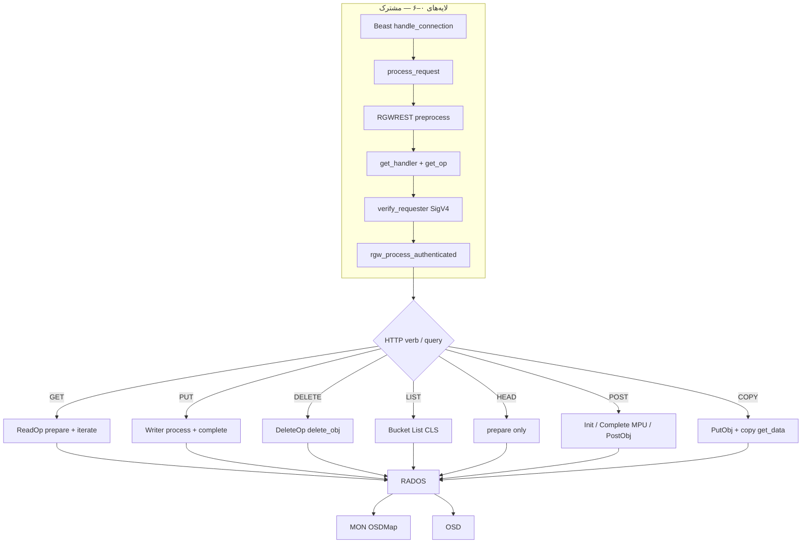

# فاز ۰ — مسیر درخواست‌ها (فهرست عملیات)

همهٔ عملیات S3 پرکاربرد از **همان اسکلت لایه‌های ۰–۶** عبور می‌کنند؛ تفاوت اصلی در **factory** (`op_get` / `op_put` / `op_post` / …)، کلاس `RGWOp`، و I/O زیر SAL (خواندن، نوشتن، فقط index، یا ترکیب) است.

!!! info "نحوه خواندن"
    - **متن فارسی** راست‌به‌چپ است.
    - **بلوک‌های کد** چپ‌به‌چپ (LTR) هستند.
    - جزئیات لایه‌های مشترک (بوت، Beast، `process_request`, SigV4): **[مرجع لایه‌های مشترک](shared-layers-reference.md)**.
    - **شرح روایی هر کلاس و تابع** (منطق، خطا، FIXME به زبان داستان): **[narrative-reference.md](narrative-reference.md)**.
    - مرجع عمیق GET (الگوی همهٔ اسناد verb): **[مسیر GET](full-request-path.md)**.

---

## نمای کلی: سه محور + یک لایه cluster

| محور | سوال | لایه‌های ۰–۶ | لایه ۷+ |
|------|------|--------------|---------|
| **حمل** | بایت‌ها از/به کجا می‌روند؟ | Beast → `RGWRestfulIO` | `ReadOp` / `Writer` / بدون body |
| **کنترل** | URI، هدر، XML/JSON؟ | `preprocess` → `get_handler` → `send_response` | `get_params` در op |
| **سیاست** | چه کسی؟ چه مجوزی؟ | `verify_requester` → `verify_permission` | IAM action per verb |
| **ذخیره** | oid، pool، PG؟ | — | SAL → `RGWRados` → librados → OSD |

→ جزئیات MON/OSD/CLS: **[لایه RADOS · OSD · MON](rados-osd-mon-stack.md)**

---

## جدول عملیات و اسناد

| عملیات | HTTP نمونه | کلاس `RGWOp` اصلی | IAM (نمونه) | I/O RADOS غالب | سند |
|--------|------------|-------------------|-------------|----------------|-----|
| **GET** | `GET /b/k` | `RGWGetObj` | `s3:GetObject` | data pool read × N stripe | [full-request-path.md](full-request-path.md) |
| **HEAD** | `HEAD /b/k` | `RGWGetObj` (بدون iterate) | همان GET | head read فقط | [full-request-path-head.md](full-request-path-head.md) |
| **PUT** | `PUT /b/k` | `RGWPutObj` | `s3:PutObject` | write stripes + index link | [full-request-path-put.md](full-request-path-put.md) |
| **COPY** | `PUT` + `x-amz-copy-source` | `RGWCopyObj` ⊂ `RGWPutObj` | Get منبع + Put مقصد | read source + write dest | [full-request-path-copy.md](full-request-path-copy.md) |
| **DELETE** | `DELETE /b/k` | `RGWDeleteObj` | `s3:DeleteObject` | index CLS + remove stripes | [full-request-path-delete.md](full-request-path-delete.md) |
| **LIST** | `GET /b?list-type=2` | `RGWListBucket` | `s3:ListBucket` | index pool CLS فقط | [full-request-path-list.md](full-request-path-list.md) |
| **POST** | `POST ?uploads` / `?uploadId` / form | Init / Complete / `RGWPostObj` | `s3:PutObject` | meta + compose + write | [full-request-path-post.md](full-request-path-post.md) |

---

## لایه‌های مشترک (خلاصه — جزئیات در shared-layers-reference)

| لایه | فایل‌های اصلی | خروجی کلیدی روی `req_state` |
|------|----------------|------------------------------|
| ۰ بوت | `rgw_main.cc`, `rgw_appmain.cc` | `penv.driver`, `penv.rest` |
| ۱ Beast | `rgw_asio_frontend.cc` | `RGWRestfulIO`, parse HTTP |
| ۲ process | `rgw_process.cc` | `req_state`, انتخاب `op` |
| ۳ REST | `rgw_rest.cc`, `rgw_rest_s3.cc` | `bucket_name`, `request_uri_aws4` |
| ۴ factory | `op_*` در handler | `s->op_type`, نمونه `RGWOp` |
| ۵ Auth | `rgw_auth*.cc`, `rgw_rest_s3.cc` | `s->auth.identity`, `s->user` |
| ۶ authenticated | `rgw_process_authenticated` | `execute` یا خطا |

> **Source:** [`rgw_process_env.h`](https://github.com/ceph/ceph/blob/main/src/rgw/rgw_process_env.h#L44-L59)

> **Source:** [`rgw_op.h`](https://github.com/ceph/ceph/blob/main/src/rgw/rgw_op.h#L286-L306)

**ترتیب عمدی در `rgw_process_authenticated`:** `init_permissions` → `read_permissions` → `verify_permission` → `verify_params` → `execute` → `complete`. بایت‌های سنگین (GET iterate، PUT process) **بعد** از مجوز اجرا می‌شوند.

→ جدول کامل فیلدهای `req_state` و SigV4: [shared-layers-reference.md](shared-layers-reference.md) و [GET](full-request-path.md).

---

## انتخاب Handler REST

| URI scope | Handler | `op_*` نمونه |
|-----------|---------|--------------|
| سرویس | `RGWHandler_REST_Service_S3` | `op_get` → ListBuckets |
| bucket | `RGWHandler_REST_Bucket_S3` | `op_get` → ListObjects |
| object | `RGWHandler_REST_Obj_S3` | `op_get` / `op_put` / `op_post` / `op_delete` |

> **Source:** [`rgw_rest.cc`](https://github.com/ceph/ceph/blob/main/src/rgw/rgw_rest.cc#L2297-L2325)

**Virtual-hosted vs path-style:** در `preprocess` نام bucket از host یا URI استخراج می‌شود؛ برای SigV4 مقدار `request_uri_aws4` **قبل** از rewrite ذخیره می‌شود (همان الگوی GET).

---

## مقایسه verbها در لایه ۷ (SAL / RADOS)

| Verb | SAL API | `RGWRados` / CLS | pool غالب |
|------|---------|------------------|-----------|
| GET | `Object::get_read_op` → `iterate` | `Object::Read::iterate`, `iterate_obj` | data |
| PUT | `get_atomic_writer` → `process`/`complete` | `AtomicObjectProcessor`, `Object::Write` | data + index |
| COPY | همان Writer + `get_data(fst,lst)` | read + write | data (دو طرف) |
| DELETE | `get_delete_op` / `delete_object` | `Object::Delete::delete_obj` | index + data |
| LIST | `Bucket::List` | `list_objects_ordered`, `cls_rgw_bucket_list_op` | index |
| POST Init | `MultipartUpload::init` | metadata upload | meta/index |
| POST Complete | `MultipartUpload::complete` | compose + index | data + index |

→ جدول MOSDOp تقریبی و Objecter: [rados-osd-mon-stack.md](rados-osd-mon-stack.md).

---

## امنیت — مشترک همه verbها

| تهدید | کنترل |
|--------|--------|
| جعل هویت | SigV4 / POST policy / presigned |
| دسترسی افقی | IAM روی ARN bucket/object؛ `x-amz-expected-bucket-owner` |
| افشای وجود object | `-EPERM` vs `-ENOENT` برای anonymous |
| DoS | dmclock (`schedule_request`)، rate limit، سقف LIST/multipart parts |
| MITM | TLS روی frontend |
| اجرای کد ادمین | Lua `preRequest` — سطح دسترسی config |

**Admin bypass:** فقط برای `-EACCES` / `-EPERM` / `-ERR_AUTHORIZATION` و `identity->is_admin()` — نه برای `-ENOENT` (جزئیات در [GET](full-request-path.md)).

**مسیرهای حساس اضافی:**

- **Browser POST:** policy base64 + HMAC (v2/v4) — [POST](full-request-path-post.md).
- **COPY:** مجوز Get روی منبع قبل از خواندن — [COPY](full-request-path-copy.md).
- **Replication / `s->system_request`:** شاخهٔ مجوز جدا در برخی opها.

---

## خطاهای مشترک (نمونه)

| `ret` | مرحله | HTTP / S3 (نمونه) |
|-------|--------|-------------------|
| `-ERR_SIGNATURE_NO_MATCH` | auth | 403 |
| `-ERR_INVALID_ACCESS_KEY` | auth | 403 |
| `-EACCES` | `verify_permission` | 403 AccessDenied |
| `-ENOENT` | policies / prepare | 404 |
| `-ERR_RATE_LIMITED` | dmclock | 503 SlowDown |
| `-ERR_METHOD_NOT_ALLOWED` | `get_op` null | 405 |

هر verb جدول گسترده‌تر خود را در سند اختصاصی دارد.

---

## الگوریتم `process_request` (سطح بالا)

1. ساخت `req_state` روی stack.
2. `rest->get_handler` → `handler->init` → `init_meta_info`.
3. `handler->get_op(s)` — اگر null → 405.
4. (اختیاری) Lua `preRequest`.
5. `schedule_request` (dmclock).
6. `op->verify_requester` — شکست → `abort_early`.
7. `postauth_init`.
8. `rgw_process_authenticated` → `execute`.
9. `done`: Lua post، ops log، آزاد کردن op.

> **Source:** [`rgw_process.cc`](https://github.com/ceph/ceph/blob/main/src/rgw/rgw_process.cc#L175-L220)

**چرا auth قبل از `read_permissions`?** tenant/virtual host و برخی اعتبارسنجی‌های نام object به identity وابسته‌اند؛ اما خواندن metadata شیء از RADOS تا `read_permissions` به تأخیر می‌افتد.

### `op_mask` و dmclock

| `RGWOp` | `op_mask()` | dmclock client (نمونه) |
|---------|-------------|-------------------------|
| `RGWGetObj` | `READ` | data |
| `RGWPutObj` / `RGWCopyObj` | `WRITE` | data |
| `RGWDeleteObj` | `DELETE` | metadata |
| `RGWListBucket` | `READ` | metadata |

`verify_op_mask` در `rgw_process_authenticated` مطابقت نوع API (read-only bucket policy و غیره) را چک می‌کند.

### پایان خطا — `abort_early`

> **Source:** [`rgw_rest.cc`](https://github.com/ceph/ceph/blob/main/src/rgw/rgw_rest.cc#L682-L704)

نگاشت `-ENOENT` → 404، امضای بد → `SignatureDoesNotMatch`، quota → XML S3 استاندارد — **قبل از** ارسال body شیء در GET/PUT.

---

## factoryهای `RGWHandler_REST_Obj_S3` (مرجع سریع)

| متد handler | query / شرط مهم | کلاس نمونه |
|-------------|-----------------|------------|
| `op_get` | `uploadId` | `RGWListMultipart` |
| `op_put` | `src_bucket` | `RGWCopyObj_ObjStore_S3` |
| `op_put` | `partNumber`+`uploadId` | `RGWPutObj` (part) |
| `op_post` | `uploads` | `RGWInitMultipart` |
| `op_post` | `uploadId` | `RGWCompleteMultipart` |
| `op_delete` | `uploadId` | `RGWAbortMultipart` |

جزئیات هر شاخه در سند verb مربوطه.

---

## ساختار `req_state` — فیلدهای پرتکرار

| فیلد | کی پر می‌شود؟ | استفاده در verbها |
|------|----------------|-------------------|
| `info.method` / `args` | preprocess | انتخاب op، multipart query |
| `bucket_name` | preprocess / postauth | همه |
| `bucket` | `init_permissions` | IAM bucket-level |
| `object` | `read_permissions` | GET/PUT/DELETE روی key |
| `auth.identity` | `verify_requester` | SigV4 / POST policy |
| `yield` | Beast | async RADOS |
| `op_type` | پس از `get_op` | perf، ops log |

> **Source:** [`rgw_common.h`](https://github.com/ceph/ceph/blob/main/src/rgw/rgw_common.h#L1304-L1330)

---

## IAM actions به ازای عملیات (خلاصه)

| S3 API | IAM action اصلی | op داخلی |
|--------|-----------------|----------|
| GetObject | `s3:GetObject` | `RGWGetObj` |
| PutObject | `s3:PutObject` | `RGWPutObj` |
| DeleteObject | `s3:DeleteObject` | `RGWDeleteObj` |
| ListBucket | `s3:ListBucket` | `RGWListBucket` |
| CreateMultipartUpload | `s3:PutObject` | `RGWInitMultipart` |
| CompleteMultipartUpload | `s3:PutObject` | `RGWCompleteMultipart` |
| PutObjectCopy | `s3:GetObject` + `s3:PutObject` | `RGWCopyObj` |

نسخه‌دار: `s3:GetObjectVersion` / `DeleteObjectVersion` وقتی `versionId` در درخواست باشد.

---

## مرجع توابع — لایه مشترک

| تابع | فایل | نقش |
|------|------|------|
| `handle_connection` | `rgw_asio_frontend.cc` | HTTP → `process_request` |
| `process_request` | `rgw_process.cc` | ارکستراتور |
| `RGWREST::preprocess` | `rgw_rest.cc` | URI، `bucket_name` |
| `RGWREST::get_handler` | `rgw_rest.cc` | انتخاب handler |
| `RGWOp::verify_requester` | `rgw_op.h` | Authentication |
| `rgw_process_authenticated` | `rgw_process.cc` | مجوز + execute |
| `abort_early` | `rgw_rest.cc` | پاسخ خطا |
| `rgw_rados_operate` | `driver/rados/rgw_tools.cc` | sync/async librados |

---

## ترتیب مطالعه پیشنهادی

1. [shared-layers-reference.md](shared-layers-reference.md) — یک‌بار لایه‌های ۰–۶
2. [GET](full-request-path.md) — الگوی کامل (trace، امنیت، SAL read)
3. [HEAD](full-request-path-head.md) — variant کم‌هزینه GET
4. [PUT](full-request-path-put.md) — pipeline نوشتن
5. [rados-osd-mon-stack.md](rados-osd-mon-stack.md) — زیر SAL (همراه PUT/GET)
6. [LIST](full-request-path-list.md) — bucket index CLS
7. [DELETE](full-request-path-delete.md) — versioning، object lock
8. [POST](full-request-path-post.md) — multipart + browser
9. [COPY](full-request-path-copy.md) — PutObj با منبع داخلی

---

## جدول ردیابی — نقاط ورود مشترک

| # | فایل:خط | نماد / رویداد |
|---|---------|----------------|
| 1 | `rgw_main.cc:104` | `main` |
| 2 | `rgw_appmain.cc:214` | `init_storage` |
| 3 | `rgw_asio_frontend.cc:355` | `process_request` |
| 4 | `rgw_process.cc:297` | `req_state` |
| 5 | `rgw_rest.cc:2306` | `preprocess` |
| 6 | `rgw_process.cc:381` | `verify_requester` |
| 7 | `rgw_process.cc:206` | `read_permissions` |
| 8 | `rgw_process.cc:268` | `execute` |
| 9 | `driver/rados/rgw_rados.cc:1175` | `rados.connect()` |
| 10 | `driver/rados/rgw_tools.cc:241` | `async_operate` |

---

## پرسش‌های تمرینی

1. کدام verbها بدون خواندن **data pool** می‌توانند موفق شوند؟
2. تفاوت `RGWHandler_REST_Bucket_S3` و `RGWHandler_REST_Obj_S3` در انتخاب `op_get` چیست؟
3. اگر `get_op` برای `DELETE` با `uploadId` چه کلاسی برمی‌گردد؟ (راهنما: [DELETE](full-request-path-delete.md))
4. چرا COPY در `op_put` است نه `op_post`؟
5. `penv.driver` از کدام تابع بوت پر می‌شود؟

---

## گام بعدی

→ [فاز ۱ — چرخه RGWOp](../02-phase-1-rgwop-lifecycle.md)

→ [خلاصه فاز ۰](../01-phase-0-request-path.md)
