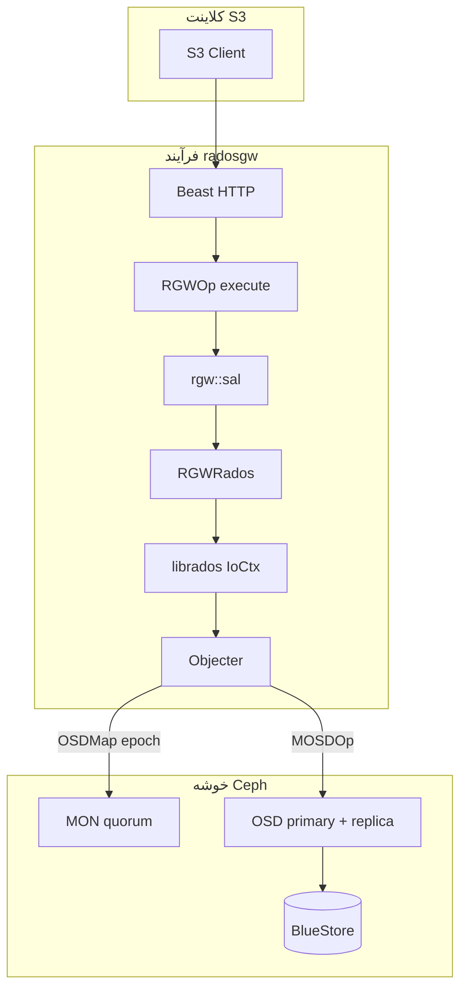
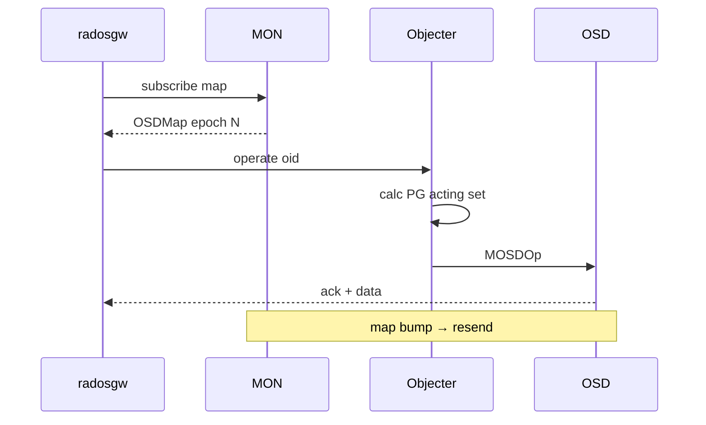
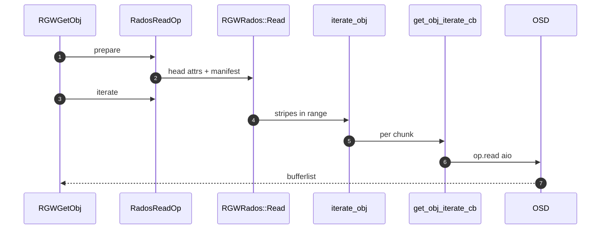
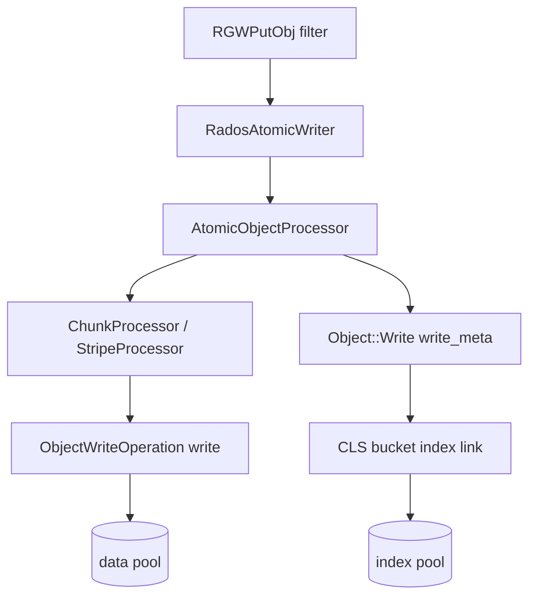
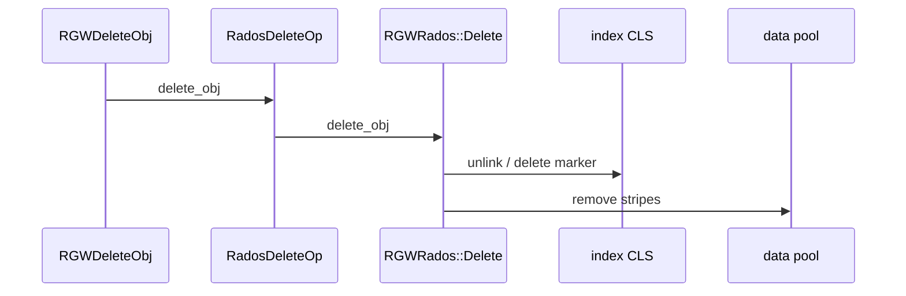

# لایه‌های RADOS، OSD و MON — جریان داده زیر RGW

این سند **لایه ۹** زنجیرهٔ فاز ۰ است: پس از SAL و `RGWRados`، بایت‌ها و metadata چگونه از **librados** به **OSD** می‌رسند و **MON** چه نقشی دارد.

!!! info "نحوه خواندن"
    - **متن فارسی** RTL؛ **کد** LTR.
    - **[شرح روایی](narrative-reference.md)** · لایه‌های HTTP: **[shared-layers-reference.md](shared-layers-reference.md)** · **[فهرست](index.md)**.
    - verbها: [GET](full-request-path.md) · [PUT](full-request-path-put.md) · [LIST](full-request-path-list.md) · [DELETE](full-request-path-delete.md) · [POST](full-request-path-post.md) · [COPY](full-request-path-copy.md).

---

## پشتهٔ کامل

| لایه | مسئولیت |
|------|---------|
| ۰–۶ | HTTP، auth — اسناد verb |
| ۷ `rgw::sal` | `RadosStore`, `RadosObject`, `Writer`, `ReadOp`, `DeleteOp` |
| ۸ `RGWRados` | manifest، bucket index، placement |
| ۹a librados | `IoCtx::operate`, `async_operate` |
| ۹b Objecter | pool → PG → primary OSD |
| ۹c MON | OSDMap، cephx، pool meta |
| ۹d OSD | replica، read/write، CLS |

RGW با `CEPH_ENTITY_TYPE_CLIENT` بوت می‌شود (`rgw_main.cc`) — **کلاینت RADOS**، نه daemon OSD/MON.

---

## بوت و poolها

> **Source:** [`driver/rados/rgw_rados.cc`](https://github.com/ceph/ceph/blob/main/src/rgw/driver/rados/rgw_rados.cc#L1167-L1194)

> **Source:** [`driver/rados/rgw_rados.cc`](https://github.com/ceph/ceph/blob/main/src/rgw/driver/rados/rgw_rados.cc#L1243-L1288)

| pool (نام در zone) | نقش |
|--------------------|------|
| root | zone، period |
| `*.rgw.buckets.index` | **bucket index** — LIST، نام→meta، delete marker |
| `*.rgw.buckets.data` | **stripeهای داده** — GET/PUT body |
| gc / lc / log | workers پس‌زمینه |

**Placement rule** روی bucket → CRUSH → OSD؛ RGW oid را می‌سازد، PG را Objecter از **OSDMap** (MON) حل می‌کند.

---

## نقش MON

MON در مسیر یک `GET` معمولاً **byte برنمی‌گرداند**، اما بدون map سالم I/O شروع نمی‌شود.

| وظیفه MON | اثر روی RGW |
|-----------|-------------|
| OSDMap / CrushMap | Objecter: object → PG → OSD |
| Pool existence | `open_*_pool_ctx` |
| cephx | `rados.connect()` با `client.rgw.*` |
| quorum | از دست رفتن → timeout / block |
| service map | `service_daemon_register` — وضعیت RGW |

**دیباگ:** HTTP OK ولی hang → `ceph -s`، PG state، MON quorum.

---

## librados و Objecter

> **Source:** [`driver/rados/rgw_tools.cc`](https://github.com/ceph/ceph/blob/main/src/rgw/driver/rados/rgw_tools.cc#L230-L256)

| مفهوم | توضیح |
|--------|--------|
| `librados::Rados` | handle cluster |
| `IoCtx` | یک pool + namespace |
| `optional_yield` | Beast async → `async_operate` بدون block thread |
| `ObjectReadOperation` / `WriteOperation` | read/write/omap/**cls** |
| Objecter | داخل librados؛ صف، resend، throttle |

**جریان Objecter (خلاصه):**

1. `operate(oid, op)` → hash object → PG id.
2. از OSDMap: primary + replica set.
3. ارسال `MOSDOp` به primary (و replication برای write).
4. completion → callback / coroutine resume (`yield`).

**CLS:** منطق روی OSD — برای RGW مهم: class `rgw` روی **bucket index oid** (`cls_rgw_bucket_list_op`, link/unlink).

---

## مسیر GET — `iterate` تا دیسک

### نمودار

### `Object::Read::iterate`

> **Source:** [`driver/rados/rgw_rados.cc`](https://github.com/ceph/ceph/blob/main/src/rgw/driver/rados/rgw_rados.cc#L8383-L8406)

| پارامتر config | اثر |
|----------------|-----|
| `rgw_get_obj_max_req_size` | حداکثر هر chunk read |
| `rgw_get_obj_window_size` | تعداد aio هم‌زمان (throttle) |

### `iterate_obj` — پیمایش manifest

> **Source:** [`driver/rados/rgw_rados.cc`](https://github.com/ceph/ceph/blob/main/src/rgw/driver/rados/rgw_rados.cc#L8409-L8461)

**الگوریتم:**

1. `get_obj_state` — head + manifest.
2. اگر manifest: برای هر stripe در `[ofs,end]`:
   - `read_obj` = raw oid در pool placement
   - `read_ofs` = offset داخل stripe
   - `cb(...)` با `read_len` ≤ `max_chunk_size`
3. بدون manifest: read از head oid تنها.
4. خطا در cb → abort؛ `data.cancel()` در iterate.

### `get_obj_iterate_cb` — ارسال aio

> **Source:** [`driver/rados/rgw_rados.cc`](https://github.com/ceph/ceph/blob/main/src/rgw/driver/rados/rgw_rados.cc#L8330-L8380)

| گام | توضیح |
|-----|--------|
| `append_atomic_test` | داده inline در head — بدون OSD |
| `op.read(read_ofs, len)` | `ObjectReadOperation` |
| `aio->get(..., cost, id)` | throttle + مرتب‌سازی با `obj_ofs` |
| `flush` | انتظار completionها |

**تابع wrapper استاتیک:** `_get_obj_iterate_cb` → delegate به `RGWRados::get_obj_iterate_cb`.

---

## مسیر PUT — Writer تا OSD و index

### SAL — `RadosAtomicWriter`

> **Source:** [`driver/rados/rgw_sal_rados.cc`](https://github.com/ceph/ceph/blob/main/src/rgw/driver/rados/rgw_sal_rados.cc#L5106-L5129)

| متد | نقش |
|-----|------|
| `prepare` | `processor.prepare` — manifest خالی، head |
| `process` | stripe write به data pool |
| `complete` | finalize head + **index** |

### `AtomicObjectProcessor::complete`

> **Source:** [`driver/rados/rgw_putobj_processor.cc`](https://github.com/ceph/ceph/blob/main/src/rgw/driver/rados/rgw_putobj_processor.cc#L371-L436)

**الگوریتم commit:**

| # | گام | توضیح |
|---|------|--------|
| 1 | `writer.drain()` | انتظار aio نوشتن stripeها |
| 2 | `manifest_gen.create_next` | بستن manifest |
| 3 | `Object::Write::write_meta` | attrs، ETag، ACL روی head |
| 4 | index | نام object → dirent در shard index (CLS) |
| 5 | شکست `-ETIMEDOUT` | ممکن است head بعداً بنویسد — GC tail |

**ترتیب قابل مشاهده بودن:** تا `write_meta` + index link موفق، LIST ممکن است object را نشان ندهد؛ PUT نیمه‌کاره → part/GC.

**quota:** لایه `RGWOp` — OSD اندازه را فقط ذخیره می‌کند.

---

## مسیر LIST — `list_objects` و CLS

### SAL / RGWRados

> **Source:** [`driver/rados/rgw_rados.cc`](https://github.com/ceph/ceph/blob/main/src/rgw/driver/rados/rgw_rados.cc#L1910-L1938)

| پارامتر | نقش |
|---------|------|
| `max` | سقف نتایج (حافظه + `rgw_max_listing_results`) |
| `marker` / `prefix` / `delimiter` | صفحه‌بندی S3 |
| shard | bucket بزرگ — چند oid index |

**الگوریتم `list_objects_ordered`:**

- حلقه با `SOFT_MAX_ATTEMPTS` — forward progress روی marker.
- فراخوانی CLS list روی shard oid مناسب.
- فیلتر delimiter → `common_prefixes`.
- معمولاً **بدون** read از data pool.

### `cls_rgw_bucket_list_op`

> **Source:** [`driver/rados/rgw_rados.cc`](https://github.com/ceph/ceph/blob/main/src/rgw/driver/rados/rgw_rados.cc#L11081-L11090)

| موضوع | جزئیات |
|--------|--------|
| oid | shard index (مثلاً `.dir.{marker}`) |
| op | CLS `rgw` — نه read ساده |
| اجرا | primary OSD آن PG |
| خروجی | `rgw_bucket_dir_entry` — size، etag، flags |
| `check_disk_state` | pending/uncommitted → repair |

---

## مسیر DELETE — SAL و `delete_obj`

### SAL wrapper

> **Source:** [`driver/rados/rgw_sal_rados.cc`](https://github.com/ceph/ceph/blob/main/src/rgw/driver/rados/rgw_sal_rados.cc#L3767-L3800)

> **Source:** [`driver/rados/rgw_sal_rados.cc`](https://github.com/ceph/ceph/blob/main/src/rgw/driver/rados/rgw_sal_rados.cc#L3802-L3823)

| API | نقش |
|-----|------|
| `get_delete_op()` | factory از `RadosObject` |
| `RadosDeleteOp::delete_obj` | کپی params → `RGWRados::Object::Delete` |
| `delete_object` | shortcut بدون op جدا |

### `RGWRados::Object::Delete::delete_obj`

> **Source:** [`driver/rados/rgw_rados.cc`](https://github.com/ceph/ceph/blob/main/src/rgw/driver/rados/rgw_rados.cc#L6498-L6534)

| versioning | رفتار index / data |
|------------|-------------------|
| off | حذف head + stripeها |
| on، بدون versionId | **delete marker** در index |
| versionId مشخص | حذف آن نسخه |

**Object lock:** `verify_object_lock` در لایه op قبل از حذف فیزیکی.

---

## مسیر POST multipart — RADOS

| مرحله | RADOS |
|--------|--------|
| Init | meta oid برای uploadId |
| Part PUT | part objects در data pool |
| Complete | `RadosMultipartUpload::complete` — compose + index |
| Abort | حذف meta + partها |

> **Source:** [`driver/rados/rgw_sal_rados.cc`](https://github.com/ceph/ceph/blob/main/src/rgw/driver/rados/rgw_sal_rados.cc#L4315-L4358)

---

## جدول توابع — لایه ۹

| تابع | فایل | verb |
|------|------|------|
| `RGWRados::init_rados` | `rgw_rados.cc` | بوت |
| `rgw_rados_operate` | `rgw_tools.cc` | همه |
| `RadosReadOp::prepare` | `rgw_sal_rados.cc` | GET/HEAD/COPY read |
| `RGWRados::Object::Read::iterate` | `rgw_rados.cc` | GET |
| `RGWRados::iterate_obj` | `rgw_rados.cc` | GET/COPY |
| `RGWRados::get_obj_iterate_cb` | `rgw_rados.cc` | GET/COPY |
| `RadosAtomicWriter::process/complete` | `rgw_sal_rados.cc` | PUT/POST |
| `AtomicObjectProcessor::complete` | `rgw_putobj_processor.cc` | PUT |
| `Bucket::List::list_objects_ordered` | `rgw_rados.cc` | LIST |
| `cls_rgw_bucket_list_op` | `rgw_rados.cc` | LIST |
| `RadosDeleteOp::delete_obj` | `rgw_sal_rados.cc` | DELETE |
| `Object::Delete::delete_obj` | `rgw_rados.cc` | DELETE |
| `RadosMultipartUpload::complete` | `rgw_sal_rados.cc` | POST complete |

---

## مقایسه verb → لایه RADOS

| Verb | pool غالب | نوع op | MOSDOp تقریبی |
|------|-----------|--------|----------------|
| GET head | data | read | 1 |
| GET body | data × N stripe | read aio × window | window_size |
| PUT | data + index | write + cls | chunks + 1 meta |
| COPY | data × 2 | read + write | sum هر دو |
| LIST | index | cls list | 1+ per shard/page |
| DELETE | index + data | cls + remove | 1–N |
| HEAD | data (head) | read کوچک | 1 |

---

## پیکربندی `ceph.conf`

| option | اثر |
|--------|-----|
| `mon_host` | اتصال librados |
| `rgw_max_chunk_size` | chunk PUT/COPY |
| `rgw_get_obj_window_size` | parallelism GET |
| `rgw_get_obj_max_req_size` | سقف هر read |
| `rgw_multipart_min_part_size` | POST part |
| `rgw_mp_lock_max_time` | قفل complete |
| `osd_pool_default_size` | replica PUT latency |

---

## خطاهای cluster

| علامت | لایه |
|-------|------|
| `-ECONNREFUSED` | MON / firewall |
| pool نامعتبر | zone vs cluster |
| `-EIO` | OSD disk |
| PG inactive | recovery — RGW slow |
| `-ETIMEDOUT` aio | OSD load |
| stale map | موقت پس از failover |

---

## امنیت در لایه cluster

| موضوع | نکته |
|--------|------|
| ACL داده | RGW در op؛ OSD فقط oid |
| LIST | فقط metadata index — نه محتوا |
| CLS | فقط از `client.rgw` با caps |
| حذف | delete marker ≠ wipe فوری data — GC |
| multisite | bilog در index |

---

## جدول ردیابی

| # | فایل:خط | رویداد |
|---|---------|--------|
| 1 | `rgw_rados.cc:1175` | `rados.connect()` |
| 2 | `rgw_rados.cc:1252` | open pools |
| 3 | `rgw_sal_rados.cc:3730` | Read::prepare |
| 4 | `rgw_rados.cc:8398` | `iterate_obj` |
| 5 | `rgw_rados.cc:8373` | `op.read` در cb |
| 6 | `rgw_tools.cc:241` | `async_operate` |
| 7 | `rgw_sal_rados.cc:5116` | Writer `complete` |
| 8 | `rgw_putobj_processor.cc:427` | `write_meta` |
| 9 | `rgw_rados.cc:1910` | `list_objects_ordered` |
| 10 | `rgw_rados.cc:11083` | `cls_rgw_bucket_list_op` |
| 11 | `rgw_sal_rados.cc:3791` | SAL `delete_obj` |
| 12 | `rgw_rados.cc:6518` | delete marker |

---

## پرسش‌های تمرینی

1. چرا LIST به data pool نیاز ندارد؟
2. تفاوت oid در index pool و stripe در data pool؟
3. `get_obj_iterate_cb` چه زمانی بدون OSD برمی‌گردد؟
4. delete marker کجا ذخیره می‌شود؟
5. اگر MON down باشد ولی map cache قدیمی باشد چه می‌شود؟

---

## مستندات مرتبط

- [ماژول RADOS driver](../../modules/rados-driver.md)
- [چرخه عمر شیء](../../architecture/object-lifecycle.md)
- [shared-layers-reference.md](shared-layers-reference.md)
- [index.md](index.md)

→ [GET](full-request-path.md) · [PUT](full-request-path-put.md)
