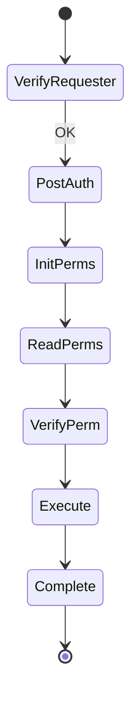

# لایه‌های مشترک ۰–۶ (همه عملیات فاز ۰)

این سند **بخش مشترک** تمام verbهای S3 است. هر سند PUT/DELETE/… فرض می‌کند این لایه‌ها را می‌شناسید.

| لایه | فایل‌های اصلی | خروجی کلیدی |
|------|----------------|-------------|
| ۰ بوت | `rgw_main.cc`, `rgw_appmain.cc` | `RGWProcessEnv`, `driver` |
| ۱ Beast | `rgw_asio_frontend.cc` | `RGWRestfulIO`, HTTP parse |
| ۲ process | `rgw_process.cc` | `req_state`, انتخاب op |
| ۳ REST | `rgw_rest.cc`, `rgw_rest_s3.cc` | handler, `preprocess` |
| ۴ Op factory | `op_get` / `op_put` / … | نمونه `RGWOp` |
| ۵ Auth | `rgw_auth*.cc`, `rgw_rest_s3.cc` | `s->auth.identity` |
| ۶ authenticated | `rgw_process_authenticated` | `execute` |

→ جزئیات verb-specific از لایه ۷ به بعد: [فهرست عملیات](index.md)

---

## ساختارهای مشترک

### `RGWProcessEnv`

> **Source:** [`rgw_process_env.h`](https://github.com/ceph/ceph/blob/main/src/rgw/rgw_process_env.h#L44-L59)

### `req_state` (خلاصه فیلدها)

| فیلد | پر شدن |
|------|--------|
| `info` | `preprocess` |
| `bucket_name` | `preprocess` / `postauth_init` |
| `bucket`, `object` | `init_permissions` / `read_permissions` |
| `user`, `auth.identity` | auth |
| `yield` | Beast / `process_request` |

### چرخه `RGWOp`

| متد | نقش |
|-----|------|
| `verify_requester` | Authentication |
| `init_permissions` | bucket policies |
| `read_permissions` | object ACL/IAM |
| `verify_permission` | Authorization |
| `verify_params` | query/body validation |
| `pre_exec` | hook |
| `execute` | منطق اصلی |
| `complete` | `send_response` |

---

## لایه ۰ — `main` / `init_storage`

> **Source:** [`rgw_main.cc`](https://github.com/ceph/ceph/blob/main/src/rgw/rgw_main.cc#L104-L120)

> **Source:** [`rgw_appmain.cc`](https://github.com/ceph/ceph/blob/main/src/rgw/rgw_appmain.cc#L214-L230)

| تابع | نقش |
|------|------|
| `rgw_global_init` | `CephContext`, logging |
| `AppMain::init_storage` | `DriverManager::get_storage` → `RadosStore` |
| `cond_init_apis` | `RGWREST` + ثبت S3 handlers |
| `init_frontends2` | listen TCP |

---

## لایه ۱ — `handle_connection`

> **Source:** [`rgw_asio_frontend.cc`](https://github.com/ceph/ceph/blob/main/src/rgw/rgw_asio_frontend.cc#L313-L356)

| تابع/مرحله | نقش |
|------------|------|
| `http::async_read_header` | parse method, URI, headers |
| `StreamIO` + filters | body length, chunk |
| `process_request` | ورود هسته |

---

## لایه ۲ — `process_request`

> **Source:** [`rgw_process.cc`](https://github.com/ceph/ceph/blob/main/src/rgw/rgw_process.cc#L278-L325)

> **Source:** [`rgw_process.cc`](https://github.com/ceph/ceph/blob/main/src/rgw/rgw_process.cc#L336-L377)

> **Source:** [`rgw_process.cc`](https://github.com/ceph/ceph/blob/main/src/rgw/rgw_process.cc#L379-L417)

| تابع | خطا → |
|------|--------|
| `get_handler` | null → 405 |
| `get_op` | null → METHOD_NOT_ALLOWED |
| `schedule_request` | `-EAGAIN` → rate limit |
| `verify_requester` | `abort_early` |
| `rgw_process_authenticated` | همان |

---

## لایه ۳ — `RGWREST::get_handler`

> **Source:** [`rgw_rest.cc`](https://github.com/ceph/ceph/blob/main/src/rgw/rgw_rest.cc#L2297-L2338)

> **Source:** [`rgw_rest.cc`](https://github.com/ceph/ceph/blob/main/src/rgw/rgw_rest.cc#L2033-L2045)

| تابع | نقش |
|------|------|
| `preprocess` | URI، `op_from_method`، امنیت `\0` |
| `get_manager` | درخت REST |
| `handler->init` | اتصال `s`, `cio` |

---

## لایه ۵–۶ — Auth و `rgw_process_authenticated`

SigV4 کامل: [GET — لایه ۵ (احراز هویت SigV4)](full-request-path.md)

> **Source:** [`rgw_process.cc`](https://github.com/ceph/ceph/blob/main/src/rgw/rgw_process.cc#L175-L275)

| مرحله | تابع handler/op |
|--------|-----------------|
| 1 | `init_permissions` |
| 2 | `retarget` |
| 3 | `read_permissions` |
| 4 | `init_processing` |
| 5 | `verify_op_mask` |
| 6 | `verify_permission` |
| 7 | `verify_params` |
| 8 | `pre_exec` |
| 9 | `rate_limit` |
| 10 | `execute` |
| 11 | `complete` |

---

## `abort_early`

> **Source:** [`rgw_rest.cc`](https://github.com/ceph/ceph/blob/main/src/rgw/rgw_rest.cc#L682-L704)

---

## مرجع توابع مشترک

| تابع | فایل |
|------|------|
| `process_request` | `rgw_process.cc` |
| `rgw_process_authenticated` | `rgw_process.cc` |
| `RGWREST::preprocess` | `rgw_rest.cc` |
| `RGWREST::get_handler` | `rgw_rest.cc` |
| `RGWOp::verify_requester` | `rgw_op.h` |
| `RGW_Auth_S3::authorize` | `rgw_rest_s3.cc` |
| `abort_early` | `rgw_rest.cc` |

→ [GET کامل](full-request-path.md) · [RADOS/OSD/MON](rados-osd-mon-stack.md)
