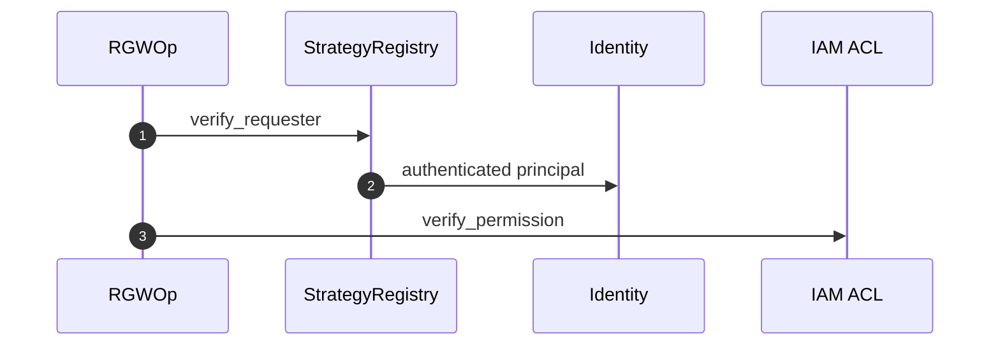

# ماژول احراز هویت و مجوز

## فایل‌ها

| فایل | نقش |
|------|-----|
| `rgw_auth_registry.h` | `StrategyRegistry` |
| `rgw_auth_s3.h/.cc` | امضای AWS |
| `rgw_auth_swift.*` | Swift |
| `rgw_iam_policy.cc` | سیاست IAM |
| `rgw_acl*.cc` | ACL سطل/شیء |

## جریان

1. **Authentication** — `op->verify_requester(registry)` → `Identity`
2. **Authorization** — `verify_permission()` — IAM + ACL + bucket policy

## ادغام OPA

اگر `rgw_use_opa_authz` فعال باشد، `rgw_opa_authorize` قبل از `verify_permission` فراخوانی می‌شود (`rgw_process.cc`).

## مستندات

- [خط لوله](../architecture/request-pipeline.md)
- [تحلیل امنیت](../analysis/code-quality-and-security.md)
