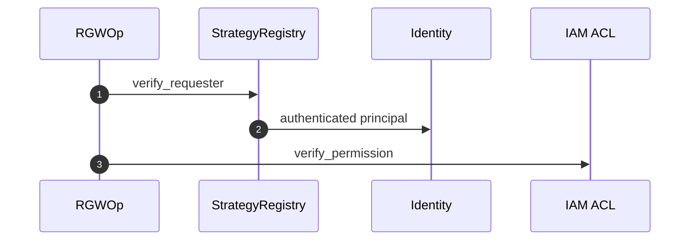

# Authentication and authorization module

## Files

| File | Role |
|------|------|
| `rgw_auth_registry.h` | `StrategyRegistry` |
| `rgw_auth_s3.h/.cc` | AWS signature |
| `rgw_auth_swift.*` | Swift auth |
| `rgw_iam_policy.cc` | IAM policy |
| `rgw_acl*.cc` | Bucket/object ACL |

## Flow

1. **Authentication** — `op->verify_requester(registry)` → `Identity`
2. **Authorization** — `verify_permission()` — IAM + ACL + bucket policy

## OPA integration

When `rgw_use_opa_authz` is enabled, `rgw_opa_authorize` runs before `verify_permission` (`rgw_process.cc`).

## Related

- [Request pipeline](../architecture/request-pipeline.md)
