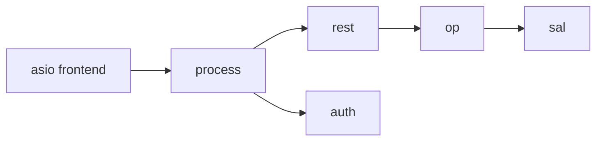

# ماژول مسیر درخواست (Core Request Path)

## درخت بسته

```text
src/rgw/
  rgw_process.cc      # process_request
  rgw_asio_frontend.cc
  rgw_common.h        # req_state
  rgw_request.h
  rgw_rest.h / rgw_rest.cc
  rgw_op.h / rgw_op.cc
```

## جدول لایه

| فایل | لایه | واحد استقرار |
|------|------|--------------|
| `rgw_asio_frontend.cc` | Transport | `radosgw` |
| `rgw_process.cc` | Orchestration | `radosgw` |
| `rgw_rest*.cc` | Protocol | `radosgw` |
| `rgw_op.cc` | Domain ops | `radosgw` |

## `req_state`

مرکز وضعیت هر درخواست — bucket، object، user، auth:


> **Source:** [`rgw_common.h`](https://github.com/ceph/ceph/blob/main/src/rgw/rgw_common.h#L1304-L1344)


[مشاهده در GitHub](https://github.com/ceph/ceph/blob/main/src/rgw/rgw_common.h#L1304-L1344)

## `RGWREST` و مسیریابی


> **Source:** [`rgw_rest.h`](https://github.com/ceph/ceph/blob/main/src/rgw/rgw_rest.h#L662-L676)


## تعامل با سایر ماژول‌ها



## پیوست نمادها

پس از `make generate`: [فهرست نمادها](https://github.com/ceph/ceph/tree/main/src/rgw) — جستجوی `rgw_process.cc`, `rgw_op.h`.

## مستندات معماری

- [خط لوله درخواست](../architecture/request-pipeline.md)
- [نمودارهای توالی](../architecture/sequence-diagrams.md)
