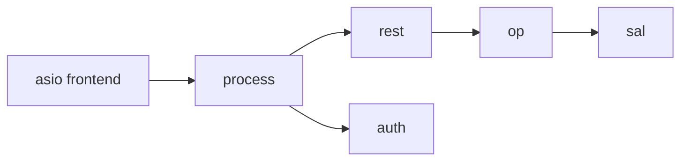

# Core request path module

## Package tree

```text
src/rgw/
  rgw_process.cc      # process_request
  rgw_asio_frontend.cc
  rgw_common.h        # req_state
  rgw_request.h
  rgw_rest.h / rgw_rest.cc
  rgw_op.h / rgw_op.cc
```

## Layer table

| File | Layer | Deploy unit |
|------|-------|-------------|
| `rgw_asio_frontend.cc` | Transport | `radosgw` |
| `rgw_process.cc` | Orchestration | `radosgw` |
| `rgw_rest*.cc` | Protocol | `radosgw` |
| `rgw_op.cc` | Domain ops | `radosgw` |

## `req_state`

Central per-request state — bucket, object, user, auth:

> **Source:** [`rgw_common.h`](https://github.com/ceph/ceph/blob/main/src/rgw/rgw_common.h#L1304-L1344)

[View on GitHub](https://github.com/ceph/ceph/blob/main/src/rgw/rgw_common.h#L1304-L1344)

## `RGWREST` routing

> **Source:** [`rgw_rest.h`](https://github.com/ceph/ceph/blob/main/src/rgw/rgw_rest.h#L662-L676)

## Interaction with other modules



## Architecture docs

- [Request pipeline](../architecture/request-pipeline.md)
- [Sequence diagrams](../architecture/sequence-diagrams.md)
