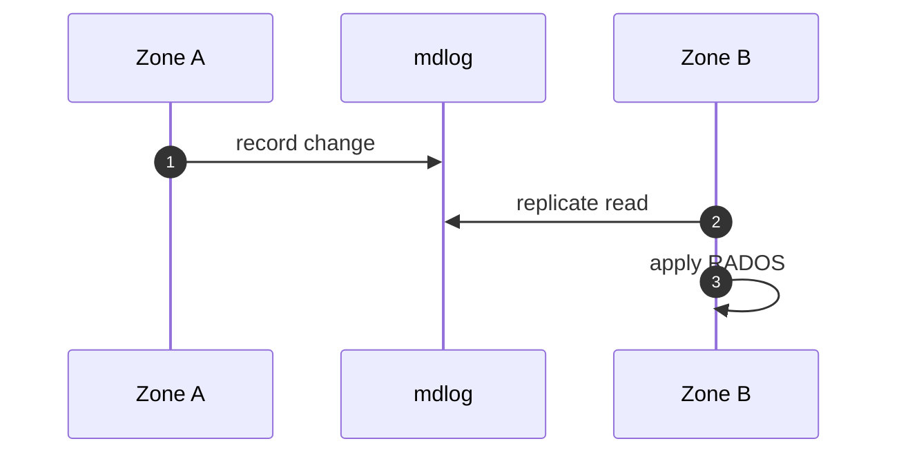

# ماژول Multisite

## مفاهیم

| مفهوم | فایل مرجع |
|--------|-----------|
| Realm | `rgw_realm.cc` |
| Period | `rgw_period.cc` |
| Zone / Zonegroup | `rgw_zone.h` |
| Data sync | `driver/rados/rgw_data_sync.*` |
| Bucket sync | `rgw_bucket_sync.cc` |
| HTTP بین زون‌ها | `rgw_rest_conn.h` |

## جریان همگام‌سازی متادیتا

## Reload بدون restart

- `rgw_realm_reloader.cc`
- `rgw_period_pusher.cc`

## محدودیت‌ها

[محدودیت‌های HA](../architecture/critical-gaps-and-ha-limitations.md)

## پیوست

جستجو در [symbol-index](https://github.com/ceph/ceph/tree/main/src/rgw): `rgw_sync`, `rgw_zone`.
