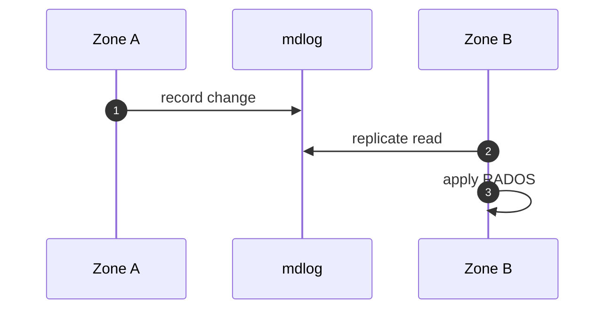

# Multisite module

## Concepts

| Concept | Reference file |
|---------|----------------|
| Realm | `rgw_realm.cc` |
| Period | `rgw_period.cc` |
| Zone / Zonegroup | `rgw_zone.h` |
| Data sync | `driver/rados/rgw_data_sync.*` |
| Bucket sync | `rgw_bucket_sync.cc` |
| Inter-zone HTTP | `rgw_rest_conn.h` |

## Metadata sync flow

## Reload without restart

- `rgw_realm_reloader.cc`
- `rgw_period_pusher.cc`

## Limitations

[Critical gaps and HA limitations](../architecture/critical-gaps-and-ha-limitations.md)
