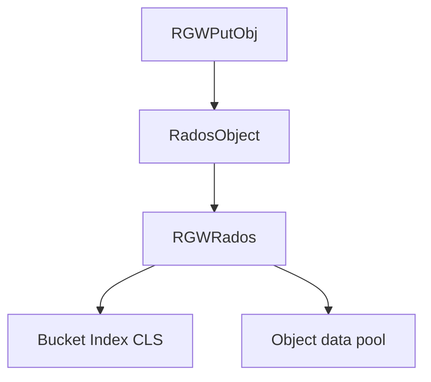

# ماژول درایور RADOS

## هدف

پیاده‌سازی تولید SAL روی **Ceph RADOS**: poolها، bucket index (CLS)، GC، resharding، notify.

## درخت

```text
driver/rados/
  rgw_sal_rados.h / .cc   # RadosStore
  rgw_rados.h / .cc       # RGWRados core
  rgw_bucket.cc
  rgw_gc.*
  rgw_reshard.*
  rgw_data_sync.*
  rgw_service.h           # RGWServices_Def
```

## `RadosStore`

کلاس اصلی SAL برای RADOS — zone، placement، عملیات admin:

[rgw_sal_rados.h](https://github.com/ceph/ceph/blob/main/src/rgw/driver/rados/rgw_sal_rados.h)

## لایه سرویس

`RGWServices_Def` سرویس‌های `RGWSI_*` را جمع می‌کند — جزئیات در [ماژول services](services-layer.md).

## جریان نوشتن (خلاصه)



## واحد استقرار

همان فرآیند `radosgw` — driver درون process بارگذاری می‌شود.

## پیوست

[symbol-index](https://github.com/ceph/ceph/tree/main/src/rgw/docs-extended/pages/appendix/generated/symbol-index.md) — `driver.rados`.

## مستندات

- [چرخه عمر شیء](../architecture/object-lifecycle.md)
- [Multisite](multisite.md)
