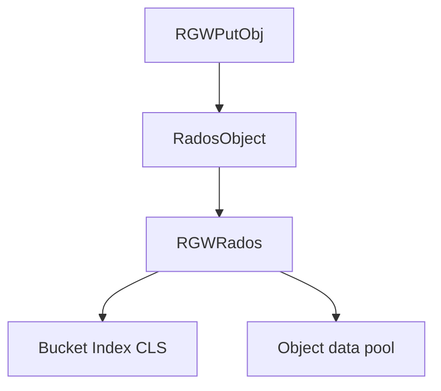

# RADOS 驱动模块

## 目的

Production SAL backend on **Ceph RADOS**: pools, bucket index (CLS), GC, resharding, notify.

## Tree

```text
driver/rados/
  rgw_sal_rados.h / .cc   # RadosStore
  rgw_rados.h / .cc       # RGWRados core
  rgw_bucket.cc
  rgw_gc.*
  rgw_reshard.*
  rgw_data_sync.*
  rgw_service.h           # RGWServices_Def
```

## `RadosStore`

Main SAL class for RADOS — zone, placement, admin operations:

[`rgw_sal_rados.h`](https://github.com/ceph/ceph/blob/main/src/rgw/driver/rados/rgw_sal_rados.h)

## Services layer

`RGWServices_Def` aggregates `RGWSI_*` services — see [Services layer module](services-layer.md).

## Write path (summary)



## Deploy unit

Same `radosgw` process — driver loaded in-process.

## 相关

- [Object lifecycle](../architecture/object-lifecycle.md)
- [Multisite module](multisite.md)
