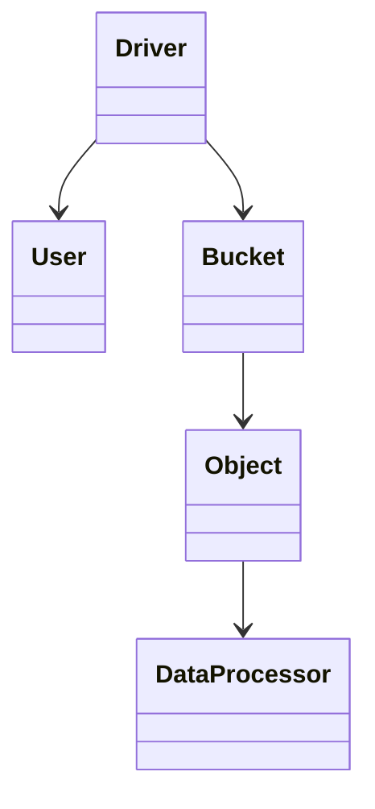

# ماژول SAL (Store Abstraction Layer)

## هدف

جداسازی پروتکل HTTP از پیاده‌سازی ذخیره‌سازی. همه عملیات داده باید از `rgw::sal::*` عبور کنند.

## فایل‌های کلیدی

| فایل | نقش |
|------|-----|
| `rgw_sal.h` | API اصلی `Driver`, `User`, `Bucket`, `Object` |
| `rgw_sal.cc` | `DriverManager`, انتخاب driver |
| `rgw_sal_filter.h` | لایه‌های فیلتر (stack) |
| `driver/*/rgw_sal_*.h` | پیاده‌سازی‌ها |

## مستندات در منبع

> **Source:** [`rgw_sal.h`](https://github.com/ceph/ceph/blob/main/src/rgw/rgw_sal.h#L98-L126)

[GitHub](https://github.com/ceph/ceph/blob/main/src/rgw/rgw_sal.h#L98-L126)

## `DriverManager`

انتخاب backend از پیکربندی (`rgw_store`) و اعمال فیلتر D4N در صورت compile:

> **Source:** [`rgw_sal.cc`](https://github.com/ceph/ceph/blob/main/src/rgw/rgw_sal.cc#L60-L79)

## classDiagram SAL (امن برای وب)

## تعامل

- **بالادست:** `RGWOp`, `rgw_process`
- **پایین‌دست:** `RadosStore`, `DBStore`, …

## پیوست

[symbol-index](https://github.com/ceph/ceph/tree/main/src/rgw) — بسته `core` و `driver.rados`.

## معماری

- [نمای کلی](../architecture/system-overview.md)
