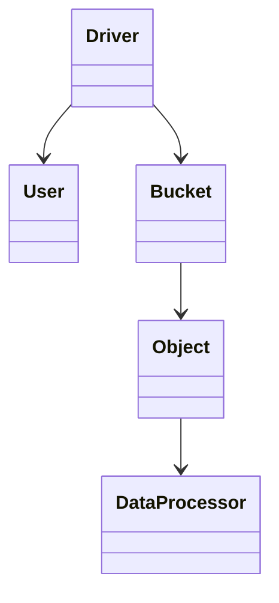

# SAL（存储抽象层）模块

## 目的

Decouple HTTP protocol logic from storage backends. All data operations go through `rgw::sal::*`.

## 关键文件

| File | Role |
|------|------|
| `rgw_sal.h` | Core API: `Driver`, `User`, `Bucket`, `Object` |
| `rgw_sal.cc` | `DriverManager`, driver selection |
| `rgw_sal_filter.h` | Filter stack layers |
| `driver/*/rgw_sal_*.h` | Backend implementations |

## Source reference

> **Source:** [`rgw_sal.h`](https://github.com/ceph/ceph/blob/main/src/rgw/rgw_sal.h#L98-L126)

## `DriverManager`

Selects backend from config (`rgw_store`) and optional D4N filter when compiled:

> **Source:** [`rgw_sal.cc`](https://github.com/ceph/ceph/blob/main/src/rgw/rgw_sal.cc#L60-L79)

## SAL class diagram

## 交互

- **Upstream:** `RGWOp`, `rgw_process`
- **Downstream:** `RadosStore`, `DBStore`, …

## ## 架构文档

- [System overview](../architecture/system-overview.md)
