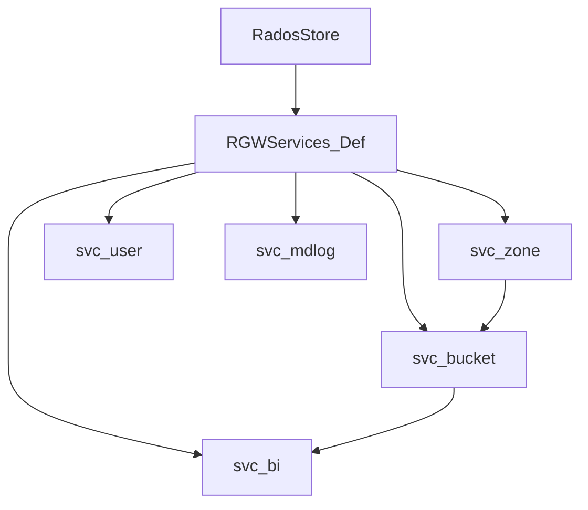

# ماژول Services (`services/`)

## هدف

تجزیه منطق RADOS به سرویس‌های کوچک قابل تست و reuse — بین `RadosStore` و librados/CLS.

## سرویس‌های اصلی

| سرویس | فایل | مسئولیت |
|--------|------|---------|
| `RGWSI_Zone` | `svc_zone.h` | realm, period, placement |
| `RGWSI_User_RADOS` | `svc_user_rados.h` | متادیتای کاربر |
| `RGWSI_Bucket_SObj` | `svc_bucket_sobj.h` | instance سطل |
| `RGWSI_BucketIndex_RADOS` | `svc_bi_rados.h` | ایندکس اشیاء |
| `RGWSI_MDLog` | `svc_mdlog.h` | لاگ متادیتا multisite |
| `RGWSI_SysObj` | `svc_sys_obj.h` | اشیاء سیستمی |
| `RGWSI_Notify` | `svc_notify.h` | invalidation کش |
| `RGWSI_Quota` | `svc_quota.h` | سهمیه |

## وابستگی (خلاصه)

## الگوی `RGWServiceInstance`

هر `RGWSI_*` از `RGWServiceInstance` مشتق می‌شود و در startup با `init()` / `start()` راه می‌افتد.

## پیوست

[import-graph](https://github.com/ceph/ceph/tree/main/src/rgw/docs-extended/pages/appendix/generated/import-graph.md) — یال‌های `services` → `driver`.

## مستندات

- [درایور RADOS](rados-driver.md)
