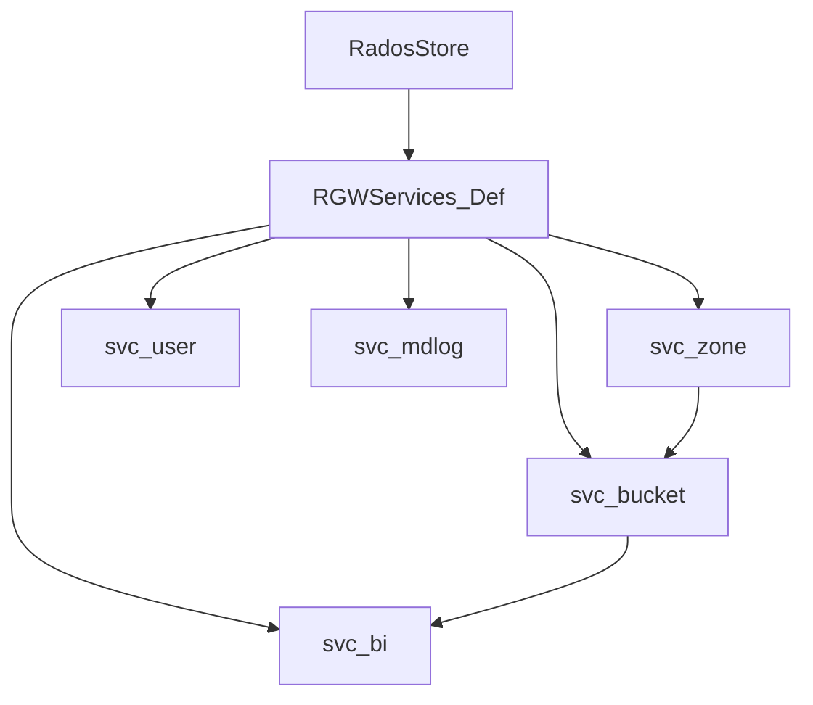

# Services layer module (`services/`)

## Purpose

Split RADOS logic into small, testable services between `RadosStore` and librados/CLS.

## Core services

| Service | File | Responsibility |
|---------|------|----------------|
| `RGWSI_Zone` | `svc_zone.h` | realm, period, placement |
| `RGWSI_User_RADOS` | `svc_user_rados.h` | user metadata |
| `RGWSI_Bucket_SObj` | `svc_bucket_sobj.h` | bucket instance |
| `RGWSI_BucketIndex_RADOS` | `svc_bi_rados.h` | object index |
| `RGWSI_MDLog` | `svc_mdlog.h` | multisite metadata log |
| `RGWSI_SysObj` | `svc_sys_obj.h` | system objects |
| `RGWSI_Notify` | `svc_notify.h` | cache invalidation |
| `RGWSI_Quota` | `svc_quota.h` | quota |

## Dependencies (summary)

## `RGWServiceInstance` pattern

Each `RGWSI_*` extends `RGWServiceInstance` and starts via `init()` / `start()`.

## Related

- [RADOS driver module](rados-driver.md)
