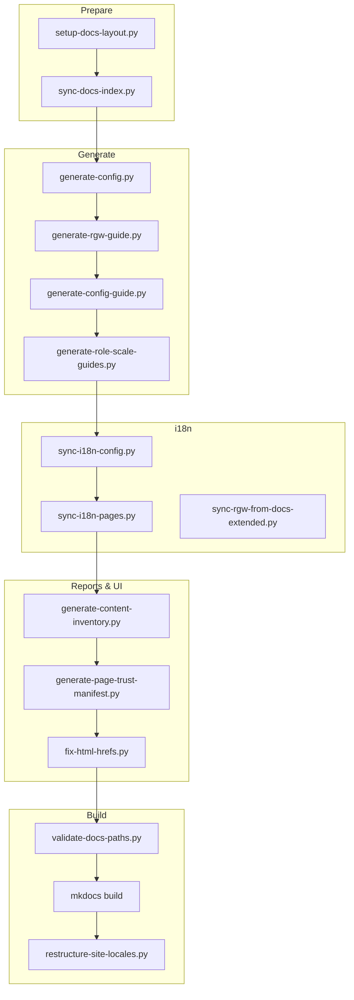

# Scripts reference

Complete guide to every script in this repository: what it does, when to run it, inputs/outputs, and how the pieces fit together.

**Layout map:** [`LAYOUT.md`](LAYOUT.md) · **Path constants:** [`repo_paths.py`](repo_paths.py)

---

## Prerequisites

```bash
pip install -r scripts/requirements.txt
```

| Dependency | Used by |
|------------|---------|
| Python 3.12+ | All `.py` scripts |
| PyYAML | Generators, i18n, inventory |
| MkDocs + Material + static-i18n + redirects | `mkdocs build` |
| `rg` (ripgrep) | Search shell scripts |
| `fzf` (optional) | `search-fuzzy.sh` |
| `dev-code/rgw/docs-extended` (optional) | `sync-rgw-from-docs-extended.py` |

After a fresh clone, always run:

```bash
python3 scripts/setup-docs-layout.py
```

---

## Pipeline overview



**One command for the full doc pipeline:**

```bash
make docs
# or: python3 scripts/regenerate-docs.py
```

This runs every step above except `validate-docs-paths.py` (run that separately before commit) and matches CI order closely.

---

## Orchestration

### `regenerate-docs.py`

Runs the full documentation regeneration chain, then `mkdocs build` and `restructure-site-locales.py`.

```bash
python3 scripts/regenerate-docs.py
```

**Step order:**

1. `setup-docs-layout.py`
2. `sync-rgw-from-docs-extended.py`
3. `generate-role-scale-guides.py`
4. `generate-rgw-guide.py`
5. `generate-config-guide.py all`
6. `sync-i18n-config.py`
7. `sync-docs-index.py`
8. `sync-i18n-pages.py`
9. `generate-content-inventory.py`
10. `generate-page-trust-manifest.py`
11. `fix-html-hrefs.py`
12. `mkdocs build`
13. `restructure-site-locales.py`

---

## Layout & validation

### `setup-docs-layout.py`

Creates or repairs MkDocs symlinks under `docs/`:

| Symlink | Target |
|---------|--------|
| `docs/cheatsheet` | `../cheatsheet` |
| `docs/arch` | `../arch` |
| `docs/dev` | `../dev` |

```bash
python3 scripts/setup-docs-layout.py
```

Run after clone, branch switch, or any layout change. CI runs this first.

---

### `validate-docs-paths.py`

Checks:

- Every `mkdocs.yml` nav entry resolves to a file under `docs/`
- Required symlinks exist and point to valid targets
- Section hub pages (`docs/index`, `cheatsheet/index`, `arch/index`, `dev/index`) use correct `/en/`, `/fa/`, `/zh/` locale links

```bash
python3 scripts/validate-docs-paths.py
```

Exits non-zero on failure. Run before opening a PR.

---

### `restructure-site-locales.py`

Post-processes MkDocs output for the published URL layout:

- Moves English pages from `site/` root → `site/en/`
- Writes root `site/index.html` redirect to `en/`
- Keeps shared dirs at site root: `assets/`, `stylesheets/`, `javascripts/`, `search/`
- Patches `__config.base` in English HTML so search index loads from `/search/`
- Fixes asset paths and canonical URLs

```bash
mkdocs build
python3 scripts/restructure-site-locales.py
python3 scripts/restructure-site-locales.py --site-dir /path/to/site
```

**Note:** `mkdocs serve` without this step serves English at `/` (not `/en/`). Use `regenerate-docs.py` or restructure manually to mirror production.

---

### `fix-html-hrefs.py`

Strips `.md` suffixes from `href` attributes in hub pages and OVERVIEW files so static HTML links work after MkDocs build.

**Touches:** `cheatsheet/config/OVERVIEW.md`, `cheatsheet/guides/OVERVIEW.md`, `cheatsheet/cli/OVERVIEW.md`, `REFERENCE.md`, hub `index.md` files.

```bash
python3 scripts/fix-html-hrefs.py
```

Run before `mkdocs build` (included in `regenerate-docs.py` and CI).

---

## Sync & index

### `sync-docs-index.py`

Syncs auxiliary pages from repo-root sources:

| Source | Output |
|--------|--------|
| `REFERENCE.md` | `cheatsheet/OVERVIEW.md` |
| `VERSION` | `docs/version.md` |
| `LICENSE` | `docs/license.md` |

Does **not** overwrite section hubs (`cheatsheet/index.md`, `arch/index.md`, `dev/index.md`).

```bash
python3 scripts/sync-docs-index.py
```

Run after editing `REFERENCE.md`, `VERSION`, or `LICENSE`.

---

### `sync-readme-i18n.py`

Keeps root **README** in three locales aligned:

| File | Source |
|------|--------|
| `README.md` | English (edit here) + auto language bar |
| `README.fa.md` | `scripts/locales/pages/readme.yaml` |
| `README.zh.md` | same YAML |

```bash
make readme
python3 scripts/sync-readme-i18n.py
```

After editing `README.md`, update fa/zh in `readme.yaml`, then run sync. CI fails if the trio is not committed. See `.cursor/rules/readme-i18n.mdc`.

---

### `sync-i18n-pages.py`

Writes `.fa.md` and `.zh.md` for hand-maintained pages listed in `HAND_PAGES`:

- `docs/index`, `docs/version`, `docs/compatibility`, `docs/license`
- `cheatsheet/config/OVERVIEW`
- `cheatsheet/cli/*` (OVERVIEW, cluster, config, osd-pool, rados, rbd, rgw, cephfs, cephadm, troubleshooting)
- `cheatsheet/guides/OVERVIEW`, `quickstart`, `getting-started`, `i18n-glossary`, `troubleshooting-guide`, `config-lookup`, `contributing`

Translations come from `scripts/locales/pages/*.yaml`. Missing keys fall back to English with a locale note from `strings.yaml`.

**Not synced here (manual hubs):** `cheatsheet/index`, `arch/index`, `dev/index`

```bash
python3 scripts/sync-i18n-pages.py
```

---

### `sync-i18n-config.py`

Syncs fa/zh wrappers for `cheatsheet/config/OVERVIEW.md` only. Option tables inside `cheatsheet/config/` stay English upstream text; locale files add translated intro/notes.

```bash
python3 scripts/sync-i18n-config.py
```

---

### `sync-rgw-from-docs-extended.py`

Syncs Persian RGW architecture docs from `dev-code/rgw/docs-extended` into `arch/rgw/*.fa.md`. Creates en/zh stub pages where needed.

```bash
python3 scripts/sync-rgw-from-docs-extended.py
```

Requires a local checkout at `dev-code/` (gitignored). CI uses `continue-on-error: true` if absent.

---

### `sync-architecture-docs.py`

Legacy alias — runs `sync-rgw-from-docs-extended.py`. Prefer the new name.

---

## Config generators

### `generate-config.py`

Fetches Ceph upstream option YAML from GitHub and writes Markdown tables.

**Output:** `cheatsheet/config/<subsystem>/*.md`, `cheatsheet/config/OVERVIEW.md`, `cheatsheet/config/readme.md`, root `VERSION`

```bash
python3 scripts/generate-config.py --ref main
python3 scripts/generate-config.py --ref main --skip-split
python3 scripts/generate-config.py --ref quincy --cache-dir scripts/upstream
```

| Flag | Description |
|------|-------------|
| `--ref` | Ceph git branch/tag (default: `main`) |
| `--cache-dir` | Cache upstream YAML (default: `scripts/upstream/`) |
| `--skip-split` | Skip `split-index.py` after generation |

**Subsystems:** global, osd, mon, mgr, mds, mds-client, rgw, rbd, rbd-mirror, cephfs-mirror, crimson, immutable-object-cache, ceph-exporter

Never hand-edit generated tables — regenerate instead.

---

### `split-index.py`

Splits `cheatsheet/config/readme.md` into per-subsystem `cheatsheet/config/<sub>/INDEX.md` link pages. Called automatically by `generate-config.py` unless `--skip-split`.

```bash
python3 scripts/split-index.py
```

---

### `generate-rgw-guide.py`

Builds RGW config deep-dive guides from `cheatsheet/config/rgw/*.md`.

**Output:** `cheatsheet/guides/rgw-config/` (OVERVIEW, TUNING, topic pages by category)

**Side effect:** Patches `mkdocs.yml` between `# rgw-nav:start` and `# rgw-nav:end`.

```bash
python3 scripts/generate-rgw-guide.py
```

Run after `generate-config.py` when RGW options change.

---

### `generate-config-guide.py`

Same engine as RGW guides for other subsystems (OSD, MON, MGR, MDS, global, RBD, …).

```bash
python3 scripts/generate-config-guide.py all
python3 scripts/generate-config-guide.py osd mon
python3 scripts/generate-config-guide.py mgr --no-nav
```

| Argument | Description |
|----------|-------------|
| `subsystems` | One or more ids, or `all` (default) |
| `--no-nav` | Do not patch `mkdocs.yml` nav markers |

Nav markers live in `mkdocs.yml` under `# config-guides-nav:start` (`# osd-nav:start`, etc.).

Hand-tuned option blurbs: `scripts/subsystem_enrichments.py`

---

### `generate-role-scale-guides.py`

Syncs role and scale guides from locale YAML:

**Output:** `cheatsheet/guides/roles/*`, `cheatsheet/guides/scales/*`

**Sources:** `scripts/locales/pages/roles-scales.yaml`, `rgw-from-docs-extended.yaml`

```bash
python3 scripts/generate-role-scale-guides.py
```

---

## Reports & site UI

### `generate-content-inventory.py`

Scans all `mkdocs.yml` nav pages and reports en/fa/zh completeness plus human-review status.

**Output:** `reports/content-inventory.csv`, `reports/content-inventory.md`

```bash
python3 scripts/generate-content-inventory.py
python3 scripts/generate-content-inventory.py --sync-review   # new nav → content-review.yaml
python3 scripts/generate-content-inventory.py --no-csv
```

| Flag | Description |
|------|-------------|
| `--csv` / `--md` | Output paths (defaults under `reports/`) |
| `--no-csv`, `--no-md` | Skip one format |
| `--sync-review` | Append new pages to `scripts/data/content-review.yaml` |

Human review flags: edit `scripts/data/content-review.yaml`, then re-run.

CI fails if inventory files are stale vs committed.

---

### `generate-page-trust-manifest.py`

Builds JSON for human-reviewed / auto-generated badges and toasts on the live site.

**Output:** `docs/javascripts/page-trust-data.js` (loaded by `page-trust.js`)

```bash
python3 scripts/generate-page-trust-manifest.py
python3 scripts/generate-page-trust-manifest.py --output docs/javascripts/page-trust-data.js
```

Auto-generated detection: `cheatsheet/config/`, `cheatsheet/guides/*-config/`, roles/scales, pages with `generated:` frontmatter. Human-reviewed: `scripts/data/content-review.yaml`.

Run before `mkdocs build` whenever nav or review manifest changes.

---

## Search tools (shell)

Offline search over Markdown sources (requires `rg`).

### `lookup-config.sh`

Pretty-print one Ceph config option from the reference tables.

```bash
./scripts/lookup-config.sh osd_max_scrubs
./scripts/lookup-config.sh rgw_cache_enabled
```

---

### `search-config.sh`

Search config tables only.

```bash
./scripts/search-config.sh scrub
```

---

### `search-all.sh`

Search CLI, config, and guides.

```bash
./scripts/search-all.sh scrub
./scripts/search-all.sh --cli-only "ceph orch"
./scripts/search-all.sh --config-only rgw_cache
```

---

### `search-fuzzy.sh`

Interactive file picker over cli/config/guides (requires `fzf`).

```bash
./scripts/search-fuzzy.sh
```

---

## Python libraries (import-only)

These modules are not run directly; generators import them.

| Module | Role |
|--------|------|
| [`repo_paths.py`](repo_paths.py) | Canonical paths: `CHEATSHEET`, `CONFIG`, `GUIDES`, `CLI`, `REPORTS`, … |
| [`i18n.py`](i18n.py) | `t()`, `locale_path()`, `write_localized()`, `render_all_locales()` |
| [`config_guide_lib.py`](config_guide_lib.py) | Shared config deep-dive generator (profiles, nav patching, table parsing) |
| [`subsystem_enrichments.py`](subsystem_enrichments.py) | Hand-written option explanations merged into generated guides |
| [`rgw_docs_extended.py`](rgw_docs_extended.py) | Path mapping and transforms for docs-extended sync |

---

## Data files

### `scripts/data/content-review.yaml`

Human content review manifest. Keys = repo path without `.md` (e.g. `cheatsheet/guides/quickstart`).

```yaml
cheatsheet/guides/quickstart:
  reviewed: true
```

Used by content inventory and page-trust UI.

---

### `scripts/locales/strings.yaml`

Template strings for **generated** docs: labels (`**What it does:**`), `fallback_page_note`, `upstream_table_note`, tuning headings.

---

### `scripts/locales/pages/*.yaml`

Full fa/zh bodies for **hand-written** pages synced by `sync-i18n-pages.py` and role/scale guides.

| File | Pages |
|------|-------|
| `readme.yaml` | Root `README.md` (fa/zh) |
| `cli.yaml` | CLI reference pages |
| `general-guides.yaml` | quickstart, contributing, troubleshooting, … |
| `config-overview.yaml` | `cheatsheet/config/OVERVIEW` |
| `home.yaml` | `docs/index`, `guides/OVERVIEW` |
| `roles-scales.yaml` | Role & scale guides |
| `rgw-from-docs-extended.yaml` | Extra RGW role/scale enrichments |

---

### `scripts/upstream/*.yaml.in`

Cached Ceph upstream option YAML (fetched by `generate-config.py`). Safe to commit as offline fallback; refreshed with `--ref`.

---

## CI integration

`.github/workflows/docs.yml` runs:

1. `setup-docs-layout.py`
2. `sync-docs-index.py`
3. `sync-rgw-from-docs-extended.py` (optional)
4. `generate-role-scale-guides.py`
5. `generate-rgw-guide.py`
6. `generate-config-guide.py all`
7. `sync-i18n-config.py`
8. `sync-i18n-pages.py`
9. `generate-content-inventory.py` + verify committed
10. `generate-page-trust-manifest.py`
11. `fix-html-hrefs.py` → `validate-docs-paths.py` → `mkdocs build` → `restructure-site-locales.py`

Deploy: GitHub Pages → proxied at `http://blog.ceph-s3.ir/` (`/` → `/en/` · `/fa/` · `/zh/`).

---

## Common workflows

### Fresh clone → local preview

```bash
make install setup docs
make serve-site SITE_PORT=8765
# open http://127.0.0.1:8765/en/
```

### Upstream Ceph config changed

```bash
python3 scripts/generate-config.py --ref main
python3 scripts/regenerate-docs.py
python3 scripts/validate-docs-paths.py
```

### New nav page added

1. Add entry to `mkdocs.yml`
2. Create the `.md` source file
3. `python3 scripts/generate-content-inventory.py --sync-review`
4. `python3 scripts/generate-page-trust-manifest.py`
5. Commit updated `reports/` and `scripts/data/content-review.yaml` if needed

### Edit hand-written guide (en + fa + zh)

1. Edit English `.md`
2. Update `scripts/locales/pages/*.yaml` **or** edit `.fa.md` / `.zh.md` directly
3. `python3 scripts/sync-i18n-pages.py`
4. Regenerate inventory if nav changed

### Mark page as human-reviewed

1. Edit `scripts/data/content-review.yaml` → `reviewed: true`
2. `python3 scripts/generate-content-inventory.py`
3. `python3 scripts/generate-page-trust-manifest.py`
4. `mkdocs build` (or full `regenerate-docs.py`)

---

## Troubleshooting

| Problem | Fix |
|---------|-----|
| Nav build error: file not found | `python3 scripts/setup-docs-layout.py` |
| `validate-docs-paths` symlink error | Re-run setup; ensure `docs/cheatsheet` → `../cheatsheet` |
| Search 404 on live site | Ensure `restructure-site-locales.py` ran; `site/search/search_index.json` must exist |
| CI inventory check failed | `python3 scripts/generate-content-inventory.py` and commit `reports/` |
| fa/zh shows English only | Run `sync-i18n-pages.py`; check YAML key matches `HAND_PAGES` path |
| RGW arch fa pages missing | Clone docs-extended to `dev-code/rgw/docs-extended` |
| Generated guide empty | Regenerate config first: `generate-config.py` then guide generators |

---

## Quick reference table

| Script | Type | Run when |
|--------|------|----------|
| `regenerate-docs.py` | orchestrator | Full rebuild |
| `setup-docs-layout.py` | layout | Clone, layout change |
| `validate-docs-paths.py` | validation | Before PR |
| `restructure-site-locales.py` | build | After `mkdocs build` |
| `fix-html-hrefs.py` | build | Before `mkdocs build` |
| `sync-docs-index.py` | sync | REFERENCE/VERSION/LICENSE change |
| `sync-i18n-pages.py` | i18n | Hand-page or YAML change |
| `sync-i18n-config.py` | i18n | Config OVERVIEW change |
| `sync-rgw-from-docs-extended.py` | sync | docs-extended update |
| `generate-config.py` | generator | Upstream Ceph YAML change |
| `split-index.py` | generator | After config readme change |
| `generate-rgw-guide.py` | generator | RGW config tables change |
| `generate-config-guide.py` | generator | Other subsystem config change |
| `generate-role-scale-guides.py` | generator | Role/scale YAML change |
| `generate-content-inventory.py` | report | Nav/content/review change |
| `sync-readme-i18n.py` | report | README.md / README.fa.md / README.zh.md change |
| `lookup-config.sh` | search | Look up one option |
| `search-all.sh` | search | Full-text search |
| `search-config.sh` | search | Config-only search |
| `search-fuzzy.sh` | search | Interactive browse |
